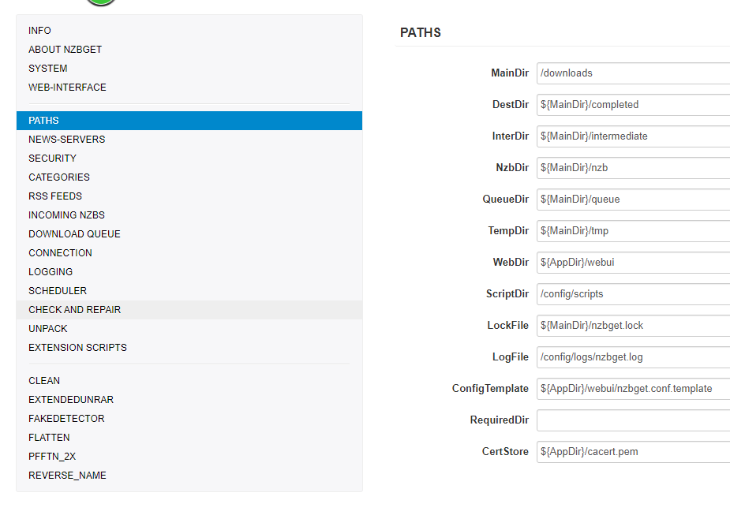
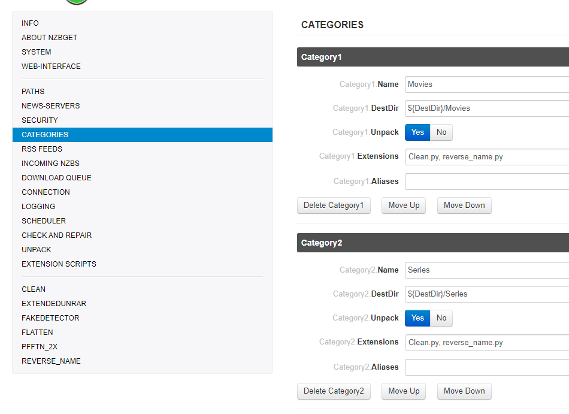

### How to setup NZBGet to use with Sonarr/Radarr.

This basic example is based on the use of the [Linux|Server.io's](https://hub.docker.com/r/linuxserver/radarr/) docker images,
Even that I personally don't prefer their folder setup it's easy for starters to use and also because most people use their docker images I decided to use them for this tutorial.

------

#### Some Basics

`${MainDir}` =>  Root directory for all tasks. 

`${AppDir} `=> Where NZBGet is installed.

`${DestDir} `=>  Destination directory for downloaded files. 

#### PATHS

I will only explain the so called most importand paths.

`MainDir` => `/downloads`
`DestDir` => `${MainDir}/completed` (so it will go in to `/downloads/completed`)
`InterDir` =>  Files are downloaded into this directory (before unpack+par2) 
` NzbDir` =>  Directory for incoming nzb-files. 
`QueueDir` =>  This directory is used to save download queue, history, information statistics, etc. 
`ScriptDir` =>  Directory with post-processing and other scripts. 
`LogFile` => Where your logfiles will be stored (**please create a log directory in your config!!!**)

####  NEWS-SERVERS

`Active` => Use this news server.
`Name` => The name is used in UI and for logging. It can be any string.
`Level` => Put your major download servers at level 0 and your fill servers at levels 1, 2, etc.. 
`Host` => Host name of news server. 
`Port` => Port to connect to. 
`Password` => Password to use for authentication. 
`Encryption` =>  Encrypted server connection (TLS/SSL). (**PREFERED TO USE THIS!!!**)
`Connections` =>  Use the lowest possible amount of connections +1 to gain your max download speed.
`Retention` =>  How long the articles are stored on the news server. 

#### CATEGORIES

`Name` => This should match what you put in Sonarr/Radarr (tv/movies/sonarr/radarr/series/films)
`DestDir` => `${DestDir}` Destination directory (/downloads/completed/Movies)
`Unpack` => Unpack downloaded nzb-files.
`Extensions` => List of extension scripts for this category.

#### INCOMING NZBS

`AppendCategoryDir` =>  Create subdirectory with category-name in destination-directory.

####  DOWNLOAD QUEUE

#### CHECK AND REPAIR

#### UNPACK

