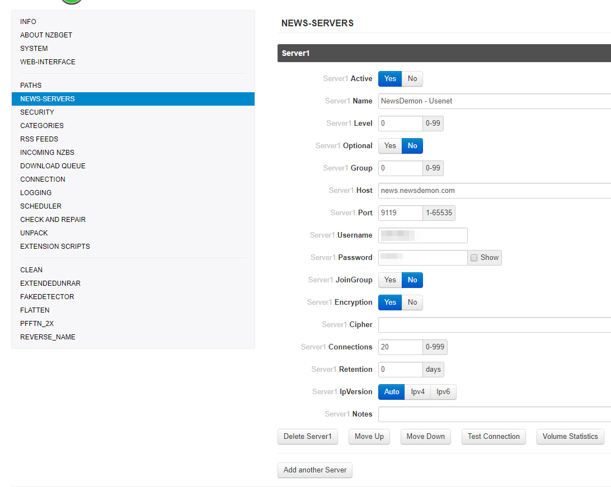
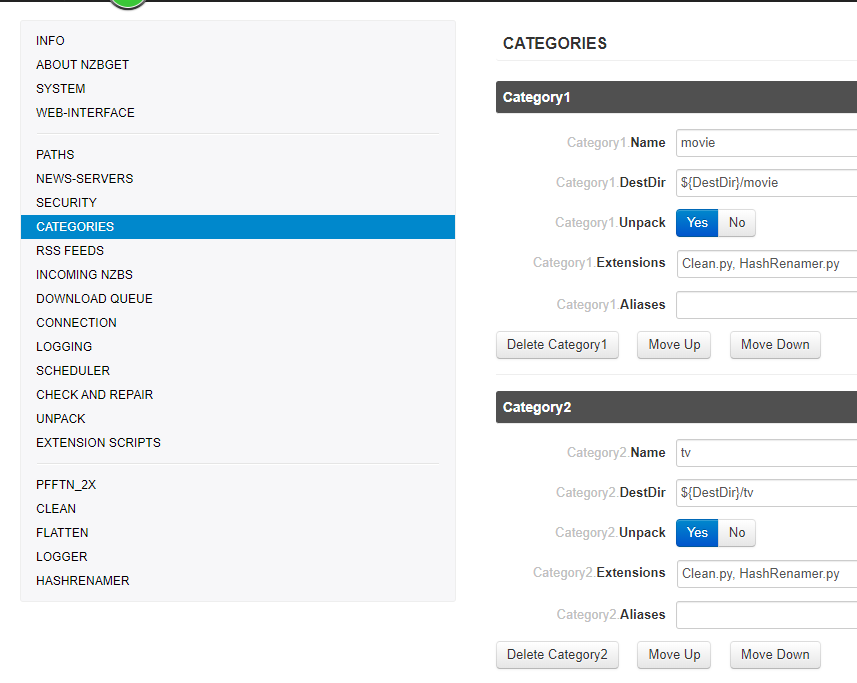
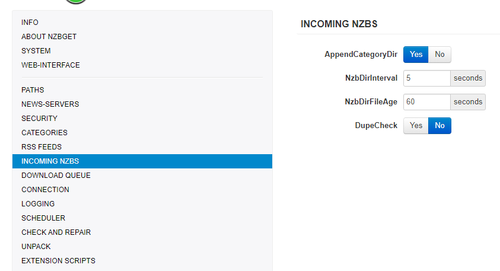
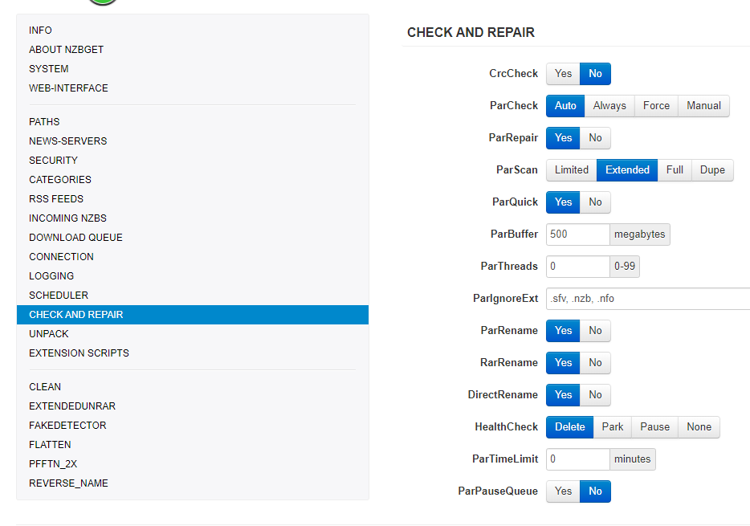
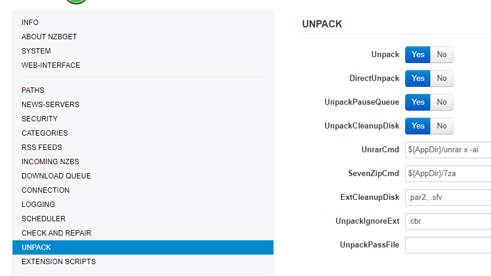

### How to setup NZBGet to use with Sonarr/Radarr.

This basic example is based on the use of docker images,
>Keep in mind I've setup my paths so it works with hardlinks and you get instant moves.
The default path setup  used by  [Linux|Server.io](https://hub.docker.com/r/linuxserver/) don't support hardlinks and instant moves.

------

#### Some Basics

>`${MainDir}` =>  Root directory for all tasks. 
 `${AppDir} `=> Where NZBGet is installed.
 `${DestDir} `=>  Destination directory for downloaded files. 

#### PATHS

I will only explain the so called most important paths.
>`MainDir` => `/data/.usenet`
`DestDir` => `${MainDir}/completed` (so it will go in to `/data/.usenet/completed`)
`InterDir` =>  Files are downloaded into this directory (before unpack+par2) 
`NzbDir` =>  Directory for incoming nzb-files. 
`QueueDir` =>  This directory is used to save download queue, history, information statistics, etc. 
`ScriptDir` =>  Directory with post-processing and other scripts. 
`LogFile` => Where your logfiles will be stored (**please create a log directory in your config!!!**)

####  NEWS-SERVERS

>`Active` => Use this news server.
`Name` => The name is used in UI and for logging. It can be any string.
`Level` => Put your major download servers at level 0 and your fill servers at levels 1, 2, etc.. 
`Host` => Host name of news server. 
`Port` => Port to connect to. 
`Password` => Password to use for authentication. 
`Encryption` =>  Encrypted server connection (TLS/SSL). (**PREFERED TO USE THIS!!!**)
`Connections` =>  Use the lowest possible amount of connections +1 to gain your max download speed.
`Retention` =>  How long the articles are stored on the news server. 

#### CATEGORIES

>`Name` => This should match what you put in Sonarr/Radarr (tv/movies/sonarr/radarr/series/films)
`DestDir` => `${DestDir}` Destination directory (/data/.usenet/completed/movie)
`Unpack` => Unpack downloaded nzb-files.
`Extensions` => List of extension scripts for this category.

#### INCOMING NZBS

>`AppendCategoryDir` =>  Create subdirectory with category-name in destination-directory.

####  DOWNLOAD QUEUE

>`WriteBuffer` => If you're low on memory don't set this to high.

#### LOGGING

#### CHECK AND REPAIR

#### UNPACK

>`DirectUnpack`=> This might lower your download speed but the overall time could be faster. (disable on low powered devices)

##### EXTENSION SCRIPTS

Depending if you're using some NZBGet script here you can change the order or when it should be used