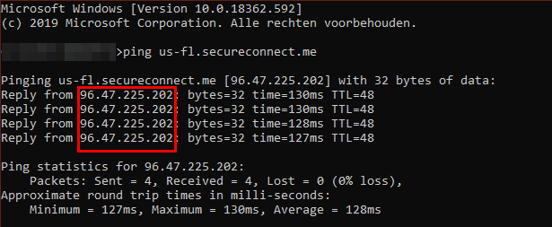
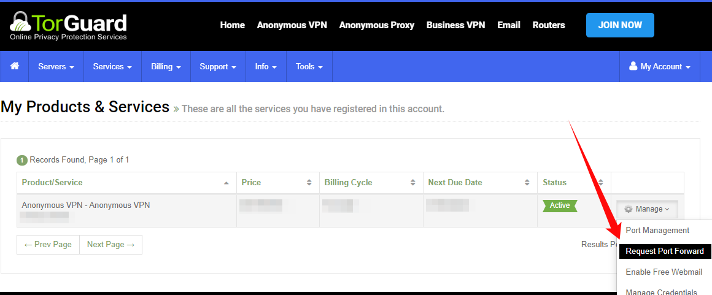
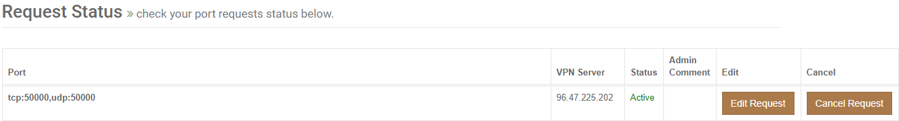
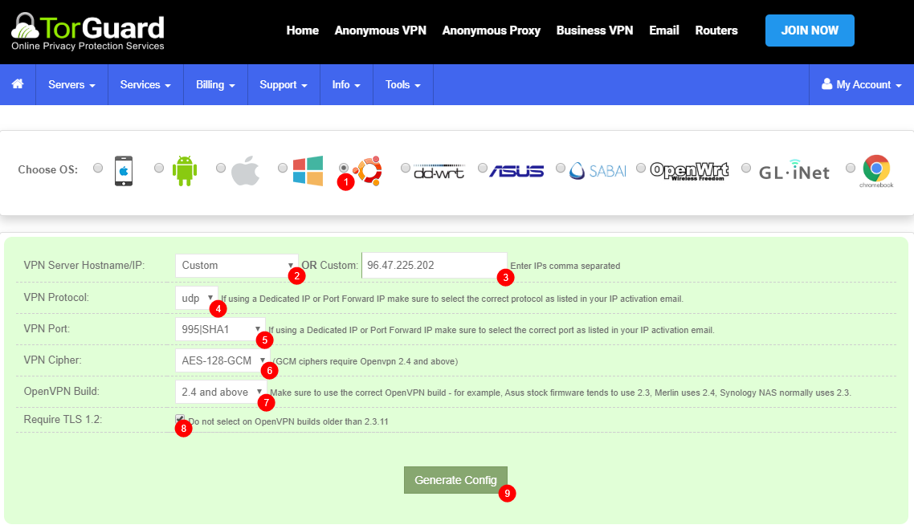

## How to setup Torguard for port forwarding.

#### Create a user account.

Go to [My Account -> Services -> My Service Credentials](https://torguard.net/clientarea.php?action=changepw).
First we're going to create a user account for your VPN so we won't need to use your main account that you use to login to your account on the Torguard site.

Create a new username and choose a secure password,
of create a Random Username and Password.

#### How to get the IP of your VPN server.
Go to [My Account -> Server -> Global VPN Network](https://torguard.net/network/)

Then we're going to select which server we're going to use,

for the best speed it's recommended to choose the one nearest to your location.
Lets use for this example `USA Miami` and copy/paste the Hostname `us-fl.secureconnect.me`.

then open a cmd window or something equal and type: `ping us-fl.secureconnect.me`

You will then get the IP Number of the server.
Remember that for later use.

#### How to set the Port forwarding.
Go to [My Account -> Services -> My Services](https://torguard.net/clientarea.php?action=products).

Then click on `Manage` and select `Request Port Forward`.

1. That's the `IP` we found earlier.
2. Select `UDP`.
3. Select a `Port/Auth` I personally use `995|SHA1`.
4. First Select the `Protocol` `TCP`. 
5. I suggest to use a higher `Port`.(This is also the port you will use in your torrent client)
6. Click on the `+` sign and do the same with the `UDP` `Protocol`.
7. Then Click on `Submit Request`.

And you will see something like this.

You will also receive a e-mail with the ports you forwarded.

#### How to create the .ovpn file.
Go to [My Account -> Tools > OpenVPN Config Generator](https://torguard.net/tgconf.php?action=vpn-openvpnconfig).

1. Choose the OS you want to use the .ovpn for.
2. Choose `Custom`.
3. Put in the `IP` we got earlier and used for the port forwarding.
4. Choose `UDP`.
5. Choose `995|SHA1` or what you selected during the port forwarding.
6. Choose `AES-128-GCM`.
7. Choose `2.4 and above`.
8. Check Requiere TLS 1.2
9. Click on `Generate Config`

Now you will download a .ovpn file with a random number.
This .ovpn file you place in the openvpn folder of your VPN torrent client.

------

#### **NOTE:**

>These settings are a recommendation if you want to choose other settings be my guest.
>If you want to support me please use the following [referral link](https://torguard.net/aff.php?aff=5575) 
and use the following code: `TGLIFE`  to get 50% Off for Life.

