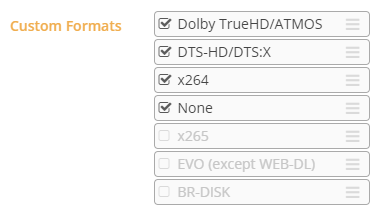
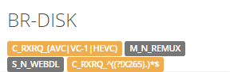
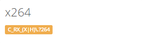
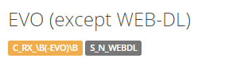

## Collection of Custom Formats for Radarr

- [Dolby TrueHD/ATMOS](#dolby-truehd/atmos)
- [DTS-HD/DTS:X](#dts-hd/dts:x)
- [BR-DISK](#br-disk)
- [x264](#x264)
- [x265 (real x265)](#x265)
- [EVO (except WEB-DL)](#evo-(except-web-dl))

------
#### Dolby TrueHD/ATMOS

> Dolby TrueHD/ATMOS = `C_RXRQ_TRUEHD|ATMOS`
> If you prefer TrueHD|Atmos audio tracks.
> To make this workable you need to put it in a order to what you prefer and above `none`.
> 
------
#### DTS-HD/DTS:X

> DTS-HD/DTS:X = `C_RXRQ_DTS.?(HD|ES|X(?!\d))` 
> If you prefer DTS-HD audio tracks.
> To make this workable you need to put it in a order to what you prefer and above `none`.
> 
------
#### BR-DISK

> BR-DISK = `C_RXRQ_(AVC|VC-1|HEVC)` `N_RXRQ_(REMUX)` `S_N_WEBDL` `C_RXRQ_^((?!x265).)*$`
> If you don't want BR-DISK (Iso's and Blu-ray folder structure).
> To make this workable you need to uncheck it in your profile !!!
> 
------
#### x264

> x264 = `C_RX_(X|H)\?264`
> If you prefer x264 releases (Encodes).
------
#### x265

> x265 = `C_RX_(X|H)\.?265`
> If you prefer x265 releases (Encodes/Re-Encodes).
> Why HEVC isn't added in this CF ?
> HEVC is officially only used for untouched sources, but most x265 Encoders/Re-Encoders mix them in the release name because they don't know better or think they do.
> I didn't add it because this would also mean that BR-DISK/Remux is a x265 and those are untouched sources so never are x265.
> Luckily most x265 Encoders/Re-Encoders also add x265 so it get's picked up correctly.
------
#### EVO (except WEB-DL)

> EVO (except WEB-DL) = `C_RX_\B(-EVO)\B` `S_N_WEBDL`
> This group is often banned for the low quality Blu-ray releases but their WEB-DL are okay.
> To make this workable you need to uncheck it in your profile !!!
> 

------
