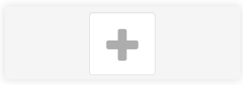
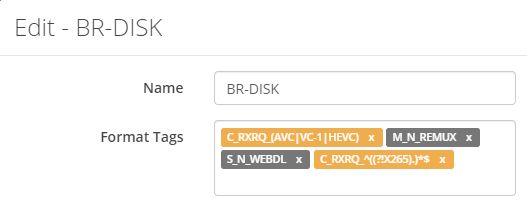

# How to make sure Radarr doesn't snatch Full Blurays (ISO/BDMV)

Radarr has problems to separate full Blurays from Bluray-Rips,
after some researching and  testing I found a way to solve this issue.
To make this work we need to make use of Custom Formats,
and make sure the used profile is making use of it (or better said not).

------

## Custom Formats

`Navigate to Settings => Custom Formats`

Then click on the  to add a new Custom Format.

On the new popup at the bottom you have the option `Advanced` and click on `Custom`

Again a new popup will appear.

Enter the following info

`Name` => `BR-DISK`

`Format Tags` => `C_RXRQ_(AVC|VC-1|HEVC)` `M_N_REMUX` `S_N_WEBDL` `C_RXRQ_^((?!x265).)*$`

**!!! NOTE: make sure the 4 tags are entered separate !!!**

## Quality Profiles

Then go to your used profiles.
Scroll down to the bottom where you see Custom Formats.

Make sure you uncheck your newly created Custom Profile `BR-DISK`

Make sure you do that with all your used Quality Profiles.

#### **NOTE:**

>**Don't uncheck `None` or else it will ignore everything except the checked Custom Formats.**

