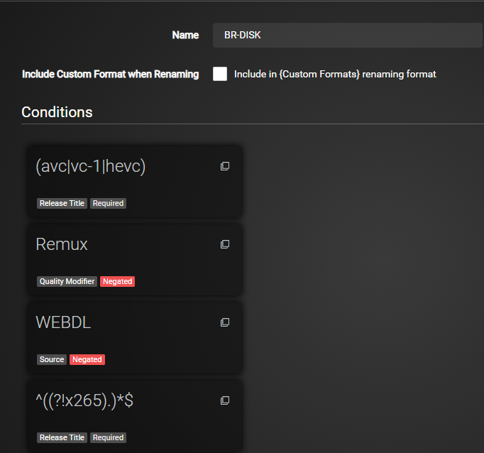
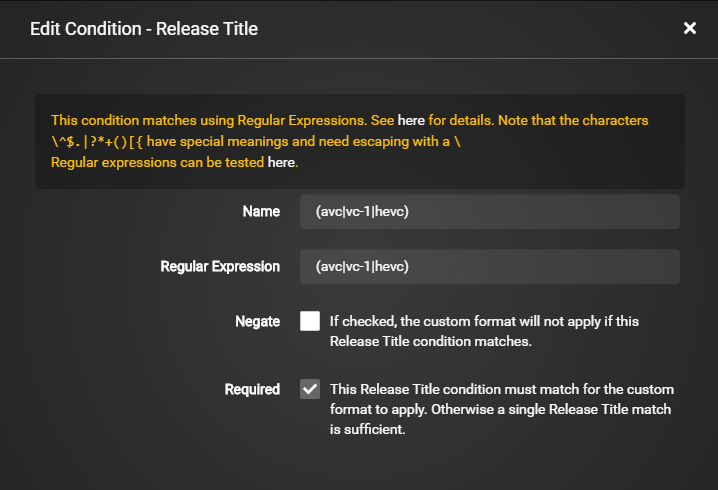
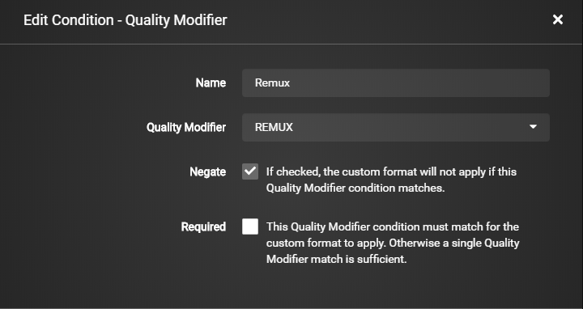
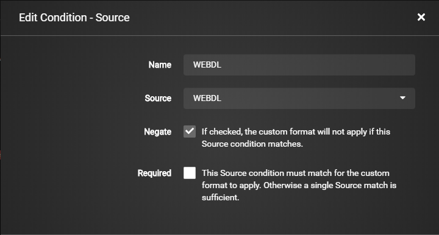
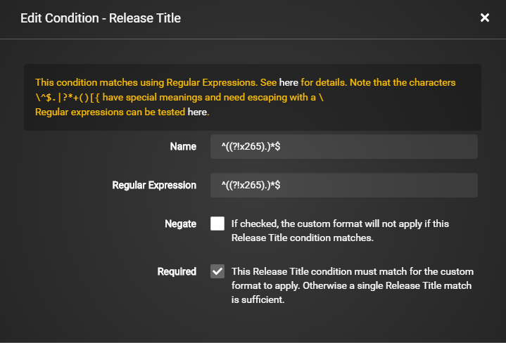
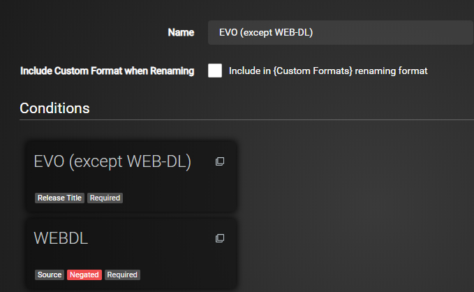
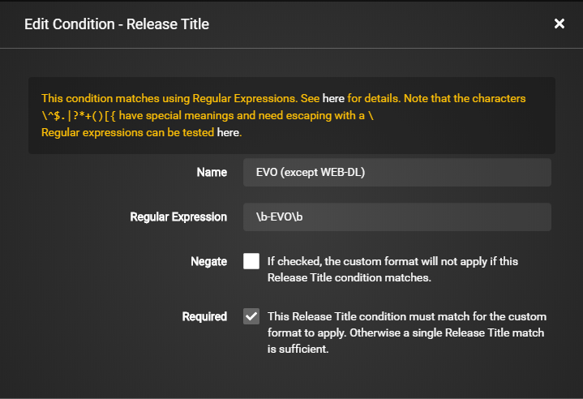
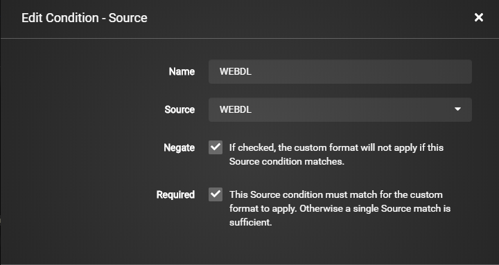

## Collection of Custom Formats for Radarr V3 (Aphrodite)

Here I will try to collect a collection of most needed/used Custom Formats,
Keep in mind Custom Formats are made to fine tune your Quality Profile !!!

With the coming of Radarr v3 the Custom Formats is much more advanced/powerful then with v2 this also means it's much more complicated  to setup.
So I decided to use more screenshots for the basic setups to make it as easy as possible.

------

[BR-DISK](#br-disk)

[EVO except WEB-DL](#evo-except-web-dl)

------

### BR-DISK

This is a custom format to help Radarr to recognize & ignore BR-DISK (ISO's and Blu-ray folder structure). 

You will need to add the following to your new Custom Format when created in your Quality Profile (`Setting` => `Profiles`) and then set the score to `-1000`

 

`(avc|vc-1|hevc)`

 

`Remux`

 

`WEBDL`

 

`^((?!x265).)*$`

 

#### **NOTE:**

> Depending on your rename scheme it could happen that it will match renamed files after download as BR-DISK,
> This is a cosmetic annoyance till I come up for another way to solve this,
> being that this Custom Format is used to not download BR-DISK it does it purpose as intended.
> Several reasons why this is happening:
>
> - Blame the often wrongly used naming of x265 encodes.
> - Radarr v3 uses dynamic custom formats 

------

### EVO except WEB-DL

This group is often banned for the low quality Blu-ray releases but their WEB-DL are okay.

 

`\b-EVO\b`

 

`WEBDL`

 

------

