## Collection of Custom Formats for Radarr V3 (Aphrodite)

Here I will try to collect a collection of most needed/used Custom Formats.
That I've found on discord or created myself with the help of others.

> Keep in mind Custom Formats are made to fine tune your Quality Profile !!!
>
> Meaning: Quality Profile trumps Custom Formats !!!

With the coming of Radarr V3 Custom Formats are much more advanced/powerful than with v0.2, althrough this also means a Custom Format is much more complicated to setup.
So I decided to use more screenshots for the basic setups to make it as easy as possible.

------

| Audio                                    | Video                               | Misc                                    |
| :--------------------------------------- | ----------------------------------- | --------------------------------------- |
| [Dolby TrueHD/ATMOS](#dolby-truehdatmos) | [Single Layer DV](#single-layer-dv) | [BR-DISK](#br-disk)                     |
| [DTS-HD/DTS:X](#dts-hd-dts-x)            |                                     | [EVO except WEB-DL](#evo-except-web-dl) |
| [DDP (non-Atmos)](#ddp-non-atmos)        |                                     | [Special Edition](#special-edition)     |

------

### BR-DISK

This is a custom format to help Radarr to recognize & ignore BR-DISK (ISO's and Blu-ray folder structure). 

You will need to add the following to your new Custom Format when created in your Quality Profile (`Setting` => `Profiles`) and then set the score to `-1000`

 

Release Title: `(avc|vc-1|hevc)` 
Negate: `False` 
Required: `True`

 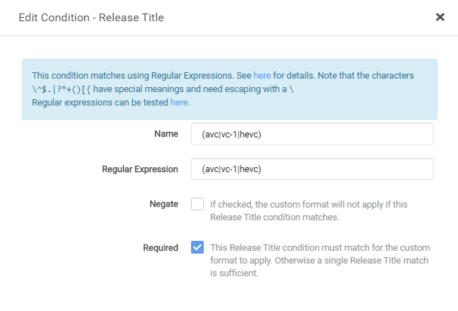

Quality Modifier: `Remux` 
Negate: `True`
Required: `False`

 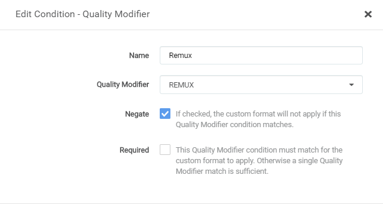

Source: `WEBDL`
Negate: `True`
Required: `False`

 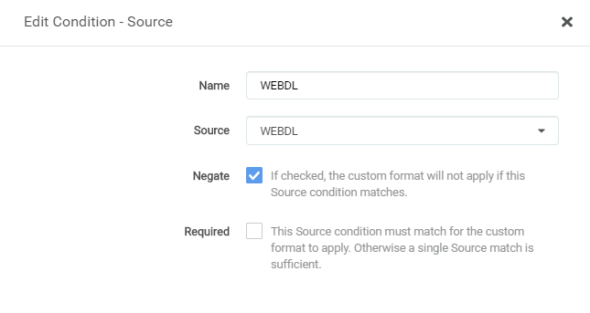

Release Title: `^((?!x265).)*$`
Negate: `True`
Required: `False`

 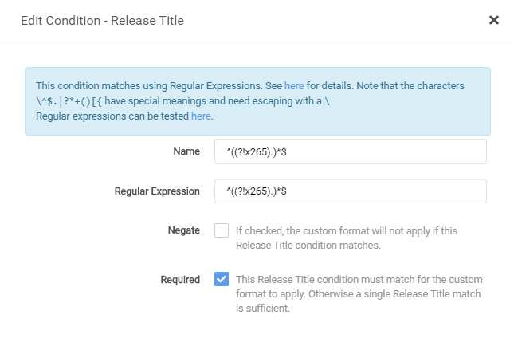

#### **NOTE:**

> Depending on your renaming scheme it could happen that Radarr will match renamed files after they are downloaded and imported as `BR-DISK`,
> This is a cosmetic annoyance till I come up for another way to solve this,
> being that this Custom Format is used to not download BR-DISK it does its purpose as intended.
> Several reasons why this is happening:
>
> - Blame the often wrongly used naming of x265 encodes.
> - Radarr v3 uses dynamic custom formats 

------

------

### EVO except WEB-DL

This group is often banned for the low quality Blu-ray releases but their WEB-DL are okay.

 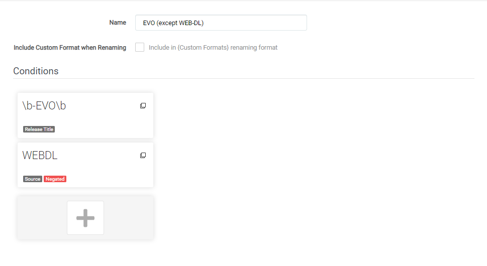

Release Title: `\b-EVO\b`
Negate: `False`
Required: `False`

 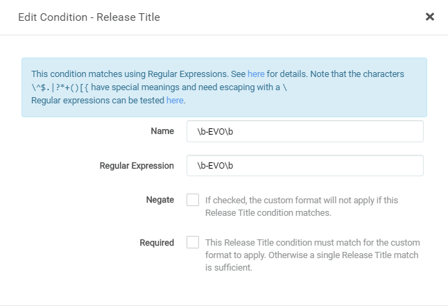

Source: `WEBDL`
Negate: `True`
Required: `True`

 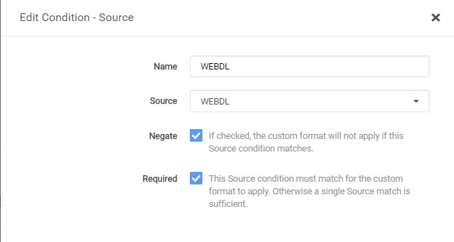

------

------

### Dolby TrueHD/ATMOS

If you prefer TrueHD|Atmos audio tracks.

 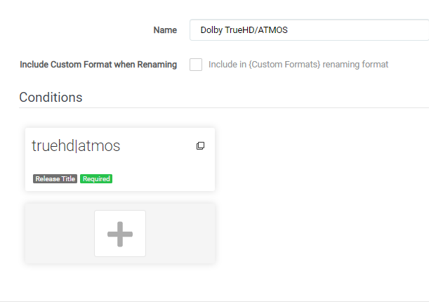

Release Title: `truehd|atmos`
Negate: `False`
Required: `True`

 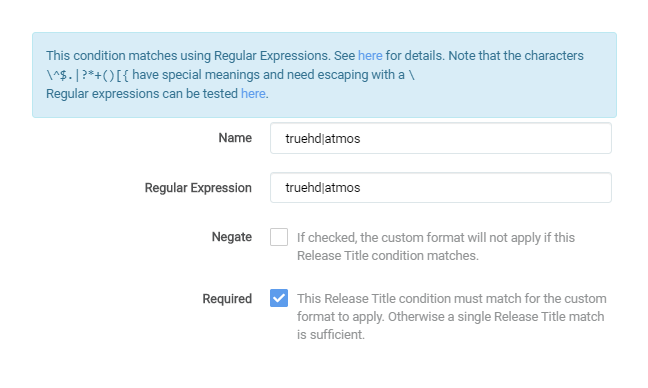

------

------

### DTS-HD/DTS:X

If you prefer DTS-HD/DTS:X audio tracks.

 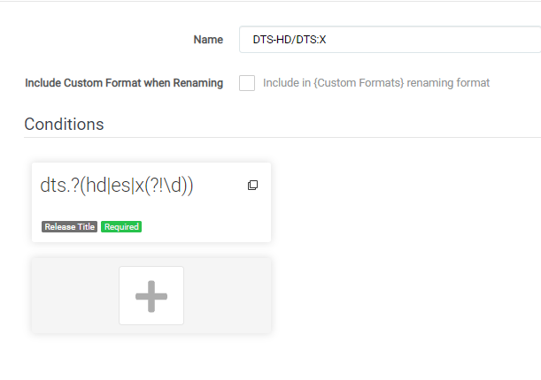

Release Title: `dts.?(hd|es|x(?!\d))`
Negate: `False`
Required: `True`

 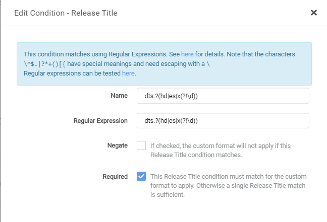

------

------

### Single Layer DV

Custom Format for Single Layer Dolby Vision releases.

 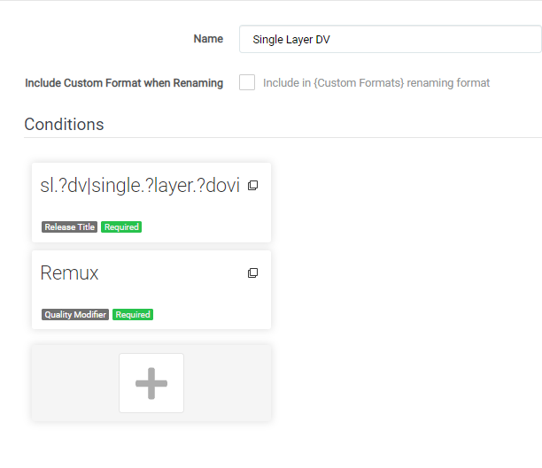

Release Title: `sl.?dv|single.?layer.?dovi` 
Negate: `False` 
Required: `True`

 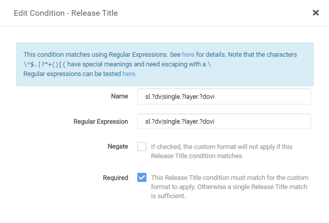

Quality Modifer: `Remux` 
Negate: `False`
Required: `True`

 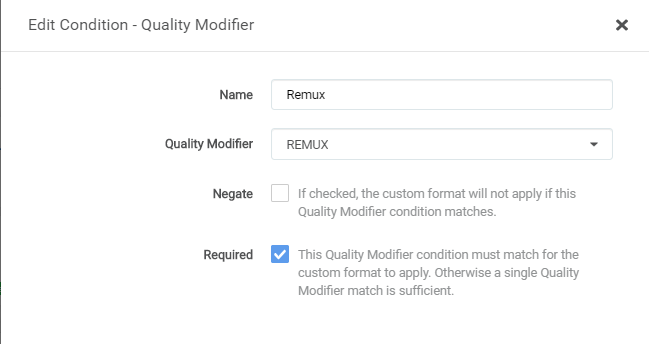

------

------

### Special Edition

Custom format for several Special Editions

 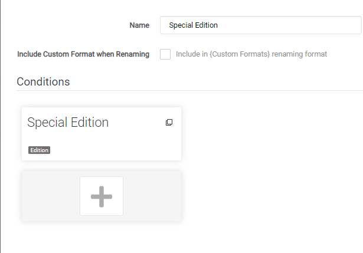

Edition: `extended|uncut|director|special|unrated|uncensored|\.cut[\.|-]`
Negate: `False`
Required: `True`

 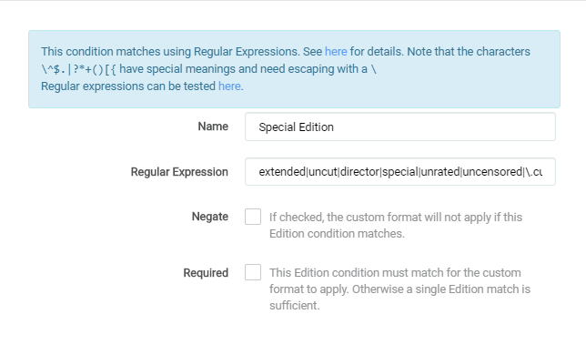

------

------

### DDP (non-Atmos)

 

Release Title: `dd(p|\+)|eac3`
Negate: `False`
Required: `True`

 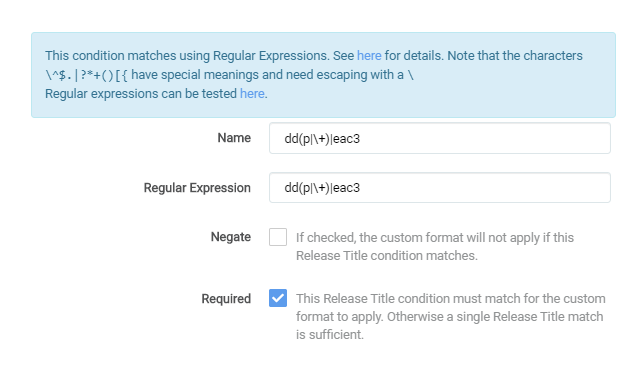

Release Title `TrueHD|ATMOS`
Negate: `True`
Required: `True`

 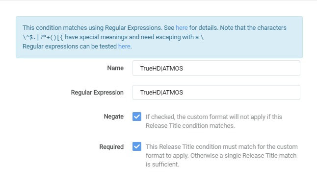

------

------

