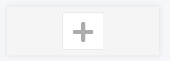
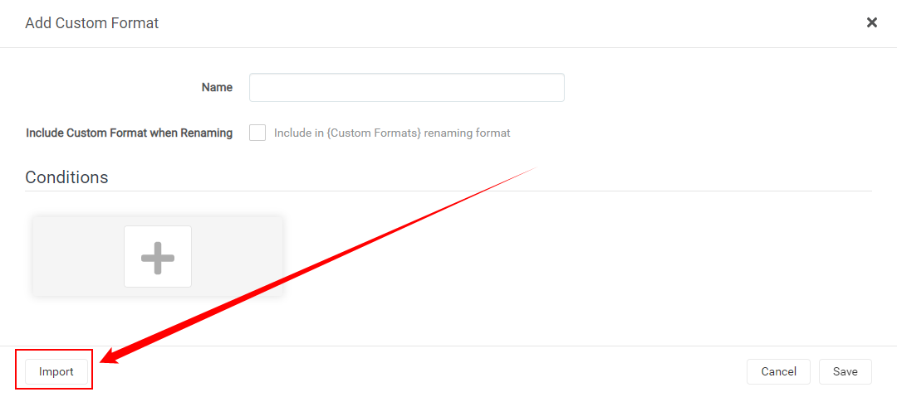
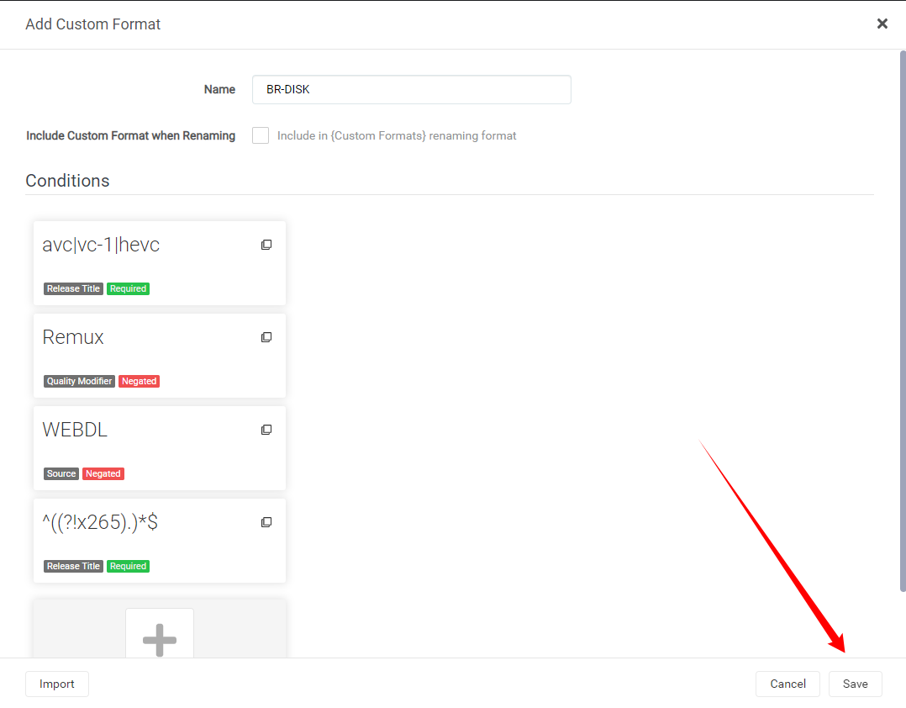
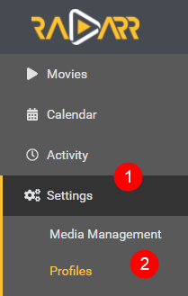
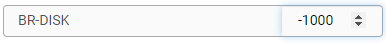
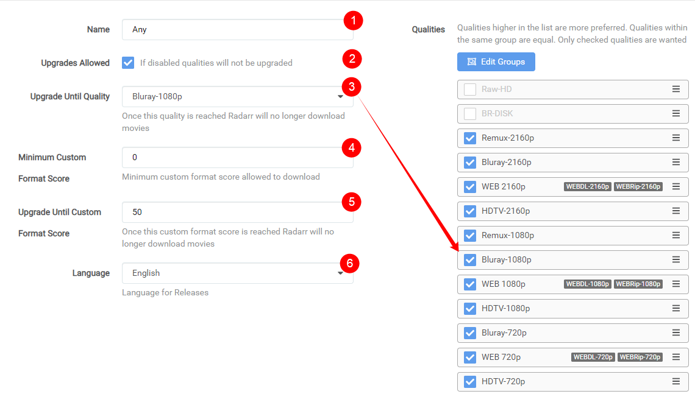

## How to import/export Custom Formats and truly make use of it

Here I will try to explain how you can import Custom Formats for Radarr v3 (Aphrodite) and make the most use of it.
> **Keep in mind Custom Formats are made to fine tune your Quality Profile !!!**
>
> **Meaning: Quality Profile trumps Custom Formats !!!**

- [How to import a JSON Custom Format](#how-to-import-a-json-custom-format)
- [How to make use of the Custom Formats in your profiles](#how-to-make-use-of-the-custom-formats-in-your-profiles)
- [Tips how to setup the scores](#tips-how-to-setup-the-scores)

## How to import a JSON Custom Format

In this example i will use the [BR-DISK](Collection-of-Custom-Formats-for-RadarrV3.md#br-disk) Custom Format the one most people don't want to download anyway and if you do then you probably don't use Radarr, Plex being both don't support it.

`Settings` => `Custom Formats`

 

Then Select a empty spot.

 

Followed by the `Import` in the lower left.

 

In the empty `Custom Format JSON` box (1) you just paste the `JSON` what you got from the [Custom Format Collection](https://github.com/TRaSH-/Tutorials-FAQ/blob/master/RadarrV3/Collection-of-Custom-Formats-for-RadarrV3.md) followed by the `Import` button (2).

> What you see in the red box is a example txt that you don't and can't remove!

 

After selecting the `Import` button you will get a screen that has all the Custom Formats variables filled in correctly,
all you need to do now is click on the `Save` button and you're done.

 

------

## How to make use of the Custom Formats in your profiles

Now we need to make use of the Custom Formats we've added.

`Settings` => `Profiles`

 

Then select the profile that you use/prefer.

The Custom Formats in the profiles needs editing on 2 spots.

First we're going to set the scores for the Custom Formats and for this we scroll all the way down.

And then we're going to set a score of `-1000` to the `BR-DISK` to make sure it will be ignored for ever and never going to go over the `Minimum Custom Format Score`.

 

After this we scroll all the way back up

 

>1. Profile name
>2. If you want that Radarr will upgrade till the quality set in (3.)
>3. Upgrade till the selected Quality
>4. The `Minimum Custom Format Score` allowed to download
>5. Keep upgrading Custom Format till this score is reached
>6. Your preferred language profile for your Releases

Being we set `BR-DISK` to `-1000` the chance that it will reach the `Minimum Custom Format Score` set in (4.) is really small.

**NOTE:**

> For Custom Formats you really don't want set it to something really low like `-1000` and not something like `-10` being when you add a Custom Format what you prefer and you set it to something like `+10` it could happen that the `BR-DISK` will be downloaded (-10)+(+10)=0 and your `Minimum Custom Format Scrore` is set at `0`.

------

## Tips how to setup the scores

Personally I would only add the Custom Formats you really are interested in especially in the beginning.

So now the question what's the best score setup ?

There isn't a best scores setup being that everyone has its own personal preference what they prefer Audio or Video or perhaps both.

My suggestion is to create tiers of scores based on what things matter to you.

Lets say you prefer HD audio (with object metadata)

`Basic Dolby Digital < AAC < Basic DTS < DTS-ES < Dolby Digital Plus < DTS-HD HRA < PCM = FLAC < DTS-HD MA < TrueHD (not ATMOS) < DD+ ATMOS (lossy) = ATMOS (indeterminate) < DTS X < TrueHD ATMOS`

In this example above I have lossy Atmos over lossless DTS because the object metadata matters more to me over lossy vs lossless

- Separate all your audio codecs by 100
- Separate special editions/hybrid/4k remaster, etc by 10
- Separate channel count by 5

keep in mind some scores could add up so keep that in mind (depending which Custom Formats you've added and use).

So it's important to keep this in mind when setting up your scores.

THNX:

> A big thnx to [rg9400](https://github.com/rg9400) for providing me with info needed to create the Tips secction.
