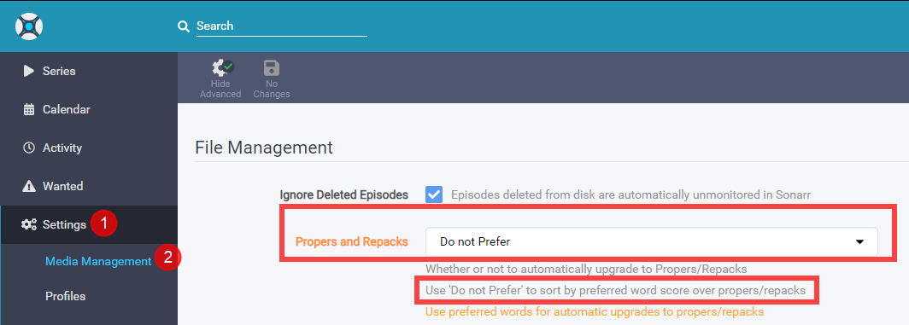
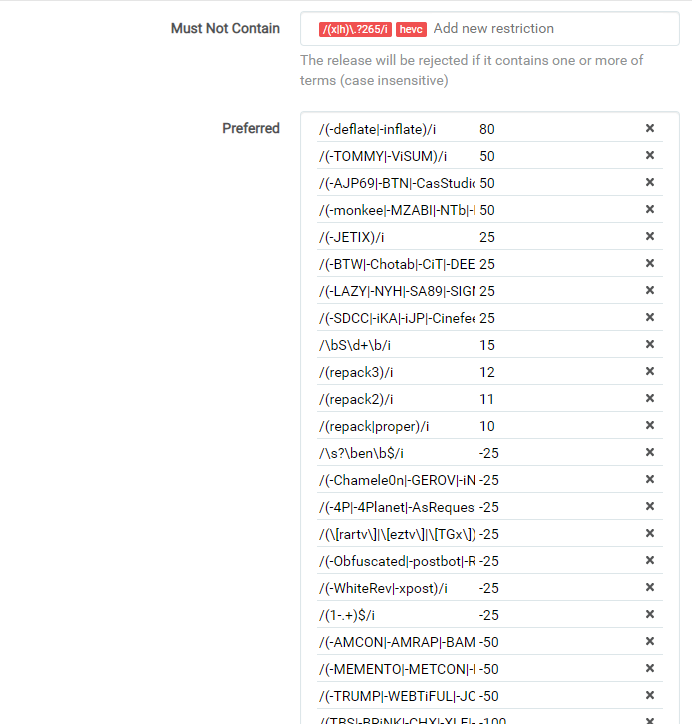
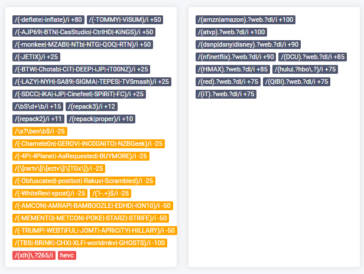

## Sonarr Release Profile RegEx (WEB-DL)

(*the regex isn't mentioned anywhere, it's a hidden advanced feature*)

------

Sonarr V3 has a great feature called Release Profile.
With this option you can fine tune your preference.

The Release profile that we're going to use for this example is mainly to prefer P2P releases over Scene releases, (Scene releases are still being downloaded but upgraded).
So if you care less about quality then stop reading and don't use this guide.
Why ? Scene release always release in a rush to bring it out as fast as possible,
so I noticed  often that I got Repacks/Proper releases from them or from different groups and quality.
P2P releases are a bit smarter and work sort of together by not doing the same release.
Also I noticed that with some Scene releases the 5.1 audio was stripped out or converted to AAC audio.
And in my opinion the P2P are of better quality.
Theirs 1 Scene releaser that do bring out quality releases `-deflate/-inflate` .

> ***Keep in mind this list will be a constant work in progress because I will be updating it when it's needed***
> ***So best to set a notification for updates for this page.***

#### Update

A large portion of Amazon WEB-DLs in the last week have only had 192Kbps DD+5.1, because that's all Amazon made available initially. 
The proper 640Kbps DD+5.1 audio might appear a few hours later or a few months, but when they get updated the episodes will be REPACKED.

#### Propers and Repacks

First we're need to make sure a P2P release isn't being replaced by a Scene Repack/Proper release !

 

Settings => `Media Management`
Where we going to set it to `Do not Prefer`

Then we navigate in Sonarr to the Settings =>  `Profiles`

 

Then you will get a popup screen that will look like this =>

 

`Must Contain` => add words that the release name **MUST HAVE!**

`Must Not Contain` => add words that the release name **MUST NOT HAVE AND SO TO BE IGNORE!**

`Preferred` => add words you prefer with a certain score what you prefer more or upgrade.

`Include Preferred when Renaming` => When you add `{Preferred Words}` to your renaming scheme it will add this info.

`Indexers` => Specify what indexer the profile applies to.

`Tags` => create a tag so this is only used by shows that you give this tag or else it's global.

The Number between the **[**brackets**]** are the scores the release name will get during a automatic and manual search and with the use of the scores some releases will be preferred over others and even upgraded.

#### Release Source (Streaming Service)

```markdown
# Preferred (3)
 [100]   /(amzn|amazon).?web.?dl/i
 [100]   /(atvp).?web.?dl/i
  [90]   /(dsnp|dsny|disney).?web.?dl/i
  [90]   /(nf|netflix).?web.?dl/i
  [85]   /(DCU).?web.?dl/i
  [85]   /(HMAX).?web.?dl/i
  [75]   /(hulu|.?hbo\.?)/i
  [75]   /(red).?web.?dl/i
  [75]   /(QIBI).?web.?dl/i
  [75]   /(iT).?web.?dl/i
```

> Also check mark `Include Preferred when Renaming` and add `{Preferred Words}` to your renaming scheme when you get download loop issues!!!
>
> What it does:
>
> When enabled the block with the [Release Source (Streaming Service)](#release-source-streaming-service) in it are then added to the file name which fixes any loops due to Sonarr seeing a new NF rip when an AMZN rip is found.
> Probably doesn’t happen if cutoff is met, but for anything that is unmet or any forced searches it results in a loop because NF is not in Sonarr’s copy so it upgrades, and loops.
> Enabling the include in preferred words for AMZN and adding that to the file name fixes that.
>
> Example of a naming scheme for series:
>
> `{Series TitleYear} - S{season:00}E{episode:00} - {Episode CleanTitle} {[Quality Full]}{[MediaInfo Simple]}{[Preferred Words]}{-Release Group}`
>

#### P2P + Scene Groups

```markdown
# Must Not Contain (2)
/(x|h)\.?265/i, hevc

# Preferred (3)
  [80]   /(-deflate|-inflate)/i
  [50]   /(-AJP69|-BTN|-CasStudio|-CtrlHD|-KiNGS)/i
  [50]   /(-monkee|-MZABI|-NTb|-NTG|-QOQ|-RTN)/i
  [50]   /(-TOMMY|-ViSUM|-T6D)/i
  [25]   /(-BTW|-Chotab|-CiT|-DEEP|-iJP|-iT00NZ)/i
  [25]   /(-LAZY|-NYH|-SA89|-SIGMA|-TEPES|-TVSmash)/i
  [25]   /(-SDCC|-iKA|-iJP|-Cinefeel|-SPiRiT|-FC)/i
  [25]   /(-JETIX|-Coo7|-WELP|-KiMCHI|-BLUTONiUM)/i
  [25]   /(-orbitron|-ETHiCS|-RTFM|-PSiG)/i
  [12]   /(repack3)/i
  [11]   /(repack2)/i
  [10]   /(repack|proper)/i

  [-50]  /(-AMCON|-AMRAP|-BAMBOOZLE|-EDHD|-ION10)/i
  [-50]  /(-MEMENTO|-METCON|-POKE|-STARZ|-STRiFE)/i
  [-50]  /(-TRUMP|-WEBTiFUL|-JOMT|-APRiCiTY|-HILLARY)/i
  [-50]  /(-SQUEAK|-KOMPOST|-WNN|-LiGATE|-BTX|-ALiGN)/i
  [-50]  /(-BLACKHAT|-BEA|-N3TFL1X|-EYEZ)/i
 [-100]  /(TBS|-BRiNK|-CHX|-XLF|-worldmkv|-GHOSTS)/i
 [-100]  /(-VIDEOHOLE)/i
```

#### Optional preferred preferences

```markdown
# Optional (use these only if you dislike renamed and retagged releases)
  [-25]  /(\[rartv\]|\[eztv\]|\[TGx\])/i
  [-25]  /(-4P|-4Planet|-AsRequested|-BUYMORE)/i
  [-25]  /(-Chamele0n|-GEROV|-iNC0GNiTO|-NZBGeek)/i
  [-25]  /(-Obfuscated|-postbot|-Rakuv|-Scrambled)/i
  [-25]  /(-WhiteRev|-xpost)/i
# Optional (matches releases that ends with EN)
  [-25]  /\s?\ben\b$/i
# Optional Matches any release that contains '1-' as prefix for Release Groups
  [-25]  /(1-.+)$/i
# Optional Matches Season Packs (use this if you prefer Season packs)
  [15]   /\bS\d+\b(?!E\d+\b)/i
```

#### A little explanation of the scores and why

Scores [75]-[100] Release Source.
Scores [25]-[50] P2P Groups.
Scores [10] Give a repack/proper a higher score but don't trump P2P groups for a Scene fix.

Scores [-25] Retagged/Renames/Obfuscated  releases.
> *If you're getting often a error message like* `Has the same filesize as existing file` *you might need to consider to remove the [-25].*

Scores [-50] Scene groups.
Scores [-100] Groups that mess with the audio or add another preferred language.

Optional => We've tested it and it worked for what we've tested it on, if it will work in your situation we don't know if you notice something wrong just contact me and we will try to fix it or remove it.

The reason why I got multiple entry's with the same score is because the line will go out of the box and I don't like how that looks.

#### Final Results

When you've done it correctly it will look something like this.

 

And after you clicked on `Save` it will look something like this:

 

------

> *This list is made by collecting information from Sonarr Discord Channel,*
> *and personal testing and a few others that helped.*
> *So I want to thnx everyone who helped to make this list possible,*
> *For privacy reasons I decided not to add the names/nick of the persons.*
> *If you want to be mentioned please message me on discord,*
> *including a link for proof to what part you want to be credited.*

------

### Why Not x265

Then the question why I put `/(x|h)\.?265/i` as `Must Not Contain`.
Luckily someone else on Discord described it nice and correctly in my opinion.

```
x265 is good for 4k remuxes.
If the media isn't source quality/remux, then there will be a loss of quality every time.
Also, once you go x265, typically that file is done.
It can't be changed to something else without a huge loss of quality.

Something like 95% of video files are x264 and have much better direct play support.
If you have more than a couple users,
you will notice much more transcoding.
Just depends on your priorities.

So basically if you are storage poor and just need to save space, use x265.
The catch is if you want best quality x265, you need source quality files, so you still have huge file sizes.
If you want maximum compatibility and the option to change your files to something else later,
then x264.
It's all really dependent on specific situations for different people
```

#### Some extra info about 4K/X265

> Source: Plex, [4k, transcoding, and you - aka the rules of 4k - a FAQ](https://forums.plex.tv/t/plex-4k-transcoding-and-you-aka-the-rules-of-4k-a-faq/378203)
>
> 1. Don’t bother transcoding 4k
> 2. If you cannot direct play 4k, then perhaps you should not even be collecting 4k.
> 3. If you don’t have the storage space for a copy of both 4k and 1080/720, then perhaps you should not even be collecting 4k.
> 4. To avoid transcoding for remote and non-4k clients, keep your 4k content in separate plex libraries.
> 5. This may of course mean that you keep a 4k copy and a 1080/720 copy, but if you are collecting 4k content then you should not be worried about storage space, should you?

