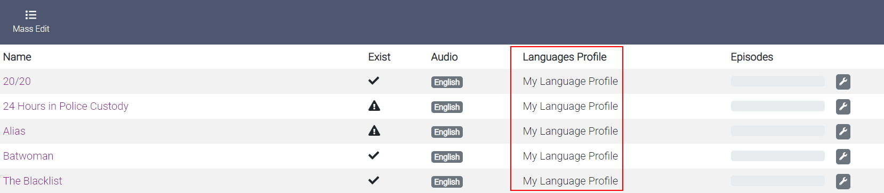

# After Install Configuration

After you've installed everything it's best to check all of your settings,

!!! warning

    Bazarr only searches for subs of Episodes and Movies that are added after the installation.

    So you will need to set the preferred languages for your existing Shows and Movies.

In this example, we will show you how to do that with a series.

click on `Mass Edit`

1. Select all.
1. Select the Language Profile you created earlier.
1. Click on `Save`.

Then go back to your Movies home screen and do the same for your Movies.
If you've done it correctly you will get something that looks like the following screenshot with your preferred languages.

