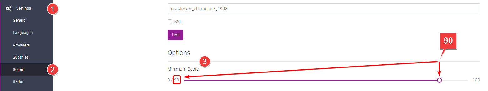
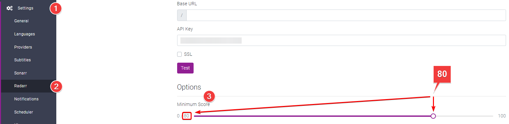
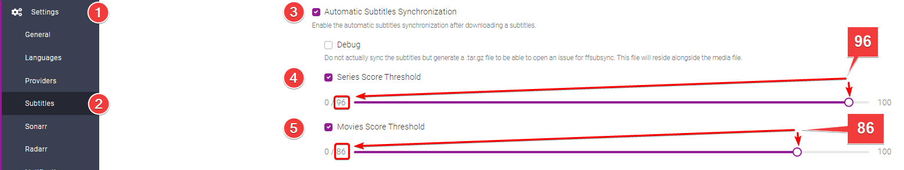

# Suggested Scoring

You just set up Bazarr and wonder which scoring you should use/set up for your subtitles and sync?

We're going to suggest a scoring for what would work with the most common languages, with this scoring 99% of your downloaded subs should be the correct ones for your release.

- Setting it too low could result in bad subs or completely out of sync and un-syncable.
- Setting too high could result in fewer subs.

## Sonarr Subtitle Minimum Score

`Settings` => `Sonarr`

Set the Minimum Score to `90`

This score is the minimal score that the subs should match for your release, settings this too low could result in bad subs or completely out of sync and un-syncable.

## Radarr Subtitle Minimum Score

`Settings` => `Radarr`

Set the Minimum Score to `80`

This score is the minimal score that the subs should match for your release, settings this too low could result in bad subs or completely out of sync and un-syncable.

## Synchronization Score Threshold

`Settings` => `Subtitles`

- Enable `Automatic Subtitles Synchronization` in step 3.
- Enable `Series Score Threshold` in step 4 and set the score to `96`.[^1]
- Enable `Movies Score Threshold` in step 5 and set the score to `86`.[^1]

This will set the Synchronization Score Threshold, meaning at which score Bazarr will sync the subtitles.

!!! info

    The synchronization is "best effort", based on the following.

    - it uses the embedded subtitles track as a reference, if not present.
    - it needs to extract the audio track and analyze it to define the start of sentence markers.

[^1]:
    Why not set the Synchronization Score to max?
    It's kinda useless to start with why would you want to try to sync perfectly matching subs in the first place?

    We noticed that when setting it to high 98-100 we would get subs that are actually 1 second to slow/fast.

--8<-- "includes/support.md"
