# Setup Guide

!!! note

    In this guide we will try to explain the basic setup you need to do to get started with Bazarr.
    For a more detailed few of all the setting check the following [LINK](https://wiki.bazarr.media/Additional-Configuration/Settings/){:target="_blank" rel="noopener noreferrer"}.

Before Bazarr works we need to set up and configure a few settings.

After installation and starting up, you open a browser and go to <http://ip_where_installed:6767>.

---

## Sonarr

First we're going to set up Sonarr.

`Settings` => `Sonarr`

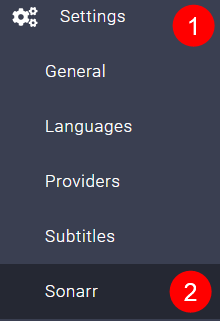

### Use Sonarr

Click on `Enabled`

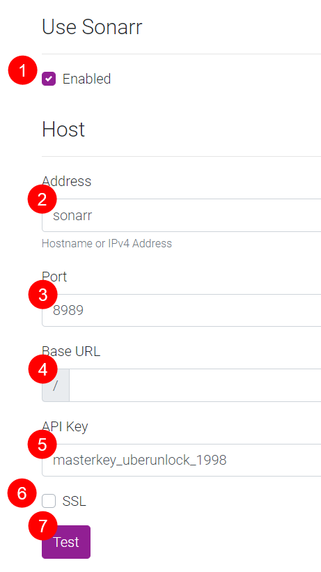

1. Enable Sonarr.
1. Enter the hostname or the IP address of the computer running your Sonarr instance.

    !!! info

        **Be aware that when using Bazarr in docker, you cannot reach another container on the same Docker host using the loopback address (ex.: 127.0.0.1 or localhost). Loopback address refers to the Bazarr Docker container, not the Docker host.**

1. Enter the TCP port of your Sonarr instance. Default is 8989.
1. Sonarr uses the Base URL _ONLY_ if used with a "Reverse Proxy" (ex: Nginx Proxy Manager or SWAG) and MUST have a leading slash if it is needed (ex: /sonarr).

    !!! info

        **If you don't use a reverse proxy or don't know what it is leave this empty!!!**

1. Enter your Sonarr API key here.
1. Enable this if your Sonarr instance is exposed through SSL.

    !!! info

        **Not needed if you reach it with a local IP address.**

1. Click the `Test` button after filling in all the fields. Make sure the test is successful before you proceed.

### Options (Sonarr)

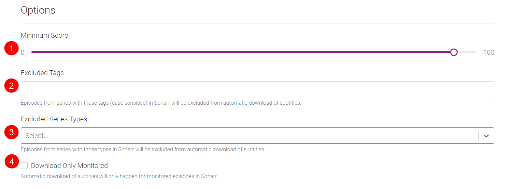

1. Select the minimum score (in percentage) required for a subtitle file to be downloaded.

    !!! info

        **Are your subs often out of sync or just bad? Raise the score!**

1. Episodes from series with those tags (case sensitive) in Sonarr will be excluded from automatic downloading of subtitles. In Sonarr you add a custom tag to a show, in this case the shows with these tags will be ignored by Bazarr.

1. Episodes from series with these types in Sonarr will be excluded from automatic downloading of subtitles.

    Options: `Standard`, `Anime`, `Daily`

1. Automatic downloading of subtitles will only happen for monitored shows/episodes in Sonarr.

### Path Mappings (Sonarr)

!!! note

    You should only use this section if Sonarr and Bazarr use a different path to access the same files.

    (for example if you run Sonarr on a different device than Bazarr or have a Synology and mix packages with Docker.)

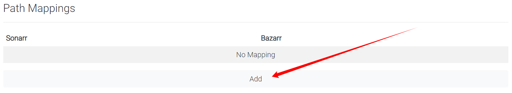

Click on `Add` and you will get an extra option

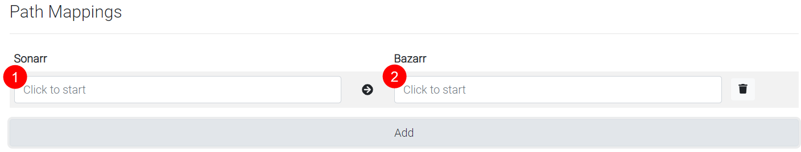

1. Here you enter the path that Sonarr uses to access your shows.
1. Here you enter the path that Bazarr uses to access your shows.

!!! warning

    **IF YOU HAVE THE SAME VALUES ON BOTH SIDES THEN YOU DON'T NEED IT!!!**

    **IT SHOULD ALSO BE REMOVED OR ELSE YOU WILL GET AN ERROR.**

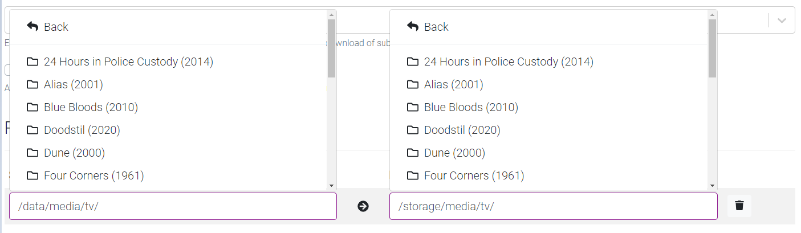

!!! info

    *If everything runs on Docker you normally don't need to use this except if you got messed up paths and then it would be smarter to fix those first to have consistent and well-planned paths.*

    Please take a look at TRaSH's Hardlink Tutorial <https://trash-guides.info/hardlinks>

!!! danger "Don't forget to save your settings!!!"

    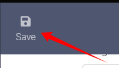

---

## Radarr

Next, we're going to set up Radarr.

`Settings` => `Radarr`

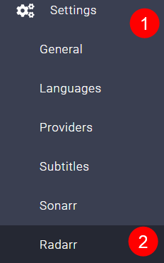

### Use Radarr

Click on `Enabled`

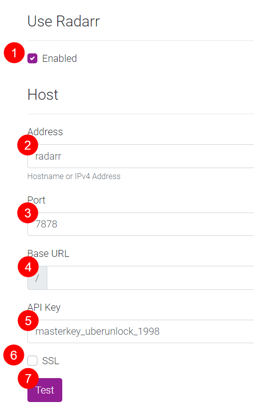

1. Enable Radarr.
1. Enter the hostname or the IP address of the computer running your Radarr instance.

    !!! info

        **Be aware that when using Bazarr in docker, you cannot reach another container on the same Docker host using the loopback address (ex.: 127.0.0.1 or localhost). Loopback address refers to the Bazarr Docker container, not the Docker host.**

1. Enter the TCP port of your Radarr instance. Default is 7878.
1. Radarr uses the Base URL _ONLY_ if used with a "Reverse Proxy" (ex: Nginx Proxy Manager or SWAG) and MUST have a leading slash if it is needed (ex: /radarr).

    !!! info

        **If you don't use a reverse proxy or don't know what it is leave this empty!!!**

1. Enter your Radarr API key here.
1. Enable this if your Radarr instance is exposed through SSL.

    !!! info

        **Not needed if you reach it with a local IP address.**

1. Click the `Test` button after filling in all the fields. Make sure the test is successful before you proceed.

### Options (Radarr)

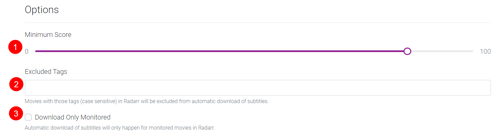

1. Select the minimum score (in percentage) required for a subtitle file to be downloaded.

    !!! info

        **Are your subs often out of sync or just bad? Raise the score!**

1. Movies with those tags (case sensitive) in Radarr will be excluded from the automatic downloading of subtitles. In Radarr you add a custom tag to a movie.

1. Automatic downloading of subtitles will only happen for monitored movies in Radarr.

### Path Mappings (Radarr)

!!! note

    You should only use this section if Radarr and Bazarr use a different path to access the same files.

    (for example, if you run Radarr on a different device than Bazarr or have a Synology and mix packages with Docker.)

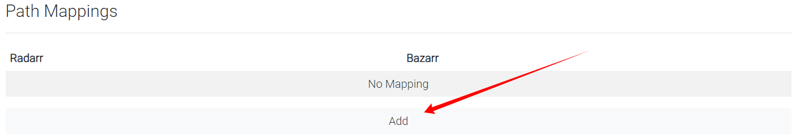

Click on `Add` and you will get an extra option

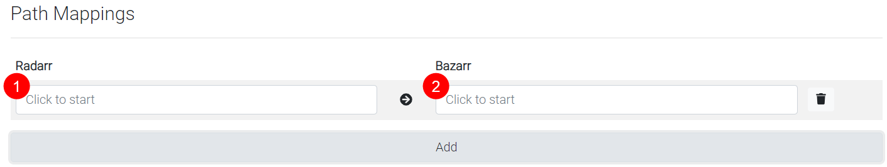

1. Here you enter the path that Radarr uses to access your movies.
1. Here you enter the path that Bazarr uses to access your movies.

!!! warning

    **IF YOU GOT THE SAME VALUES ON BOTH SIDES THEN YOU DON'T NEED IT!!!**

    **IT SHOULD ALSO BE REMOVED OR ELSE YOU WILL GET AN ERROR.**

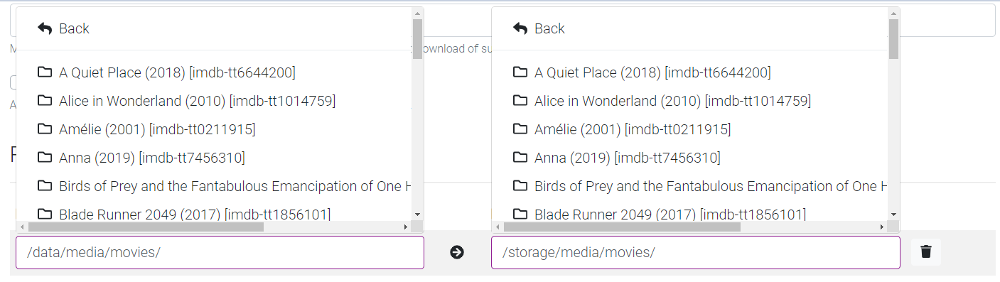

!!! info

    *If everything runs on Docker you normally don't need to use this except if you got messed up paths and then it would be smarter to fix those first to have consistent and well-planned paths.*

    Please take a look at TRaSH's Hardlink Tutorial <https://trash-guides.info/hardlinks>

!!! danger "Don't forget to save your settings!!!"

    

---

## Languages

Here we're going to configure which subtitle languages you prefer/want.

`Settings` => `Languages`

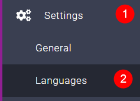

### Subtitles Language

!!! warning

    **We don't recommend enabling the `Single Language` option unless required (ie: media player not supporting language code in subtitles filename). Results may vary.

    Be aware the language code (ex.: en) is not going to be included in the subtitles file name when enabling this.**

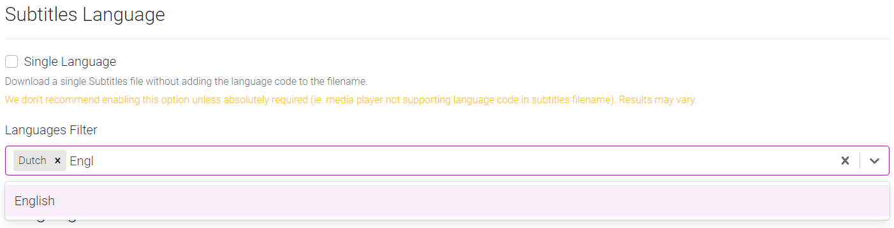

Here you select which languages you want for your subtitles, you can just start typing your language name and it will show you what's available.

These languages are the subtitle languages you later use for the `Languages Profiles`

In this example, we've selected `Dutch` and `English`.

### Languages Profiles

Select `Add New Profile`

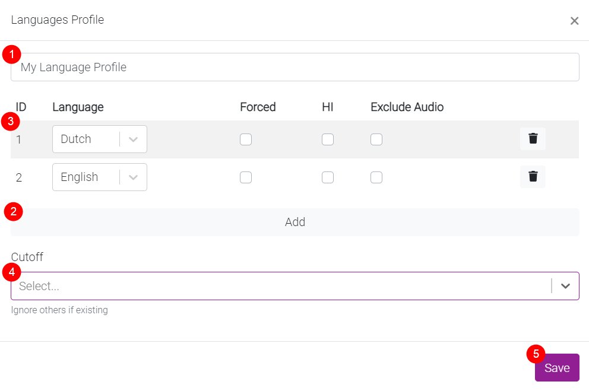

1. How you want to name your Language Profile.
1. Click on `Add` to add the languages you enabled earlier in [Subtitle Language](#subtitles-language).
1. Select the languages you want to enable for your profile (Including the optional settings).
    - Forced => [FAQ - What are Forced Subtitles](https://wiki.bazarr.media/Troubleshooting/FAQ/#what-are-forced-subtitles){:target="\_blank" rel="noopener noreferrer"}
    - HI => Hearing Impaired
    - Exclude Audio => Exclude if matching audio
1. Optional select the cutoff where you want Bazarr to stop downloading other languages.
1. Save your settings.

??? info "Cutoff"

    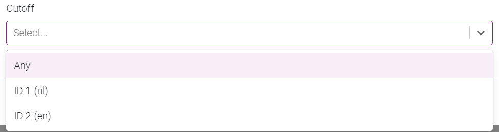

    So you can have a profile that states: English, Dutch, German, French
    With cutoff Dutch, if it finds Dutch, it will download it and call it a day.
    If no Dutch is found it will continue searching the other languages till Dutch is found.

### Default Settings

Automatically applied `Languages Profiles` to Series and Movies added to Bazarr **after** enabling this option.

!!! danger "Don't forget to Save your settings !!!"

    

---

## Providers

Here we're going to select which subtitle providers you want to use.

`Settings` => `Providers`

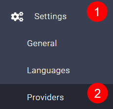

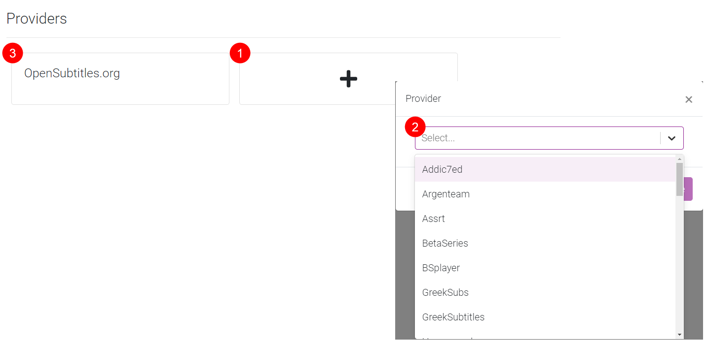

1. Click on the Plus sign box.
1. Select the subtitle providers you would like to enable. It is best to select multiple providers and create/use an account with them especially when you got a lot of wanted subtitles. Some subtitle providers require an extra paid Anti-Captcha Service.
1. Your enabled providers.

!!! tip

    If possible don't forget to support them for their free service

!!! danger "Don't forget to save your settings!!!"

    

---

## Subtitles

Here we will configure some extra settings for your subtitles

`Settings` => `Subtitles`

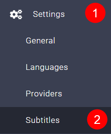

### Subtitle Options

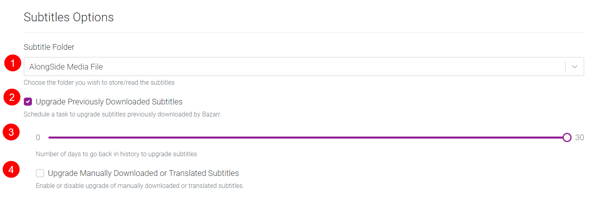

1. Where you want your subtitles it's recommended to put them `AlongSide Media File`.
1. If you want to upgrade previously downloaded subtitles.
1. How many days to go back in history for upgrading?
1. If you want to upgrade manually downloaded subtitles.

### Anti-Captcha Options

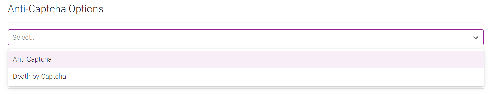

Here you can select which Anti-Captcha provider you want to use.

[Why (or) do I need the Anti-Captcha ?](https://wiki.bazarr.media/Troubleshooting/FAQ/#why-or-do-i-need-the-anti-captcha){:target="\_blank" rel="noopener noreferrer"}

!!! tip

    We recommend the following provider => <https://anti-captcha.com/>

### Performance / Optimization

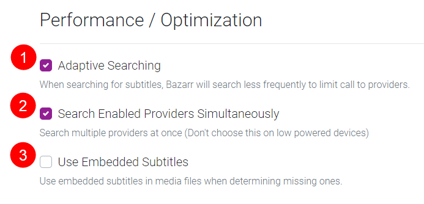

1. When searching for subtitles, Bazarr will search less frequently to limit calls to providers.
1. Search multiple providers at once (don't choose this on low-powered devices).
1. If you want to use the embedded subtitles in the media files [More Info](https://wiki.bazarr.media/Additional-Configuration/Settings/#use-embedded-subtitles){:target="\_blank" rel="noopener noreferrer"}

### Automatic Subtitles Synchronization

Enable this option for automatic subtitles synchronization.

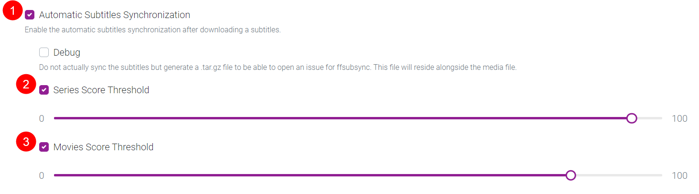

!!! danger "Don't forget to save your settings!!!"

    

---

Now wait until Bazarr gets all the info needed from Sonarr/Radarr.

## IMPORTANT

!!! tip

    **Don't forget [After Install Configuration](/Bazarr/After-install-configuration/)!!!**

---

If you still have questions please check the [Troubleshooting](https://wiki.bazarr.media/Troubleshooting/Asking-for-help-or-report-a-problem/){:target="\_blank" rel="noopener noreferrer"} section in the wiki.
For more info about the other settings check the [Settings](https://wiki.bazarr.media/Additional-Configuration/Settings/){:target="\_blank" rel="noopener noreferrer"} wiki.
