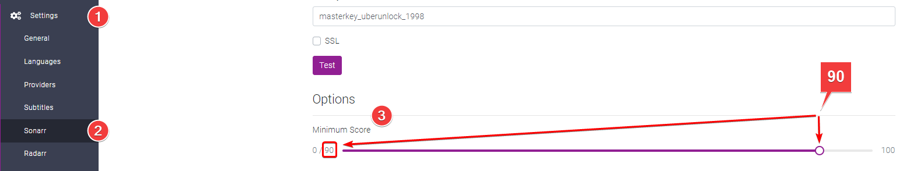
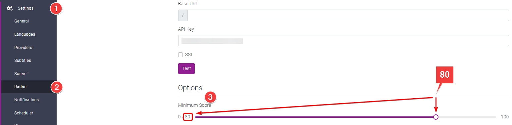
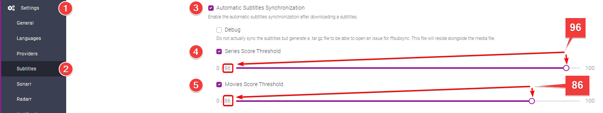

# Suggested Scoring

You just setup Bazarr and wonder which scoring you should use/setup for your subtitles and sync  ?

I'll going to suggest here a scoring what would work for most common languages, with this scoring 99% of your downloaded subs should be the correct ones for your release.

- Setting it to low could result in bad subs or completely out of sync and un-syncable.
- Setting to high could result in less subs.

## Sonarr Subtitle Minimum Score

`Settings` => `Sonarr`

Set the Minimum Score to `90`

This score is the minimal score that the subs should match to for your release, settings this to low could result in bad subs or completely out of sync and un-syncable.

## Radarr Subtitle Minimum Score

`Settings` => `Radarr`

Set the Minimum Score to `80`

This score is the minimal score that the subs should match to for your release, settings this to low could result in bad subs or completely out of sync and un-syncable.

## Synchronization Score Threshold

`Settings` => `Subtitles`

- Enable `Automatic Subtitles Synchronization` at step 3.
- Enable `Series Score Threshold` at step 4 and set the score to `96`.[^1]
- Enable `Movies Score Threshold` at step 5 and set the score to `86`.[^1]

This will set the Synchronization Score Threshold, meaning at which score bazarr will sync the subtitles.

!!! info
    The synchronization is best effort based on the following.

    - it use the embedded subtitles track as reference, if not present.
    - it needs to extract the audio track and analyze it to define start of sentence markers.

[^1]:
    Why not set the Synchronization Score to max?
    It's kinda useless to start with why would you want to try to sync perfectly matching subs in the first place ?

    I personally noticed that when setting it to high 98-100 I would actually get subs that are like 1 second to slow/fast.

--8<-- "includes/support.md"
