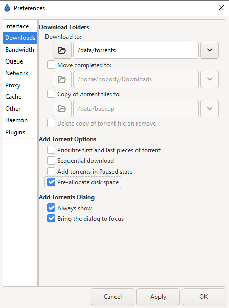
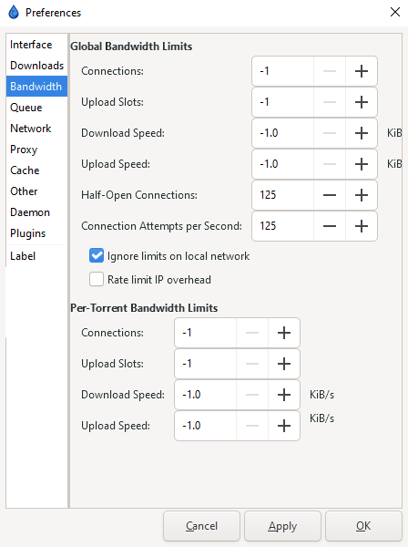
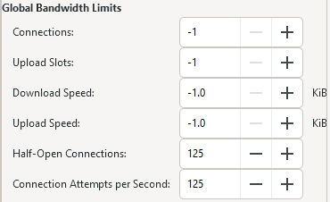
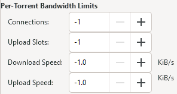
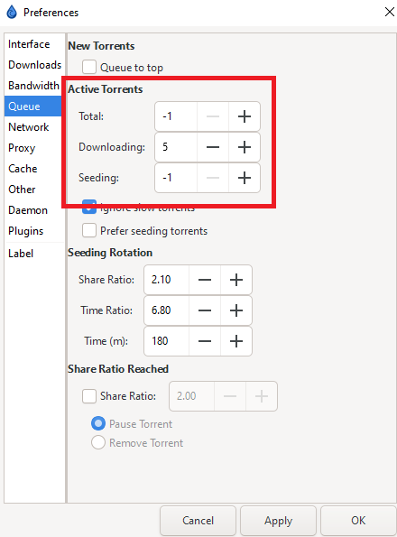
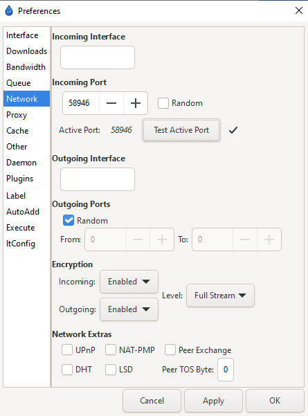
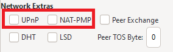
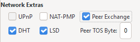
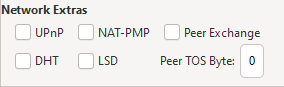
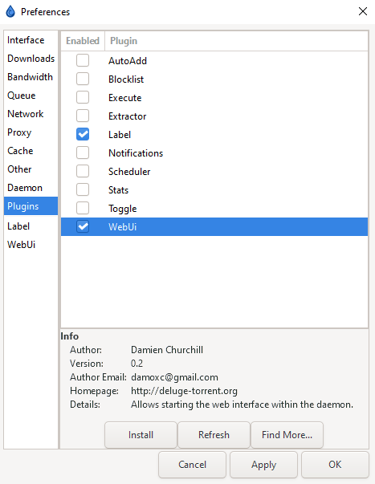

# Basic-Setup

{! include-markdown "../../../includes/downloaders/basic-setup.md" !}

---

!!! Note

    Settings that aren't covered means you can change them to your liking or just leave them on default.

---

## Accessing your settings

`Edit` => `Preferences` will bring up your option window once you have launched Deluge for the first time.

## Downloads

Once you are here, you can edit your download settings in the `Downloads` section.

### Download Path

`Download to` is where you want you want Deluge to download your media. If you want to move your files upon completion - check the box and enter a path for that option as well.

### Saving .torrent Copies

Copy (and delete upon removal) of the .torrent file upon completion.

!!! success ""

    **Suggested: `Personal preference`**

### Pre-allocated Files

Pre-allocate disk space for the added torrents. This limits fragmentation and also makes sure if you use a cache drive or a feeder disk, that the space is available.

!!! success ""

    **Suggested: `Enabled`**

!!! warning

    Do not set Pre-allocated disk space if you are using ZFS as your filesystem as ZFS [does not support fallocate](https://github.com/openzfs/zfs/issues/326){:target="\_blank" rel="noopener noreferrer"}

{! include-markdown "../../../includes/downloaders/warning-path-location.md" !}

---

## Bandwidth

Here you can set your rate limits, meaning your maximum download/upload/connections.

!!! info

    In Deluge, the value of `-1` is used for "infinity" or "unlimited".

The best settings depend on many factors.

- Your ISP speed.
- Your hardware.
- Bandwidth needed by other services in your home network.

!!! success ""

    **Suggested:** `For a home connection that you use with others it's best practice to set the upload/download rate to about 70-80% of your maximum upload/download speed.`

## Global Bandwidth Limits

These are the client-wide settings, they will apply to the total traffic of all torrents.

!!! tip

    The only thing you NEED to place a limit on is half-open connections and connections per second.

    For most high-speed broadband connections ~100-150 seems ideal. If you experience lag when initiating a download, try lowering these values.

### Per-Torrent Limits

In addition to global limits, you can set limits per torrent.

!!! info

    If you only wish to apply global limits, set all of these to `-1`.

---

## Queue

These settings are intended to manage your number of active seeds, downloads, and uploads.

!!! info

    In Deluge, the value of `-1` is used for "infinity" or "unlimited".

### Active Torrents

Unless you have a specific reason, `Total` can be set to `-1`. These are torrents seen as seeding by the tracker.

`Seeding` is the number of active torrents uploading, and `Downloading` is the number of concurrently downloading torrents.

### Seeding Rotation & Share Ratio

I recommend using the seeding goals in your Starr Apps indexer settings (enable advanced) to remove completed downloads. These sections are then not necessary.

---

## Network

This is where you will bind Deluge to a specific interface/address, specify port usage, and disable network protocols.

### Incoming Port

!!! info ""

    You've followed the [Setup TorGuard for port forwarding](/Misc/How-to-setup-Torguard-for-port-forwarding/){:target="\_blank" rel="noopener noreferrer"} and want to know where in your download client you should add the port you've port forwarded.

`Incoming Port` should be set to a specific port that you have opened/forwarded (if you are behind any NAT/Firewall/VPN.)

!!! WARNING

    Default ports of 6880-6890 are not recommended.

Make sure you click `Test Active Port` and get a ✓ before moving on.

!!! success ""

    **Suggested: `Critical`**

### Encryption

Encryption should be enabled on both `Incoming` and `Outgoing`. The default `Level` of `Either` will accept both encrypted and standard connections.

!!! success ""

    **Suggested: `Level = Full Stream`**

### Network Extras

You can configure your network protocols in this section. Depending on which type of tracker you use, some of these will be beneficial while on other trackers (private) it will put you at risk of being banned/disabled.

!!! warning

    Please read this section carefully.

1. UPnP and NAT-PMP should be both disabled in your router, as well as in Deluge, as they can pose security risks.

    

    !!! success ""

        **Suggested: `Disabled`**

1. Public trackers can benefit from having settings like DHT (Distributed Hash Table) and Peer Exchange (PEX) enabled. These protocols rely on sources besides the trackers to get peers. **The following settings are recommended ONLY for public trackers.**

    

    !!! success ""

        **Suggested: `Recommended`**

1. Decent private trackers will use the "private flag" and ignore these settings by default. However, it is strongly recommended that you use the following settings if you use private trackers. Almost all private trackers have rules stating that you must disable DHT, PEX, and LSD/LPD (Local Peer Discovery). Failing to do so puts your account at risk of being disabled.

    

    !!! success ""

        **Suggested: `Disabled`**

---

## Plugins

Finally, you will want to enable some plugins. There are plenty of plugins on the Deluge community forums to browse once you are familiar with the client, but for the time being, we will only be covering the `WebUI` and `Label` plugins to get started.

!!! tip

    If you are familiar with the client and plugins you can find more information [here](./Tips/Plugins.md)

!!! info

    If you are running a docker container, such as binhex's image, the `WebUI` plugin may not need to be enabled. Instead, it may be configured in the container.

### WebUI

Once you have enabled the `WebUI` plugin, it will appear in your `Preferences` menu list, and you will need to enable the web interface and set the port you want the WebUI to listen on.

!!! info

    The default WebUI password is `deluge` and you can change that in preferences inside the WebUI once you access it through your browser.

    Remember your password, we will need this later.

### Label

The `Label` plugin will allow you to categorize/sort your torrents. You can assign one Label per torrent. Starr apps can also use Deluge's labels to help them keep track of downloads and imported torrents.

Labels are a valuable tool, if used properly, to keep your torrents managed and organized.

--8<-- "includes/support.md"
