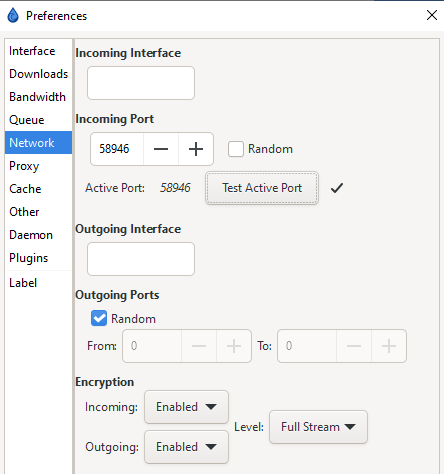

# Port Forwarding

<!--@include: ../../../includes/downloaders/port-forwarding.md-->

---

## Client settings

The `Network` section of `Preferences` is where you will bind Deluge to a specific interface/address, and specify port usage.

## Incoming Port

`Incoming Port` should be set to a specific port that you have opened/forwarded (if you are behind any NAT/Firewall/VPN.)

::: warning

Default ports of 6880-6890 are not recommended.

:::

Make sure you click `Test Active Port` and get a ✓ before moving on.

::: tip

**Suggested: `Critical`**

:::

<!--@include: ../../../includes/support.md-->
