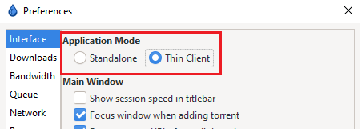
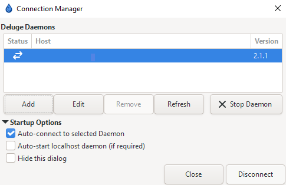

# Thin Client

## Daemon

If you are already running Deluge in `daemon` or `console` mode, or running via Docker, this is usually enabled by default. You will need to check your compose or core.conf for the "daemon_port" if you do not know it.

!!! tip

    You can also access the daemon settings in `Preferences` in the WebUI if you do not have access to the GTK/UI

You will need to have "Allow Remote Connections" enabled if you are not connecting to Deluge from localhost.

!!! info

    If you do not have access to the WebUI, and are instead doing this by editing Deluge's `core.conf`, you will need to change "allow_remote" to true.

    Restart Deluge for the changes to take effect.

---

## Switching to Thin-Client

Once your daemon (container for Docker) is up and running, it's time to set up the client you'll be using to manage your daemon. You'll need to [install Deluge](https://deluge-torrent.org/download/) on the computer _from which_ you want to manage the "main" instance of Deluge. This will usually be on a second computer, but if you wish to use Deluge with Thin-Client locally, to always seed in the background, that works as well.

Simply go to `Edit` => `Preferences` and switch from `Standalone` to `Thin Client`

Restart Deluge.

!!! info

    You will still need to set the daemon to run at start-up.

### Connections Manager

After switching to `Thin Client` you will need to connect to your daemon. Go to `Edit` => `Connections Manager` and click on `Add` to add the daemon.

!!! ATTENTION

    If you mistyped your password while adding the connection, it will prompt you to enter it. There is a bug that does not accept/save the correct password unless it is entered through the `Add`/`Edit` Menu.

    If you mistype the password while you are adding the connection, go to `Edit` on the connection and retype the password into the password field.

!!! WARNING

    You can find your users and passwords for the daemon in the `auth` file inside your appdata/config folder for Deluge.

    You can add users in the `Daemon` settings in preferences as well.

    BE AWARE: These passwords are stored in PLAIN-TEXT in your `auth` file.

{! include-markdown "../../../../includes/support.md" !}
