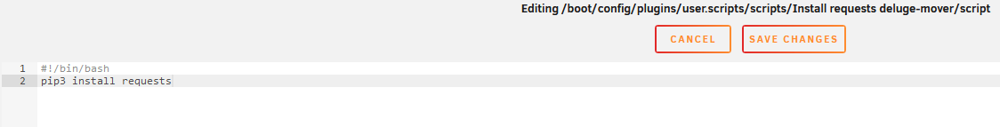

# unRAID Mover and Deluge

When you make use of the unRAID cache drive for your `/data/torrents` share, and the torrents in Deluge are still seeding, the mover can't move files since they are still in use.

Using the following instructions will allow you to move the files with the use of the Deluge JSON-RPC.

!!! abstract "Workflow Rules"

    1. Pause torrents in a specified age range that reside on your cache drive.
    1. Run the unRAID mover.
    1. Resume the torrents after the mover has completed.

!!! warning

    The screenshots below are only **EXAMPLES** to show you how it should look and where you need to place the data that you need to add. They are **NOT** always a 100% reflection of the actual data, and not always the actual values you need to add.

    - Always follow the recommendations described in the guide.
    - If you have any questions, or aren't sure, just click the chat badge to join the Discord Channel where you can ask your questions directly.

## Needed

### `deluge-mover` script

Download the following standalone Python script.

- [Script (deluge-mover.py)](https://raw.githubusercontent.com/zakkarry/deluge-mover/master/deluge-mover.py){:target="\_blank" rel="noopener noreferrer"}

Thanks to [zakary](https://github.com/zakkarry){:target="\_blank" rel="noopener noreferrer"} (Developer on [cross-seed](https://github.com/cross-seed/cross-seed){:target="\_blank" rel="noopener noreferrer"})

### Plugins

Install the following plugins:

- User Scripts
- You will need to manually install the following packages for the correct Slackware version from [https://packages.slackware.com/](https://packages.slackware.com/){:target="\_blank" rel="noopener noreferrer"}
    - python3
    - python-setuptools
    - python-pip

--8<-- "includes/downloaders/nerdtools-replacement-package-slackware.md"

---

## Setup

After you install the needed `Plugins` - it's time to configure everything.

### `requests` module

`deluge-mover.py` needs the requests Python module, so we need to make sure it's installed when your unRAID server starts, or when the Array is started the first time.

You can choose one of the following 3 options (select a tab) to install `requests`.

=== "User scripts"

    With this option, we're going to install the `requests` module when the Array is started the first time.

    In your unRAID Dashboard, go to your `Settings` tab and select `User Scripts` in the `User Utilities` section at the bottom.

    

    At the bottom of the `User Scripts` page select the `ADD NEW SCRIPT` button.

    

    A popup will appear asking you to name the script. For this example, we're going to use `Install requests (deluge-mover)` and then click on `OK`.

    

    Click on the cogwheel of the new script in the list, and select `Edit Script`.

    

    Copy/Paste the following in the new window that opens, then click `SAVE CHANGES`.

    ```bash
    #!/bin/bash
    pip3 install requests
    ```

    

    Select in the schedule list when the script should run, and choose `At First Array Start Only`.

    

    Click on `Apply`.

    Finally, you will need to choose `RUN IN BACKGROUND` or restart your unRAID server to install the `requests` module.

=== "Python venv"

    With this option, we're going to create a [Python virtual environment](https://docs.python.org/3/library/venv.html) on our disk. We will use this to run and store dependencies (`requests`) for this specific environment.

    By doing this, we will **only need to configure this once** and it will be persistent after reboots *(this differs from the previous steps)*.

    First, you need to choose a location to start a new Python environment.

    !!! info

        In the next steps, you will be asked to choose a [location to store the script](#copy-the-script-to-your-preferred-location), try to be consistent.

    Suggestions:

    - `/mnt/user/appdata/deluge/scripts/.venv`
    - `/mnt/user/data/scripts/.venv`

    Run the following command in unRAID's terminal in the directory you chose:

    ```bash
    python3 -m venv --clear /mnt/user/data/scripts/.venv
    ```

    We now need to enter this new environment and install our dependency (`requests`) in it, run:

    ```bash
    source /mnt/user/data/scripts/.venv/bin/activate
    pip3 install requests
    deactivate # to leave the environment
    ```

    !!! info

        Replace `/mnt/user/data/scripts/.venv` with the path you have chosen.

=== "Go File"

    With this option, we're going to install the `requests` module when the unRAID server is started.

    On your USB stick/key go to `/boot/config` and open the `go` file with your text editor ([VSCode](https://code.visualstudio.com/){:target="_blank" rel="noopener noreferrer"}/[Notepad++](https://notepad-plus-plus.org/downloads/){:target="_blank" rel="noopener noreferrer"}).

    Copy/paste the following command

    ```bash
    pip3 install requests
    ```

    Restart your unRAID Server or run the above command from the terminal.

---

### Script

Now, using your favorite text editor ([VSCode](https://code.visualstudio.com/){:target="\_blank" rel="noopener noreferrer"}/[Notepad++](https://notepad-plus-plus.org/downloads/){:target="\_blank" rel="noopener noreferrer"}) edit the script you downloaded at the beginning of the guide ([HERE](#deluge-mover-script)).

You only need to change a few options at the top of the script.

```python
### CONFIGURATION VARIABLES ###

# this webui will need to be the JSON-RPC endpoint
# this ends with '/json'
deluge_webui = "http://localhost:8112/json"
deluge_password = "deluged"

# this changes whether the actual cache drive is checked for
# applicable files to pause/move before pausing.
#
# if this is false, it will pause all torrents in the age-range
# instead of only torrents in that range that exist on the cache
check_fs = False

# if you are using the mover tuner and don't want to use it for
# this script, set this to true
#
# if you do not use mover tuner, leave this as false
use_mover_old = False

# this is the absolute host path to your cache drive's downloads
# you only need this to be changed/set if using 'check_fs = True'
cache_download_path = "/mnt/cache/torrents/completed"

# the age range of days to look for relevant torrents to move
# i dont recommend setting age_day_max to less than the schedule
# you run the script on...
#
# if you run every 7 days, this should be at least 7 to prevent
# files from being stuck on your cache forever
#
# 0 disables age_day_max
# set both age vars to 0 to move everything on your cache drive

age_day_min = 3
age_day_max = 0
```

- `deluge_webui` => The URL you use to access Deluge locally. (_the_ `"` _should remain_)
- `deluge_password` => Your Deluge WebUI `Password`. (_the_ `"` _should remain_)
- `check_fs` => If set to `True`, it will check for the file on the cache drive before pausing.
- `use_mover_old` => See below.

    !!! warning ""

        - If you do not use `Mover Tuning`, you **DO NOT** have to make any changes.
        - If you use `Mover Tuning` but **DON'T** want to use it for the script, change this to `True`
        - If you use `Mover Tuning` and **DO** want to use it for the script, you will not have to make any changes. However, for this option, inside the `Mover Tuner` you will need to set `Move Now button follows plugin filters` to `Yes` and `Disable Mover running on a schedule` to `No`.

- `cache_download_path` => The location (host path) for your cache folder (if check_fs is True)
- `age_day_min` => Set the minimum age (days) of the torrents that you wish to move.
- `age_day_max` => Set the maximum age (days) of the torrents that you wish to move.

#### Copy the script to your preferred location

Place the script you just edited somewhere easy to access/remember.

Suggestions:

- `/mnt/user/appdata/deluge/scripts/deluge-mover.py`
- `/mnt/user/data/scripts/deluge-mover.py`

#### Final steps

Set up the scheduler for when the mover should run.

In your unRAID Dashboard, go to your `Settings` tab and select `User Scripts` in the `User Utilities` section at the bottom.


At the bottom of the `User Scripts` page select the `ADD NEW SCRIPT` button.


A popup will appear asking you to name the script. For this example, we're going to use `deluge-mover` and then click on `OK`.


Click on the cogwheel of the new script in the list.


Choose your method (select a tab) and copy/paste the script in the new window that opens, then click `SAVE CHANGES`.
=== "Python (Native)"

    ``` bash
        #!/bin/bash
        /usr/local/emhttp/plugins/dynamix/scripts/notify -s "Deluge Mover" -d "Deluge Mover starting @ `date +%H:%M:%S`."
        echo "executing script to pause torrents and run mover."
        python3 /mnt/user/data/scripts/deluge-mover.py
        echo "deluge-mover completed and resumed all paused torrents."
        /usr/local/emhttp/plugins/dynamix/scripts/notify -s "Deluge Mover" -d "Deluge Mover completed @ `date +%H:%M:%S`."
    ```

=== "Python (venv)"

    ``` bash
        #!/bin/bash
        /usr/local/emhttp/plugins/dynamix/scripts/notify -s "Deluge Mover" -d "Deluge Mover starting @ `date +%H:%M:%S`."
        echo "executing script to pause torrents and run mover."
        /mnt/user/data/scripts/.venv/bin/python3 /mnt/user/data/scripts/deluge-mover.py
        echo "deluge-mover completed and resumed all paused torrents."
        /usr/local/emhttp/plugins/dynamix/scripts/notify -s "Deluge Mover" -d "Deluge Mover completed @ `date +%H:%M:%S`."
    ```

!!! info

    Replace `/mnt/user/data/scripts/` in the script with the path you have chosen for the Python script.


Click the schedule dropdown to choose when the script should run. We want to select `Custom`.


After changing to `Custom` you will get an extra text field on the right where you can set your schedule (cron).

For this example, we're going to tell the script to run every day at 4 AM.

`0 4 * * *`

You can generate your scheduling [HERE](https://crontab.guru/)


{! include-markdown "../../../../includes/support.md" !}
