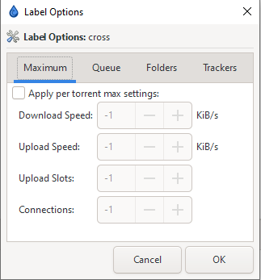

# Using Labels

## Labels

!!! info

    Labels are the equivalent of categories for qBittorrent, and how you can manage and organize your torrents in groups. Starr apps can use labels in Deluge to keep track of downloads to monitor, rather than watching every torrent in your client.

### Managing Labels

Once you have [enabled the `Label` plugin](./Basic-Setup.md#plugins), you simply right-click anywhere in the area occupied by the label index on the pane on the left and you will be presented with a menu to add/remove/edit a label or its options.

### Label Options

Each label can be customized by selecting the label, right-clicking, and going to its `Label Options`. Here you can specify the bandwidth settings, download location settings, and even seed goals.

!!! info

    In Deluge, the value of `-1` is used for "infinity" or "unlimited".

Below you see an example of the bandwidth options available for a specific label. These settings will be automatically applied as long as a torrent has this label.

If you want torrents to be moved upon completion to a specific folder, you can specify this in `Folder Options`. The torrent WILL need to finish downloading while under the label for this to happen.

!!! info

    Enabling a "Move completed to" for a label may require you to restart Deluge before it will take effect.

    Rechecking torrents will not trigger the "completion" call.

--8<-- "includes/support.md"
