# NZBGet - Basic Setup

!!! note "NZBGet development has been picked up again by new developers over at [github](https://github.com/nzbgetcom/nzbget){:target="\_blank" rel="noopener noreferrer"}!"

{! include-markdown "../../../includes/downloaders/basic-setup.md" !}

---

## Some Basics

| Name         | Description                                 |
| :----------- | :------------------------------------------ |
| `${MainDir}` | Root directory for all tasks.               |
| `${AppDir}`  | Where NZBGet is installed.                  |
| `${DestDir}` | Destination directory for downloaded files. |

## PATHS

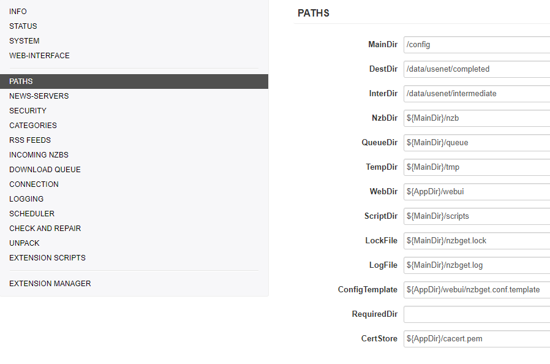

I will only explain the so-called most important paths.

| Name        | Description                                                                          |
| :---------- | :----------------------------------------------------------------------------------- |
| `MainDir`   | `/data/usenet`                                                                       |
| `DestDir`   | `${MainDir}` (so it will go in to `/data/usenet`)                                    |
| `InterDir`  | Files are downloaded into this directory (before unpack+par2)                        |
| `NzbDir`    | Directory for incoming nzb-files.                                                    |
| `QueueDir`  | This directory is used to save download queue, history, information statistics, etc. |
| `ScriptDir` | Directory with post-processing and other scripts.                                    |
| `LogFile`   | Where your log files will be stored (Please create a log directory in your config)   |

## NEWS-SERVERS

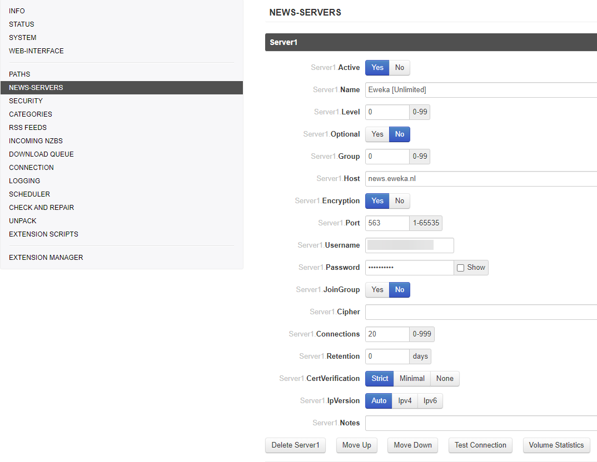

| Name          | Description                                                                                   |
| :------------ | :-------------------------------------------------------------------------------------------- |
| `Active`      | Use this news server.                                                                         |
| `Name`        | The name is used in UI and for logging. It can be any string.                                 |
| `Level`       | Put your major download servers at level 0 and your fill servers at levels 1, 2, etc..        |
| `Host`        | Host name of news server.                                                                     |
| `Port`        | Port to connect to.                                                                           |
| `Password`    | Password to use for authentication.                                                           |
| `Encryption`  | Encrypted server connection (TLS/SSL). (preferred to use this)                                |
| `Connections` | Use the lowest possible number of connections to reach your max download speed +1 connection. |
| `Retention`   | How long the articles are stored on the news server.                                          |

## CATEGORIES

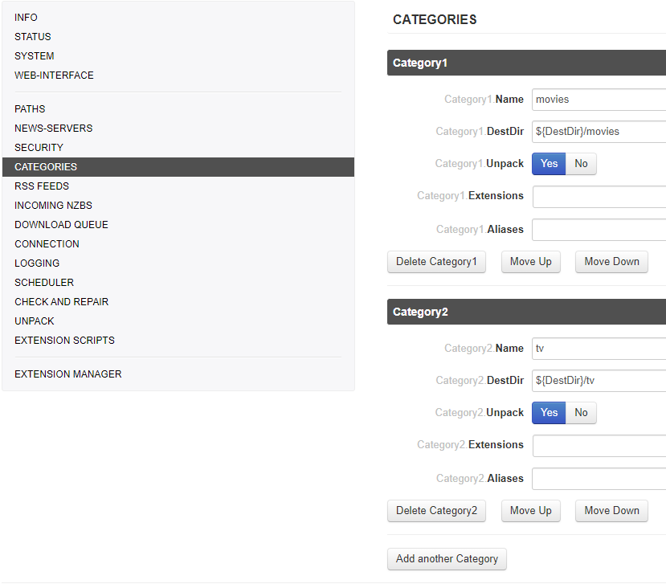

| Name         | Description                                                                            |
| :----------- | :------------------------------------------------------------------------------------- |
| `Name`       | This should match what you put in Sonarr/Radarr (tv/movies/sonarr/radarr/series/films) |
| `DestDir`    | `${DestDir}` Destination directory (/data/usenet/movies)                               |
| `Unpack`     | Unpack downloaded nzb-files.                                                           |
| `Extensions` | List of extension scripts for this category.                                           |

## INCOMING NZBS

!!! info

    `AppendCategoryDir`: Create a subdirectory with category-name in destination-directory.

## DOWNLOAD QUEUE

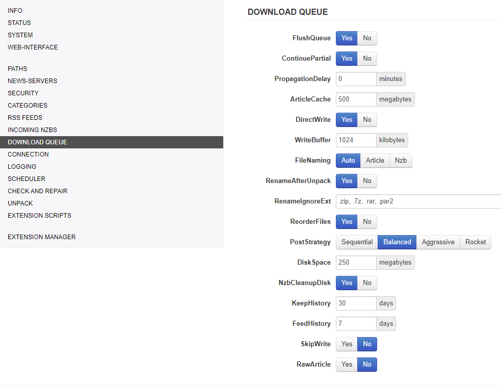

!!! warning

    `WriteBuffer`: If you're low on memory don't set this too high.

## LOGGING

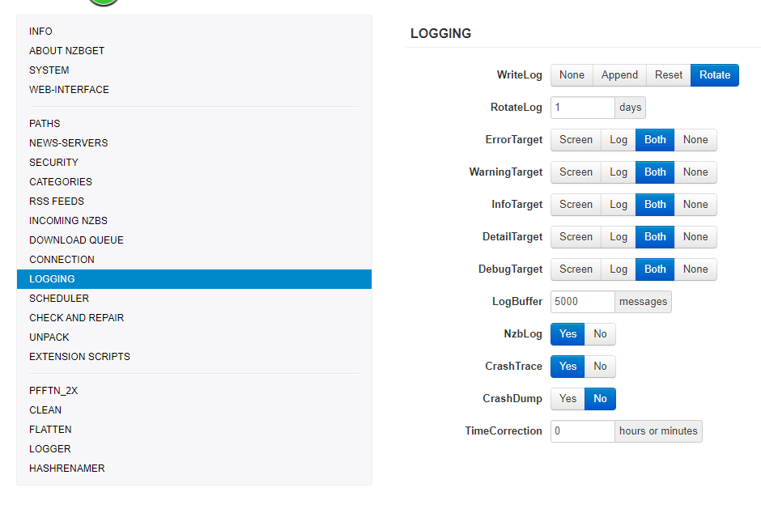

## CHECK AND REPAIR

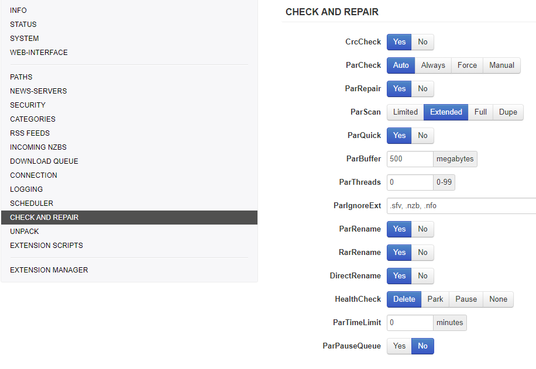

## UNPACK

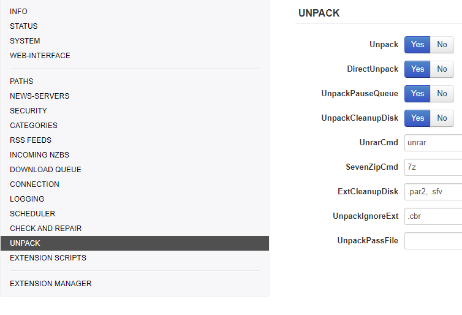

!!! info

    `DirectUnpack`: This might lower your download speed but the overall time could be faster. (disable on low-powered devices)

## EXTENSION SCRIPTS

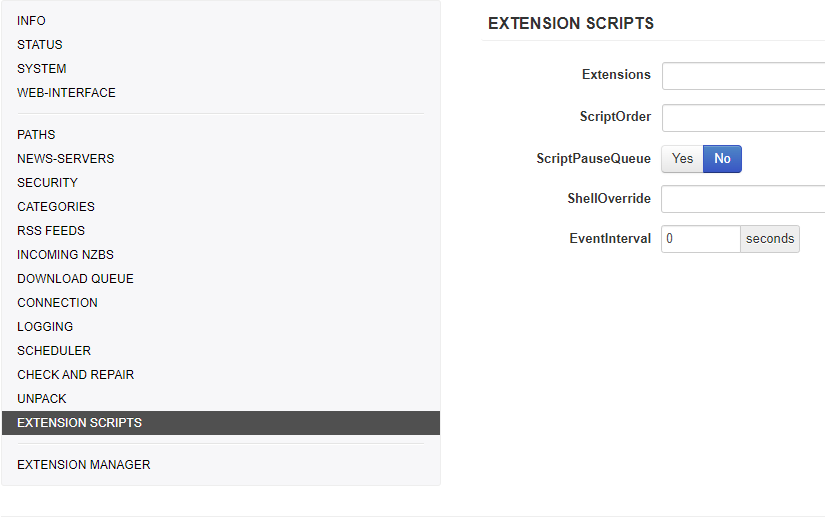

Depending if you're using some NZBGet script here you can change the order or when it should be used

---

## Recommended Sonarr/Radarr Settings

The following settings are recommended for Sonarr/Radarr, else it could happen that Sonarr/Radarr will miss downloads that are still in the queue/history.
Being that Sonarr/Radarr only looks at the last xx amount in the queue/history.

### Sonarr

??? example "Sonarr"

    `Settings` => `Download Clients`

    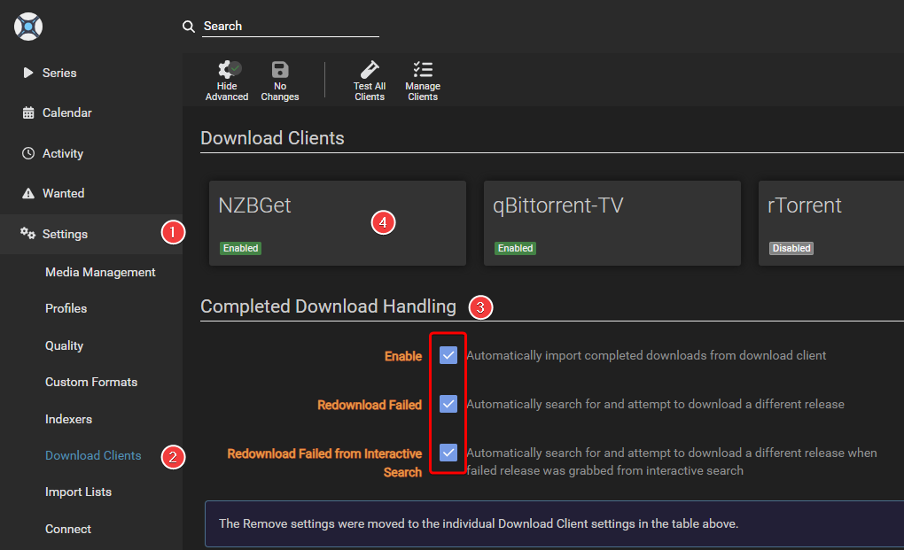

    Make sure you check both boxes under `Completed Download Handling` in step 3.

    Select NZBGet in step 4 and scroll down to the bottom of the new window where it says `Completed Download Handling` and check both boxes.

    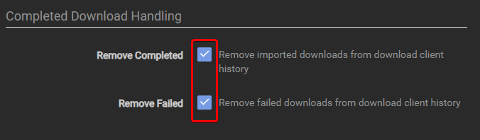

### Radarr

??? example "Radarr"

    `Settings` => `Download Clients`

    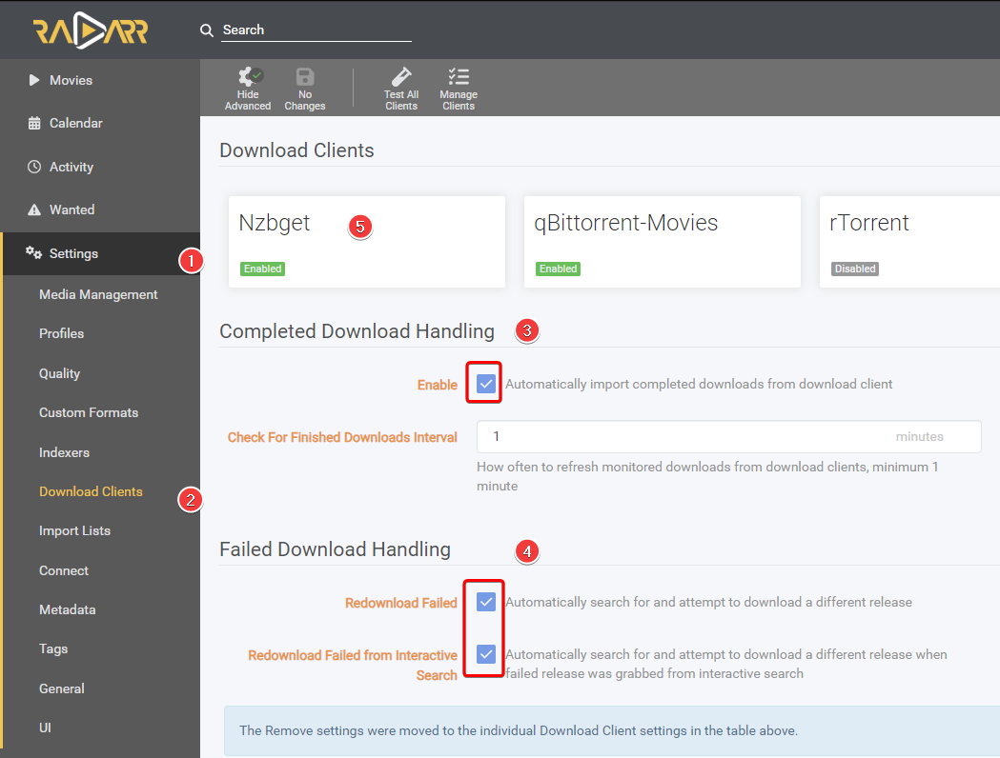

    Make sure you check both boxes under `Completed Download Handling` in step 3,

    and both boxes under `Failed Download Handling` in step 4.

--8<-- "includes/support.md"
