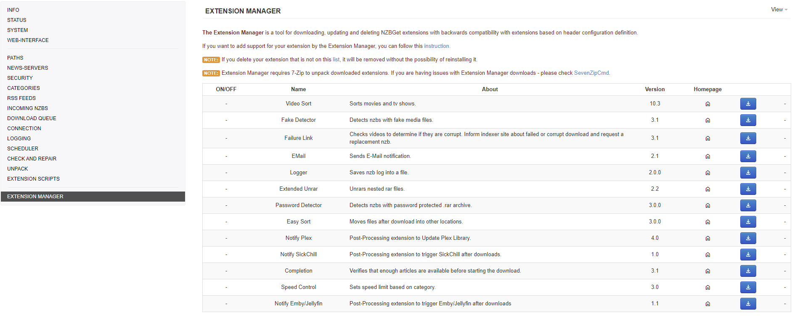
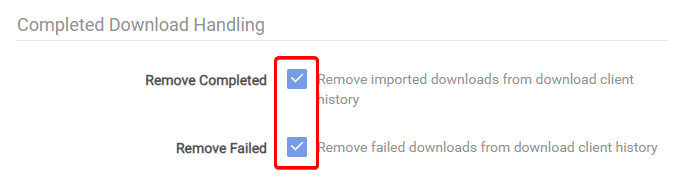

# NZBGet - Basic Setup

{! include-markdown "../../../includes/downloaders/basic-setup.md" !}

---

## Read This First

!!! note "Settings that aren't covered mean you can change them to your liking or simply leave them at default."

{! include-markdown "../../../includes/guides/screenshots-are-examples-warning.md" !}

---

## Settings

We will only cover the so-called most important and common settings. For the other settings, please refer to the descriptions provided in the application.

### Paths

`Settings` => `PATHS`

| Name         | Description                                 |
| :----------- | :------------------------------------------ |
| `${MainDir}` | Root directory for all tasks.               |
| `${AppDir}`  | Where NZBGet is installed.                  |
| `${DestDir}` | Destination directory for downloaded files. |

#### MainDir

Root directory for all tasks.

!!! success ""

    **Suggested:** If you use docker this should be set to `/config`.

#### DestDir

Destination directory for downloaded files.

!!! success ""

    **Suggested:** `/data/usenet`.

#### InterDir

Directory to store intermediate/temporary files.

*If this option is set (not empty) the files are downloaded into this directory first. After successfully downloading the nzb-file (possibly after par-repair), the files are moved to the destination directory (option [DestDir](#destdir)). If the download or unpack fails, the files remain in the intermediate directory.*

!!! success ""

    **Suggested:** `/data/usenet/intermediate` or `/data/usenet/incomplete`.

!!! tip
    In case of performance issues on higher-end environments, you can significantly improve unpack performance by placing the [InterDir](#interdir) on separate physical hard drives, preferably an SSD or NVMe, separate from the destination directory (option [DestDir](#destdir)) and the media directory where Radarr/Sonarr transfers the files.

#### NzbDir

Directory for incoming nzb-files.

!!! success ""

    **Suggested:** `Default`.

#### QueueDir

Directory to store program state.

*This directory is used to save the download queue, history, information about fetched RSS feeds, statistics, etc.*

!!! success ""

    **Suggested:** `Default`.

#### ScriptDir

Directory with post-processing and other scripts.

!!! success ""

    **Suggested:** `Default`.

---

### News-Servers

`Settings` => `NEWS-SERVERS`

#### ServerX.Active

Enable this news server.

!!! success ""

    **Suggested:** `Yes`.

#### ServerX.Name

Name of your news server.

*The name is used in UI and for logging.*

!!! success ""

    **Suggested:** Your news server name.

#### ServerX.Level

The level (priority) of your news server.

!!! success ""

    **Suggested:** Put your major download servers at level `0` and your fill servers at levels `1`, `2`, etc..

#### ServerX.Optional

This is an optional non-reliable server.

*Marking the server as optional tells NZBGet to ignore this server if a connection to this server cannot be established.*

!!! success ""

    **Suggested:** `No`

!!! info "Only switch to `Yes` if this news server is a non-reliable server."

#### ServerX.Host

Host name of news server.

!!! success ""

    **Suggested:** The host name of your news server.

#### ServerX.Encryption

Encrypted server connection (TLS/SSL).

*By changing this option you should also change the option Port accordingly because insecure and encrypted connections use different ports.*

!!! success ""

    **Suggested:** `Yes`.

#### ServerX.Port

News Server port

- `563` for a secure connection.
- `119` for an unsecured connection.

!!! success ""

    **Suggested:** Any secure port that your news server offers.

#### ServerX.Username

User name to use for authentication.

!!! success ""

    **Suggested:** Your news server Username is used for authentication.

#### ServerX.Password

Password to use for authentication.

!!! success ""

    **Suggested:** Your news server Password that is used for authentication.

#### ServerX.Connections

Maximum number of simultaneous connections to this server.

!!! success ""

    **Suggested:** Use the lowest possible number of connections to reach your max download speed `+1` connection.

#### ServerX.Retention

Server retention time.

*How long are the articles stored on the news server.*

!!! success ""

    **Suggested:** Check your news server what their retention is.

---

### Categories

`Settings` => `CATEGORIES`

#### CategoryX.Name

Category name.

!!! success ""

    **Suggested:** This should match what you use in Sonarr/Radarr categories (`tv`, `movies`, etc).

#### CategoryX.DestDir

Destination directory for this category.

!!! success ""

    **Suggested:**

    - `${DestDir}/movies` for Radarr.
    - `${DestDir}/tv` for Sonarr.

{! include-markdown "../../../includes/downloaders/warning-path-location.md" !}

#### CategoryX.Unpack

Unpack downloaded nzb-files.

!!! success ""

    **Suggested:** `Yes`.

#### CategoryX.Extensions

List of extension scripts for this category.

!!! success ""

    **Suggested:** It depends on whether you need to run an extension script.

---

### Incoming Nzbs

`Settings` => `INCOMING NZBS`

#### AppendCategoryDir

Create subdirectory with category-name in destination-directory.

!!! success ""

    **Suggested:** `Yes`.

#### DupeCheck

Check for duplicate titles.

!!! success ""

    **Suggested:** `Yes`.

#### Download Queue

`Settings` => `DOWNLOAD QUEUE`

#### FlushQueue

Flush the download queue to disk.

!!! success ""

    **Suggested:** `Yes`.

!!! tip
    You can disable this option if it negatively affects your system's disk performance. In that case, you should create backups of the queue directory (option [QueueDir](#queuedir)). Keep the option enabled if your system often crashes.

#### ContinuePartial

Continue the download of partially downloaded files.

!!! success ""

    **Suggested:** `Yes`.

!!! tip
    Disabling this option may slightly reduce disk access and is recommended on fast connections.

#### ArticleCache

Memory limit for article cache.

!!! success ""

    **Suggested:** `500`.

#### DirectWrite

Write decoded articles directly into the destination output file.

!!! success ""

    **Suggested:** `Yes`.

#### WriteBuffer

Memory limit for per connection write buffer.

!!! success ""

    **Suggested:** `1024`.

!!! warning "If you're running low on memory, avoid setting this value too high."

#### FileNaming

How to name downloaded files.

!!! success ""

    **Suggested:** `Auto`.

!!! info
    - **Article** - use file names stored in article metadata.
    - **Nzb** - use file names as defined in nzb-file.
    - **Auto** - prefer names from article metadata for obfuscated files use names from nzb-file.

#### RenameAfterUnpack

Rename downloaded files after unpack.

*This option renames the extracted and obfuscated files using the NZB filename.*

!!! success ""

    **Suggested:** `Yes`.

#### ReorderFiles

Reorder files within NZBS for optimal download order.

!!! success ""

    **Suggested:** `Yes`.

#### PostStrategy

Post-processing strategy.

*Computer resources are in heavy demand when post-processing with simultaneous tasks - ensure the hardware is capable.*

!!! success ""

    **Suggested:** `Balanced`.

!!! info
    - **Balanced** - Items that do not need par repair are post-processed one at a time, while par repair tasks may also run simultaneously one after another at the same time. This means that a post-process par repair will not prevent another task from running, but at a cost of using more computer resource
    - **Aggressive** - Will simultaneously post-process up to three items, including one par repair task.
    - **Rocket** - Will simultaneously post-process up to six items, including one or two par repair tasks.

#### NzbCleanupDisk

Delete the source nzb-file when it is not needed anymore.

!!! success ""

    **Suggested:** `Yes`.

---

### Check and Repair

`Settings` => `CHECK AND REPAIR`

#### CrcCheck

Check CRC of downloaded and decoded articles.

Normally, this option should be enabled to better detect download errors and for quick par-verification (option [ParQuick](#parquick)).

!!! success ""

    **Suggested:** `Yes`.

!!! tip
    Setting this option to `No` could speed up your download and post-processing time.

#### ParCheck

Whether and how par-verification must be performed.

!!! success ""

    **Suggested:** `Auto`.

!!! info
    - **Auto** - par-check is performed when needed. One par2-file is always downloaded. Additional par2-files are downloaded if required for repair. Repair is performed if the option [ParRepair](#parrepair) is enabled.
    - **Always** - check every download (even undamaged). One par2-file is always downloaded. Additional par2-files are downloaded if needed for repair. Repair is performed if the option [ParRepair](#parrepair) is enabled.
    - **Force** - force par-check for every download (even undamaged). All par2-files are always downloaded. Repair is performed if the option [ParRepair](#parrepair) is enabled.
    - **Manual** — par-check is skipped. One par2-file is always downloaded. If a damaged download is detected, all par2-files are downloaded, but neither par-check nor par-repair takes place. The download can then be repaired manually, eventually on another faster computer.

#### ParRepair

Automatic par-repair after par-verification.

*If the option [ParCheck](#parcheck) is set to `Auto` or `Force` this option determines whether the download must be repaired when needed. The option can be disabled if a computer does not have enough CPU power since repair may consume too many resources and time on a slow computer.*

!!! success ""

    **Suggested:** `Yes`.

#### ParScan

What files should be scanned during par-verification.

!!! success ""

    **Suggested:** `Extended`.

!!! info
    - **Limited** - Scan only files belonging to par-set.
    - **Extended** - Scan files belonging to par-set first, then scan other files until all missing files are found.
    - **Full** - Scan all files in the destination directory. Can be very time-consuming but may sometimes repair where Limited and Extended fail.
    - **Dupe** — Scan files belonging to the par-set first, then scan other files until repair is possible. Even files from other duplicate downloads are scanned. This can be very time-consuming but brings the best results.

#### ParQuick

Quick file verification during par-check.

*If the option is active, the files are quickly verified using checksums calculated during download. Quick verification is very fast because it doesn't require reading files from disk. NZBGet knows the checksums of downloaded files and quickly compares them with those stored in the par-file.*

!!! success ""

    **Suggested:** `Yes`.

!!! info "If the option is disabled, the files will be verified as usual. That's slow. Use this if the quick verification doesn't work properly."

#### ParBuffer

Memory limit for par-repair buffer.

*Set the amount of RAM that the par-checker may use during repair. Having the buffer as big as the total size of all damaged blocks allows for the optimal repair speed. The option sets the maximum buffer size, the allocated buffer can be smaller.*

!!! success ""

    **Suggested:** `500`.

!!! tip
    - If you have a lot of RAM, set the option to a few hundred (MB) for the best repair performance
    - Avoid setting this value too high if you're running low on memory.

#### ParThreads

Number of threads to use during par-repair.

*On multi-core CPUs for the best speed, set the option to the number of logical cores (physical cores + hyper-threading units). If you want to utilize the CPU to 100%, you may need to add one or two additional threads to compensate for wait intervals used for thread synchronization.*

!!! success ""

    **Suggested:** Half of your logical cores are on your server, so it doesn't interfere with other processes on your server, such as video playback.

!!! info
    - On single-core CPUs, only one thread is used.
    - Set to `0` to automatically use all available CPU cores (may not work on old or exotic platforms).

!!! warning "Par2 repair can be very resource intensive, and it could slow down your system performance and even interfere with video playback"

#### ParRename

Check for renamed and missing files using par-files.

*Par-rename restores original file names using information stored in par2-files. It also detects missing files (files listed in par2-files but not present on disk). When enabled, the par-rename is performed as the first post-processing step for every NZB file.*

!!! success ""

    **Suggested:** `Yes`.

#### RarRename

Check for renamed RAR files.

*Rar-rename restores original file names using information stored in rar-files. When enabled, the rar-rename is performed as one of the first steps of post-processing for every nzb-file.*

*Rar-rename is useful for downloads that do not have par2-files or for downloads that have files renamed before creating par2-files. In both cases, par-rename (option [ParRename](#parrename)) can't rename files, and the rar-rename makes it possible to unpack downloads that would fail otherwise.*

!!! success ""

    **Suggested:** `Yes`.

#### DirectRename

Directly rename files during downloading.

*This is similar to par-renaming (option [ParRename](#parrename)), but the files are renamed during downloading instead of the post-processing stage. This requires some tricky handling of files and works only for healthy downloads.*

!!! success ""

    **Suggested:** `Yes`.

#### HealthCheck

What to do if your download health drops below critical health.

!!! success ""

    **Suggested:** `Delete`.

!!! info
    - **Delete** - delete nzb-file from queue, also delete already downloaded files.
    - **Park** - move the nzb-file to history, and keep the already downloaded files. The commands "Download remaining files" and "Retry failed articles" are available for this nzb.
    - **Pause** - pause nzb-file.
    - **None** - Do nothing (continue download).

!!! tip "For automatic duplicate handling, the option must be set to `Delete`, `Park`, or `None`. If it is set to "Pause" you will need to manually move another duplicate from history to queue. See also option [DupeCheck](#dupecheck)."

#### ParTimeLimit

Maximum allowed time for par-repair.

*Limiting the time allowed for par-repair may be a good idea if you use NZBGet on a very slow computer like a NAS-device. NZBGet calculates the estimated time required for par-repair. If the estimated value exceeds the limit defined here, NZBGet cancels the repair.*

!!! success ""

    **Suggested:** `0`.

!!! info "Value `0` means unlimited."

#### ParPauseQueue

Pause the download queue during check/repair.

*Enable the option to give the CPU more time for par-check/repair. That helps to speed up check/repair on slow CPUs with fast connection (e.g. NAS-devices).*

!!! success ""

    **Suggested:** `Yes`.

---

### Unpack

`Settings` => `UNPACK`

Pause the download queue during check/repair.

*Enable the option to give the CPU more time for par-check/repair. That helps to speed up check/repair on slow CPUs with fast connection (e.g. NAS-devices).*

#### Unpack (Global)

Unpack downloaded nzb-files.

!!! success ""

    **Suggested:** `Yes`.

#### DirectUnpack

Directly unpack files during downloading.

*When active, the files are unpacked during downloading instead of the post-processing stage. This works only for healthy downloads. Damaged downloads are unpacked as usual during the post-processing stage after par-repair.*

!!! success ""

    **Suggested:** `Yes`.

!!! info
    - This option requires unpack to be enabled in general via the option Unpack.
    - For best results, activate the DirectRename and ReorderFiles options.

!!! warning "[DirectUnpack](#directunpack) might lower your download speed, but the overall time could be faster. (Disable on low-powered devices)."

#### UnpackPauseQueue

Pause the download queue during unpack.

*Enable the option to give the CPU more time for unpacking. That helps to speed up unpacking on slow CPUs.*

!!! success ""

    **Suggested:** `Yes`.

#### UnpackCleanupDisk

Delete archive files after successful unpacking.

!!! success ""

    **Suggested:** `Yes`.

#### UnrarCmd

Full path to unrar executable.

*The option can also contain extra switches to pass to unrar.*

#### ExtCleanupDisk

Files to delete after successful download.

#### UnpackIgnoreExt

Files to ignore during unpack.

##### Prevent unwanted extensions

!!! info "The Starr apps focus solely on media files and typically ignore all those extensions."

Add these extensions (*primarily for Windows users as they could potentially be abused or exploited*) to your [UnpackIgnoreExt](#unpackignoreext).

{! include-markdown "../../../includes/downloaders/unwanted-extensions.md" !}

!!! tip "If you are using NZBGet to download games and apps, this list shouldn't be used. You can create a separate category, set it to download only, manually extract the files, or use a separate app or instance for them."

---

### Extension Scripts

`Settings` => `EXTENSION SCRIPTS`

#### Extensions

List of active extension scripts for new downloads.

#### ScriptOrder

Execution order for extension scripts.

#### ScriptPauseQueue

Pause the download queue during the executing of the post-process script.

*Enable the option to give the CPU more time for postprocess-script. That helps to speed up postprocess on slow CPUs with fast connection (e.g. NAS-devices).*

!!! success ""

    **Suggested:** `Yes`.

#### ShellOverride

Shell overrides for script interpreters.

*By default extension scripts are executed as normal programs. The system finds an associated interpreter automatically. If for some reason that doesn't work properly you can provide shell overrides here.*

---

### Extension Manager

`Settings` => `EXTENSION SCRIPTS`

The Extension Manager is a tool for downloading, updating and deleting NZBGet extensions. It is backward-compatible with extensions based on header configuration definitions.

---

## Recommended Sonarr/Radarr Settings

The following settings are recommended for Sonarr/Radarr, otherwise, Sonarr/Radarr could miss downloads that are still in the queue/history.
Being that Sonarr/Radarr only looks at the last xx amount in the queue/history.

### Sonarr

??? example "Sonarr"

    `Settings` => `Download Clients`

    

    Make sure you check all three boxes under `Completed Download Handling` in step 3.

    In step 4, select NZBGet, scroll to the bottom of the new window where it says `Completed Download Handling`, and check both boxes.

    

### Radarr

??? example "Radarr"

    `Settings` => `Download Clients`

    

    Make sure you enable `Completed Download Handling` in step 3,

    and both boxes under `Failed Download Handling` in step 4.

    In step 5, select NZBGet, scroll to the bottom of the new window where it says `Completed Download Handling`, and check both boxes.

    

--8<-- "includes/support.md"
