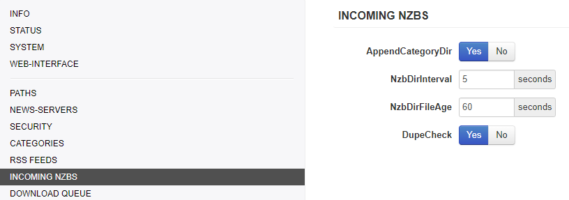

# NZBGet - Basic Setup

This basic example is based on the use of docker images

!!! attention ""
    Keep in mind the path are setup so it works with hardlinks and instant moves.

    More info [HERE](/Hardlinks/Hardlinks-and-Instant-Moves/){:target="_blank" rel="noopener noreferrer"}

!!! warning ""
    The default path setup used by [Linux|Server.io](https://hub.docker.com/r/linuxserver/){:target="_blank" rel="noopener noreferrer"} don't support hardlinks and instant moves, but you're able to change this, by not using the pre-defined paths like:

    - `/downloads` => `/data/downloads`
    - `/movies` => `/data/media/movies`
    - `/tv` => `/data/media/tv`.

------

## Some Basics

| Name         | Description                                |
|:---          |:---                                        |
| `${MainDir}` | Root directory for all tasks.              |
| `${AppDir}`  | Where NZBGet is installed.                 |
| `${DestDir}` | Destination directory for downloaded files.|

## PATHS

I will only explain the so called most important paths.

| Name        | Description                                                                            |
|:---         |:---                                                                                     |
| `MainDir`   | `/data/usenet`                                                                        |
| `DestDir`   | `${MainDir}/completed` (so it will go in to `/data/usenet/completed`)                 |
| `InterDir`  | Files are downloaded into this directory (before unpack+par2)                          |
| `NzbDir`    | Directory for incoming nzb-files.                                                      |
| `QueueDir`  | This directory is used to save download queue, history, information statistics, etc.   |
| `ScriptDir` | Directory with post-processing and other scripts.                                      |
| `LogFile`   | Where your log files will be stored (Please create a log directory in your config) |

## NEWS-SERVERS

| Name           | Description                                                                            |
|:---            |:---                                                                                    |
| `Active`       | Use this news server.                                                                  |
| `Name`         | The name is used in UI and for logging. It can be any string.                          |
| `Level`        | Put your major download servers at level 0 and your fill servers at levels 1, 2, etc.. |
| `Host`         | Host name of news server.                                                              |
| `Port`         | Port to connect to.                                                                    |
| `Password`     | Password to use for authentication.                                                    |
| `Encryption`   | Encrypted server connection (TLS/SSL). (preferred to use this)                   |
| `Connections`  | Use the lowest possible amount of connections +1 to gain your max download speed.      |
| `Retention`    | How long the articles are stored on the news server.                                   |

## CATEGORIES

| Name          | Description                                                                            |
|:---           |:---                                                                                    |
| `Name`        | This should match what you put in Sonarr/Radarr (tv/movies/sonarr/radarr/series/films) |
| `DestDir`     | `${DestDir}` Destination directory (/data/usenet/completed/movie)                     |
| `Unpack`      | Unpack downloaded nzb-files.                                                           |
| `Extensions`  | List of extension scripts for this category.                                           |

## INCOMING NZBS

!!! info
    `AppendCategoryDir`: Create subdirectory with category-name in destination-directory.

## DOWNLOAD QUEUE

!!! caution
    `WriteBuffer`: If you're low on memory don't set this to high.

## LOGGING

## CHECK AND REPAIR

## UNPACK

!!! info
    `DirectUnpack`: This might lower your download speed but the overall time could be faster. (disable on low powered devices)

## EXTENSION SCRIPTS

Depending if you're using some NZBGet script here you can change the order or when it should be used
