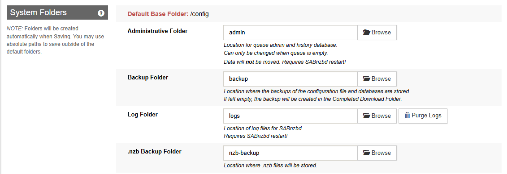
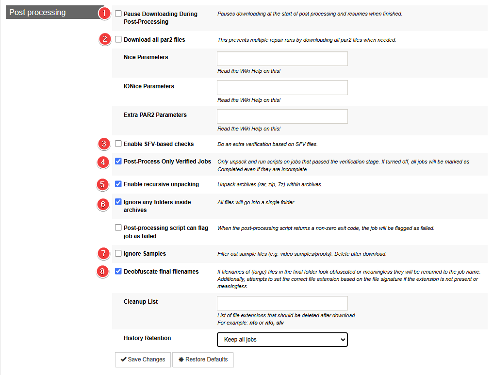

# SABnzbd - Basic Setup

{! include-markdown "../../../includes/downloaders/basic-setup.md" !}

---

!!! Note

    Settings that aren't covered means you can change them to your liking, or just leave them on default.

    **I also recommend to enable the `Advanced Settings` on the top right.**

## General

[SABnzbd Documentation](https://sabnzbd.org/wiki/configuration/4.3/general){:target="\_blank" rel="noopener noreferrer"}

### Tuning

`Settings` => `General` => `Tuning`


I recommend setting a sane maximum speed and then limiting below that, to keep your internet connection happy. You can use `Settings` => `Scheduling` to toggle the limit on and off based on time, slowing it down while your family is using the internet and speeding it up at night when they're not.

---

## Folders

[SABnzbd Documentation](https://sabnzbd.org/wiki/configuration/4.3/folders){:target="\_blank" rel="noopener noreferrer"}

### User Folders

`Settings` => `Folders` => `Users Folders`


Here you setup your download path/location.

{! include-markdown "../../../includes/downloaders/warning-path-location.md" !}

### System Folders

`Settings` => `Folders` => `System Folders`


!!! info "Starting from 4.3.x+ SABnzbd has a hidden (archive) history."

Using the .nzb Backup Folder is still recommended as it is useful for dupe detection (hash matching) or if you need to retry something from the past.
The default is empty, we picked history because it is easy. It'll end up in the `/config` folder for Docker, which isn't crazy... but this is only compressed nzb files, so it can end up pretty big. The choice is yours what you prefer.

---

## Servers

[SABnzbd Documentation](https://sabnzbd.org/wiki/configuration/4.3/servers){:target="\_blank" rel="noopener noreferrer"}

`Settings` => `Servers` => `Add Server`


!!! info ""

    USP = Usenet Service Provider

1. Server description.
1. The hostname you get from your USP.
1. The port that you get and can use from your USP.
1. Make sure you enable `SSL` so you get a secure connection to the USP.
1. Username that you got or created with your USP.
1. Password you got or created with your USP
1. Use the lowest possible number of connections to reach your max download speed +1 connection.
1. How long the articles are stored on the news server.
1. For unreliable servers, will be ignored longer in case of failures

---

## Categories

[SABnzbd Documentation](https://sabnzbd.org/wiki/configuration/4.3/categories){:target="\_blank" rel="noopener noreferrer"}

`Settings`=> `Categories`

Covered and fully explained in [SABnzbd - Paths and Categories](/Downloaders/SABnzbd/Paths-and-Categories/){:target="\_blank" rel="noopener noreferrer"}

---

## Switches

[SABnzbd Documentation](https://sabnzbd.org/wiki/configuration/4.3/switches){:target="\_blank" rel="noopener noreferrer"}

### Queue

`Settings` => `Switches` => `Queue`


1. If you have good indexers that get the nzb from the post, not generated, then you may want the Propagation delay set to 5 minutes (so you're not trying to grab an nzb right at posting). If you're not getting it from the same server as the poster used, you might wrongly have articles missing (since it hasn't necessarily propagated to your server yet) or if you use a reseller it may take them longer for them to get it from their upstream.
1. When it becomes clear during downloading that too much data is missing, abort the job to make sure Sonarr/Radarr gets the notification so it can look for another release.
1. Since we have the .nzb history folder, you can decide what you want to do here with duplicate downloads. Mine is set to Tag job, but Pause or Fail job may make sense too.
1. In the case of "Pause", you'll need to set a password and resume the job. or you set it to "Abort" and Sonarr/Radarr can look for another release.
1. This should be set to the default unless you know what you are doing. Suppose you have a decent size queue, for example, in that case, you have sab sort every 30s, which could cause spikes in CPU, let alone shuffling jobs around that may be in the middle of actions. If this results in the jobs' order moving to the front it could cause that job to take even longer to extract/stall while waiting for the next update; as with sab, by default, you only have 3 unpackers going simultaneously (configurable).
1. If your hardware isn't up to snuff, including CPU and/or IO performance, disabling Direct Unpack and/or enabling Pause Downloading During Post-Processing can help. Defaults are fine for most hardware though.

#### Prevent unwanted extensions

!!! info "The Starr apps focus solely on media files and typically ignore all those extensions."

Add these extensions (*primarily for Windows users as they could potentially be abused or exploited*) to your `Unwanted extensions` list.

```none
ade, adp, app, application, appref-ms, asp, aspx, asx, bas, bat, bgi, cab, cer, chm, cmd, cnt, com, cpl, crt, csh, der, diagcab, exe, fxp, gadget, grp, hlp, hpj, hta, htc, inf, ins, iso, isp, its, jar, jnlp, js, jse, ksh, lnk, mad, maf, mag, mam, maq, mar, mas, mat, mau, mav, maw, mcf, mda, mdb, mde, mdt, mdw, mdz, msc, msh, msh1, msh2, mshxml, msh1xml, msh2xml, msi, msp, mst, msu, ops, osd, pcd, pif, pl, plg, prf, prg, printerexport, ps1, ps1xml, ps2, ps2xml, psc1, psc2, psd1, psdm1, pst, py, pyc, pyo, pyw, pyz, pyzw, reg, scf, scr, sct, shb, shs, theme, tmp, url, vb, vbe, vbp, vbs, vhd, vhdx, vsmacros, vsw, webpnp, website, ws, wsc, wsf, wsh, xbap, xll, xnk
```

Afterwards you need to make the following adjustments:

- Change the mode of `Unwanted extensions` to `Blacklist`.
- Change `Action when unwanted extension detected` to `Fail job (move to History)`.


!!! note "If you are using SABnzbd to download games and apps, this list shouldn't be used. You can either create a separate category, set it to download only, and manually extract the files, or use a separate app or instance for them."

### Post processing

`Settings` => `Switches` => `Post processing`


1. If your hardware isn't up to snuff, including CPU and/or IO performance, disabling Direct Unpack and/or enabling Pause Downloading During Post-Processing can help. Defaults are fine for most hardware though.
1. This should be set off if you have decent internet. The amount of time spent to grab pars, if needed for verification/repair, is trivial to the time that a repair might run and fail to realize it needs more pars, and grab the next part, then retry.
1. It is your choice if you want to enable this option. It's usually an easy check and does provide benefits if the job doesn't have par2 files, as not every release has a par-set or SFV file. Generally speaking, if we're talking about scene releases, things should have both but this depends on how it's posted and how the indexer is generating the nzb. SFV is commonly used and a basic crc32 checksum is better not knowing if the file is good. Parsing an SFV file and checking the files' integrities takes very little resources. This may seem redundant given that par's checks would also handle this, however, the ease with which the check is done makes the downside almost non-existent.
1. Only unpack and run scripts on jobs that passed the verification stage. If turned off, all jobs will be marked as Completed even if they are incomplete.
1. Unpack archives (rar, zip, 7z) within archives.
1. This can help with subs that are in folders in the rar because Sonarr/Radarr don't look in sub-folders.
1. Best to leave this disabled and let the Starr apps handle this since it looks at runtime and makes a much more intelligent decision if it's a sample compared to what SABnzbd uses.
1. Helps with de-obfuscation, especially invalid file extensions

---

## Sorting

`Settings` => `Sorting`

!!! danger ":bangbang: **MAKE SURE THAT SORTING IS ENTIRELY DISABLED** :bangbang:"

## Special

Rarely used options.
Don't change these without checking the [SABnzbd Wiki](https://sabnzbd.org/wiki/configuration/4.3/special){:target="\_blank" rel="noopener noreferrer"} first, as some have serious side effects.
The default values are between parentheses.

### Unable to connect to SABnzbd

If you're trying to connect your Starr apps to SABnzbd and you're getting an error like `Unable to connect to SABnzbd` after clicking on Test.


And it SABnzbd you will see something like this.


Then go in to `Settings` => `Special` => `Values`.

Scroll down to `host_whitelist (  )` and enter your docker container name and or your domain name.

Example: `sabnzbd.domain.tld, <container name >`


---

## Recommended Sonarr/Radarr Settings

The following settings are recommended for Sonarr/Radarr, or else it could happen that Sonarr/Radarr will miss downloads that are still in the queue/history.
Being that Sonarr/Radarr only looks at the last xx amount in the queue/history.

### Sonarr

??? example "Sonarr - [Click to show/hide]"

    `Settings` => `Download Clients`

    

    Make sure you check both boxes under `Completed Download Handling` in step 3.

    Select SABnzbd in step 4 and scroll down to the bottom of the new window where it says `Completed Download Handling` and check both boxes.

    

### Radarr

??? example "Radarr - [Click to show/hide]"

    `Settings` => `Download Clients`

    

    Make sure you check both boxes under `Completed Download Handling` in step 3,

    and both boxes under `Failed Download Handling` in step 4.

    Select SABnzbd in step 5 and scroll down to the bottom of the new window where it says `Completed Download Handling` and check both boxes.

    

---

<sub>Thanks to [fryfrog](https://github.com/fryfrog){:target="\_blank" rel="noopener noreferrer"} for helping me with the settings and providing the info needed to create this Guide.</sub>

--8<-- "includes/support.md"
