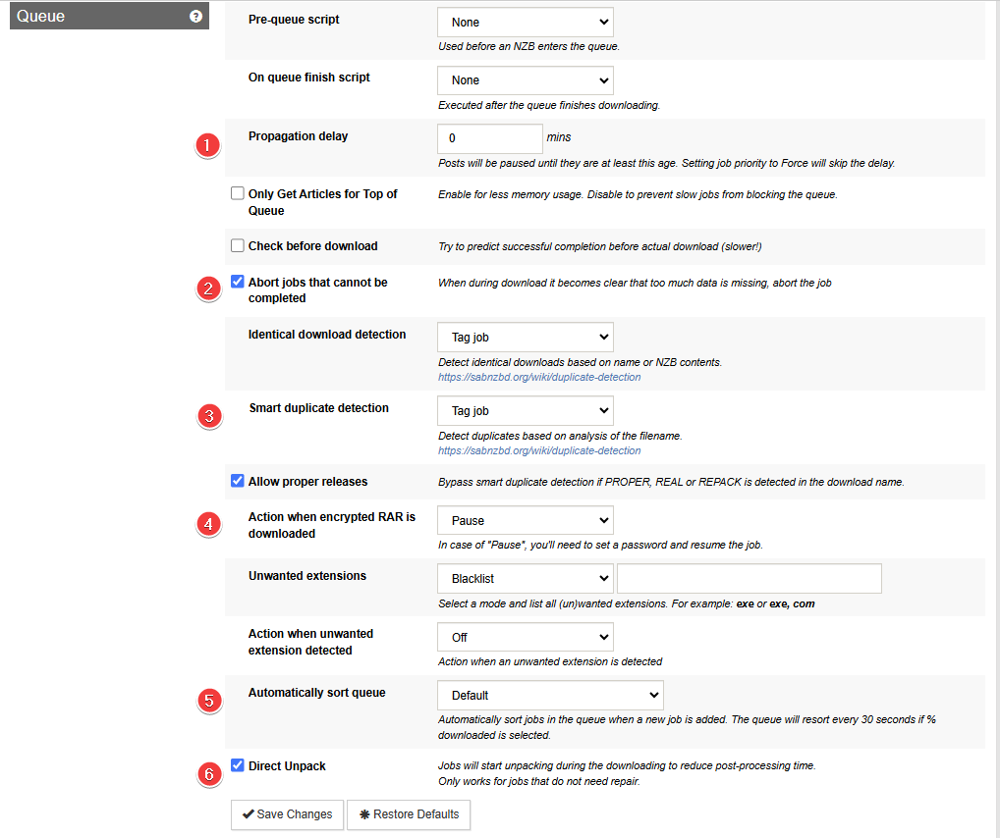

# SABnzbd - Basic Setup

{! include-markdown "../../../includes/downloaders/basic-setup.md" !}
<!-- --8<-- "includes/downloaders/basic-setup.md" -->

------

!!! Note
    Settings that aren't covered means you can change them to your own liking or just leave them on default.

    ** I also recommend to enable the `Advanced Settings` on the top right. **

## General

### Tuning

`Settings` => `General` => `Tuning`

I recommend setting a sane maximum speed and then limiting below that, to keep your internet connection happy. You can use `Settings` => `Scheduling` to toggle the limit on and off based on time, slowing it down while your family is using the internet and speeding it up at night when they're not.

------

## Folders

### User Folders

`Settings` => `Folders` => `Users Folders`

Here you setup your download path/location.

{! include-markdown "../../../includes/downloaders/warning-path-location.md" !}
<!-- --8<-- "includes/downloaders/warning-path-location.md" -->

### System Folders

`Settings` => `Folders` => `System Folders`

I recommend the .nzb Backup Folder because sabnzbd doesn't have a hidden history and having remove from history enabled in Sonarr/Radarr is the best method. This allows you to see your past downloads and it is used for duplicate download detection/prevention. Default is empty, I picked history because it is easy. It'll end up in the `/config` folder for Docker, which isn't crazy... but this is literally compressed nzb files, so can end up pretty big. But the choice is yours what you prefer.

------

## Servers

`Settings` => `Servers` => `Add Server`

!!! info ""
    USP = Usenet Service Provider

1. Server description.
1. The hostname you get from your USP.
1. The port that you get and can use from your USP.
1. Make sure you enable `SSL` so you get a secure connection to the USP.
1. Username that you got or created with your USP.
1. Password you got or created with your USP
1. Use the lowest possible amount of connections +1 to gain your max download speed.
1. How long the articles are stored on the news server.
1. For unreliable servers, will be ignored longer in case of failures

------

## Categories

`Settings`=> `Categories`

Covered and fully explained in [SABnzbd - Paths and Categories](/Downloaders/SABnzbd/Paths-and-Categories/){:target="_blank" rel="noopener noreferrer"}

------

## Switches

### Queue

`Settings` => `Switches` => `Queue`

1. When during download it becomes clear that too much data is missing, abort the job. and makes sure Sonarr/Radarr will get a notification and can look for another release.
1. Since we have the .nzb history folder, you can decide what you want to do here w/ duplicate downloads. Mine is set to Tag job, but Pause or Fail job may make sense too.
1. In case of "Pause", you'll need to set a password and resume the job. or you set it to "Abort" and Sonarr/Radarr can look for another release.
1. Suggest this sort so that the most likely to still be there stuff is downloaded first.
1. If your hardware isn't up to snuff, including cpu and/or io performance, disabling Direct Unpack and/or enabling Pause Downloading During Post-Processing can help. Defaults are fine for most hardware though.

### Post processing

`Settings` => `Switches` => `Post processing`

1. If your hardware isn't up to snuff, including cpu and/or io performance, disabling Direct Unpack and/or enabling Pause Downloading During Post-Processing can help. Defaults are fine for most hardware though.
1. Only unpack and run scripts on jobs that passed the verification stage. If turned off, all jobs will be marked as Completed even if they are incomplete.
1. Unpack archives (rar, zip, 7z) within archives.
1. This can help with subs that are in folders in the rar because sonarr/radarr don't look in sub-folders.
1. Some servers provide an alternative NZB when a download fails. I have it enabled no guarantee that it works.
1. Helps with de-obfuscation, but probably is handling the same case sonarr/radarr do okay with. Not sure how this one does, I have it enabled, but its also newish.
1. When sorting, use tags from indexer for title, season, episode, etc. Otherwise all naming is derived from the NZB name.

------

## Sorting

`Settings` => `Sorting`

!!! danger ""
    :bangbang: **MAKE SURE THAT SORTING IS ENTIRELY DISABLED** :bangbang:

------

## Recommended Sonarr/Radarr Settings

The following settings are recommended to for Sonarr/Radarr, else it could happen that Sonarr/Radarr will miss downloads that are still in the queue/history.
Being that Sonarr/Radarr only looks at the last xx amount in the queue/history.

### Sonarr

??? example "Sonarr - [CLICK TO EXPAND]"

    `Settings` => `Download Clients`

    

    Make sure you check both boxes under `Completed Download Handling` at step 3.

    Select Sabnzbd at step 4 and scroll down to the bottom of the new window where it says `Completed Download Handling` and check both boxes.

    

### Radarr

??? example "Radarr - [CLICK TO EXPAND]"

    `Settings` => `Download Clients`

    

    Make sure you check both boxes under `Completed Download Handling` at step 3,

    and both boxes under `Failed Download Handling` at step 4.

------

Thanks to [fryfrog](https://github.com/fryfrog){:target="_blank" rel="noopener noreferrer"} for helping me with the settings and providing the info needed to create this Guide.

{! include-markdown "../../../includes/support.md" !}
<!-- --8<-- "includes/support.md" -->
