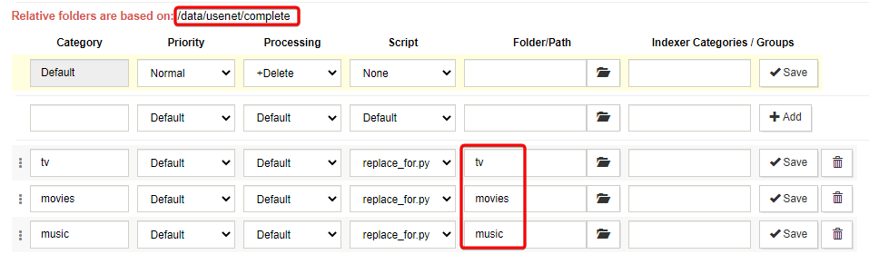
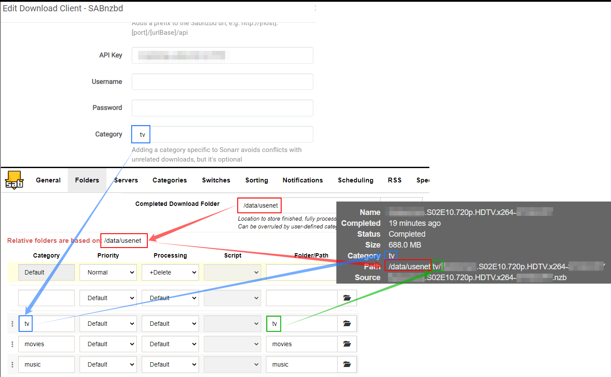

# SABnzbd - Paths and Categories

{! include-markdown "../../../includes/downloaders/path.md" !}

---

`SABnzbd config` => `Folders`

`SABnzbd config` => `Categories`

You don't need to add the full path under `Folder/Path`, it will use the `Relative folders are based on:` path you see on the top of the screenshot, that you've set up as `Completed Download Folder`.

{! include-markdown "../../../includes/downloaders/warning-path-location.md" !}

---

## Paths and Categories Breakdown

!!! Warning "This screenshot isn't 100% a reflection of the instructions above,  it's mainly to explain the breakdown and the logic."

--8<-- "includes/support.md"
