# qBittorrent - Basic Setup

{! include-markdown "../../../includes/downloaders/basic-setup.md" !}

---

!!! Note

    Settings that aren't covered means you can change them to your own liking or just leave them on default.

---

## Downloads

`Tools` => `Options` => `Downloads` (Or click on the cogwheel to access the options)

### When adding a torrent

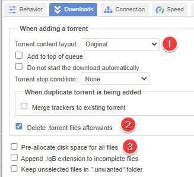

1. For consistency with other torrents, we recommend leaving this on `Original`.

    !!! success ""

        **Suggested: `Original`**

1. Delete the .torrent file after it has been added to qBittorrent.

    !!! success ""

        **Suggested: `Personal preference`**

1. Pre-allocated disk space for the added torrents limits fragmentation and also makes sure if you use a cache drive or a feeder disk that the space is available.

    !!! success ""

        **Suggested: `Enabled`**

    !!! warning

        Do not set Pre-allocated disk space if you are using ZFS as your filesystem as ZFS [does not support fallocate](https://github.com/openzfs/zfs/issues/326){:target="_blank" rel="noopener noreferrer"}

### Saving Management

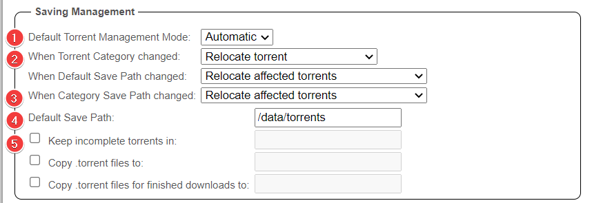

1. Make sure this is set to `Automatic`. Your downloads will not go into the category folder otherwise.

    !!! success ""

        **Suggested: `Automatic`**

1. This helps you to manage your file location based on categories.

    !!! success ""

        **Suggested: `Enabled`**

1. Same as `Step 2`

    !!! success ""

        **Suggested: `Enabled`**

1. Your download root path (Download folder/location).

    !!! success ""

        **Read the `ATTENTION` block below**

1. If you enable this, your incomplete downloads will be placed in this directory until completed. This could be useful if you want your downloads to use a separate SSD/Feeder disk[^1], but this also results in extra unnecessary moves or in worse cases a slower and more I/O intensive copy + delete.

    !!! success ""

        **Suggested: `Personal preference`**

#### ATTENTION

{! include-markdown "../../../includes/downloaders/warning-path-location.md" !}

---

## Connection

### Listening Port

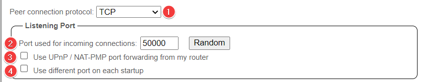

1. Set this to TCP for the best performance

    !!! success ""

        **Suggested: `TCP`**

1. Your port used for incoming connections, this is the port you opened in your router/firewall or port forwarded at your VPN provider to make sure you're connectable.

    !!! success ""

        **Suggested: `The port you opened in your router/firewall or port forwarded at your VPN provider`**

1. This should be disabled in your router for several security reasons.

    !!! success ""

        **Suggested: `Disabled`**

1. Make sure this is disabled so you don't mess up the forwarded port.

    !!! success ""

        **Suggested: `Disabled`**

### Connections Limits

The best settings for this depend on many factors so we won't be covering this.

!!! success ""

    **Suggested: `personal preference based on your setup and connection.`**

### Proxy Server

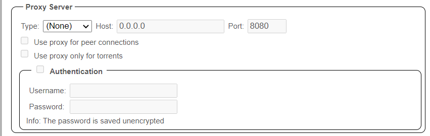

This is where you would add for example your SOCKS5 settings from your VPN provider.

!!! success ""

    **Suggested: `I personally don't recommend this unsecure option being it's un-encrypted and only spoofs your IP.`**

---

## Speed

### Global Rate Limits

Here you can set your global rate limits, meaning your maximum download/upload speed used by qBittorrent. (For all torrents)

The best settings depend on many factors.

- Your ISP speed.
- Your hardware used.
- Bandwidth needed by other services in your home network.

    !!! success ""

        **Suggested: `For a home connection that you use with others it's best practice to set the upload/download rate to about 70-80% of your maximum upload/download speed.`**

### Alternative Rate Limits

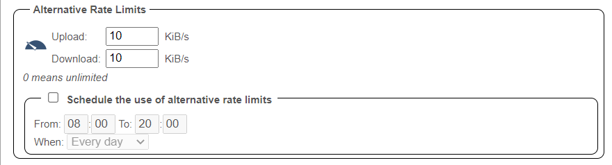

When enabled, it basically does the same as above, but with the option to set up a schedule.

Examples:

- Limit your upload/download rate during the daytime when you make the most use of it, and unlimited it during nighttime when no one is using the connection.
- If you have an internet connection that's limited during specific hours (unlimited bandwidth during the night, but limited during the day)

    !!! success ""

        **Suggested: `Personal preference`**

### Rate Limits Settings

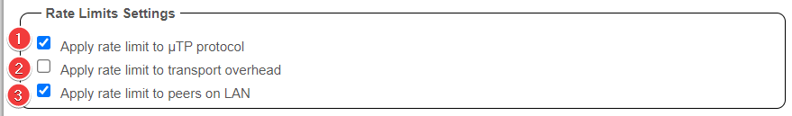

Not going to cover the technical part of what it does, but the following settings are recommended for best speeds (in most cases).

1. Prevents you from being flooded if the uTP protocol is used for any reason.

    !!! success ""

        **Suggested: `Enabled`**

1. Apply rate limit to transport overhead

    !!! success ""

        **Suggested: `Disabled`**

1. Apply rate limit to peers on LAN

    !!! success ""

        **Suggested: `Enabled`**

---

## Bittorrent

### Privacy

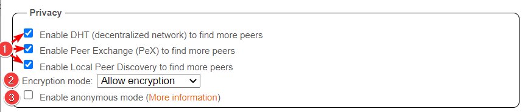

1. These settings are mainly used for public trackers (and should be enabled for them) and not for private trackers, decent private trackers use a private flag where they ignore these settings.

    !!! success ""

        **Suggested: `Personal preference`**

1. Recommended setting `Allow encryption` rather than enforcing it allows more peers to connect and is recommended on underpowered systems as it will allow for lower overhead.

    !!! success ""

        **Suggested: `Allow encryption`**

1. Anonymous mode hides the client's (qBittorrent) fingerprint from the peer-ID, sets the ‘User-Agent’ to Null and doesn’t share your IP address directly with trackers (though peers will still see your IP address). If using private trackers, it's recommended to `disable` this. We also got reports from people who are using this that they had worse speeds.

    !!! success ""

        **Suggested: `Disabled`**

### Torrent Queueing

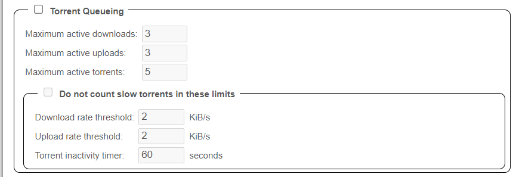

These options allow you to control the number of active torrents being downloaded and uploaded.

!!! success ""

    **Suggested: `personal preference based on your setup and connection.`**

### Seeding Limits

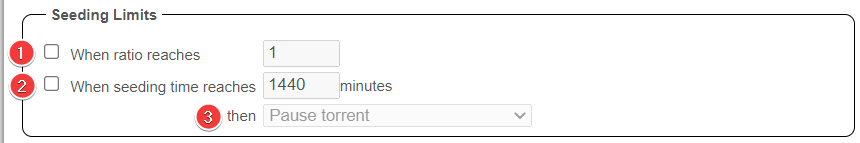

1. Your maximum seeding ratio preference. (When both ratio and seeding time are enabled it will trigger the action on whatever happens first.)

    !!! success ""

        **Suggested: `Disabled`**

1. Your maximum seeding time preference (When both ratio and seeding time are enabled it will trigger the action on whatever happens first.)

    !!! success ""

        **Suggested: `Disabled`**

1. What to do when ratio or seeding time is reached.

    !!! success ""

        **Suggested: `Paused and Disabled`**

!!! tip

    We recommend using the seeding goals in your Starr Apps indexer settings (enable advanced), or use [qBit Manage](/Downloaders/qBittorrent/3rd-party-tools/#qbit-manage){:target="\_blank" rel="noopener noreferrer"}

### Automatically add these trackers to new downloads

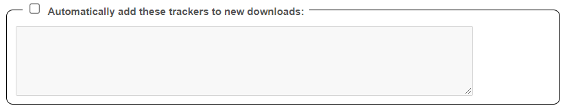

!!! success ""

    **Recommendation: `Disabled`**

!!! WARNING

    :bangbang: **NEVER USE THIS OPTION ON (Semi-)PRIVATE TRACKERS** :bangbang:

---

## Web UI

### Authentication

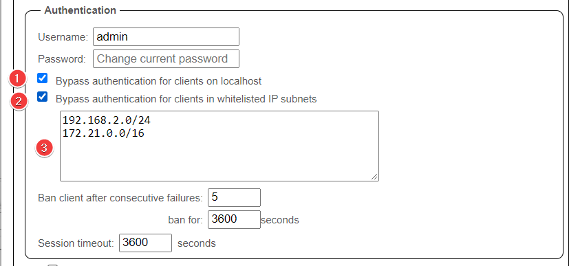

1. When enabled there will be no authentication required for clients on localhost.
1. When enabled there will be no authentication required for clients in the `step.3` whitelist.
1. Add all IP subnets that you want to bypass authentication.

### Security

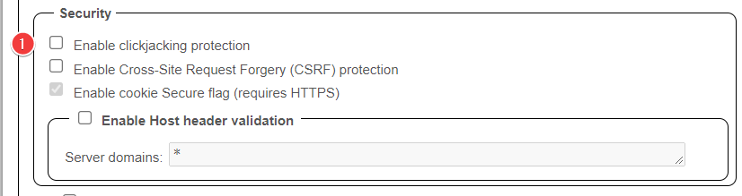

1. In some cases when this is enabled it could result in issues.

    !!! success ""

        **Suggested: `Disabled`**

--8<-- "includes/support.md"

[^1]:

    If you use unRaid then you don't need this since you can make use of the default cache drive option.
