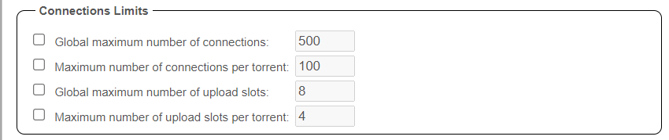

# qBittorrent - Basic Setup

--8<-- "includes/downloaders/basic-setup.md"

------

!!! Note
    Settings that aren't covered means you can change them to your own liking or just leave them on default.

------

## Downloads

`Tools` => `Options` => `Downloads` (Or click on the cog wheel to access the options)

### When adding a torrent

1. For consistent with other torrents I recommend leaving this on `Original`.

    !!! check ""
        **Suggested: `Original`**

1. Delete the .torrent file after it has been added to qBittorrent.

    !!! check ""
        **Suggested: `Personal preferences`**

1. Pre-allocated disk space for the added torrents, this limits fragmentation and also makes sure if you use a cache drive or a feeder disk that the space is available.

    !!! check ""
        **Suggested: `Enabled`**

### Saving Management

1. Make sure this is set to `Automatic` else your downloads do not go into the category folder.

    !!! check ""
        **Suggested: `Automatic`**

1. This helps you to manage your file location based on Categories.

    !!! check ""
        **Suggested: `Enabled`**

1. Same as `Step 2`

    !!! check ""
        **Suggested: `Enabled`**

1. Your download root path (Download folder/location).

    !!! check ""
        **Read the `ATTENTION` block below**

1. If you enable this, your incomplete downloads will be placed first in this location before moved to your `Default Save Path:`. This could be useful if you want your downloads to use a separate SSD/Feeder disk[^1]. But this also results in extra unnecessary moves or in worse cases a slower and more I/O intensive copy + delete.

    !!! check ""
        **Suggested: `Personal preferences`**

#### ATTENTION

--8<-- "includes/downloaders/warning-path-location.md"

------

## Connection

### Listening Port

1. Set this on TCP for the best performance

    !!! check ""
        **Suggested: `TCP`**

1. Your port used for incoming connection, this also the port you opened in your router/firewall or port forwarding on your VPN provider to make sure you're connectable.

    !!! check ""
        **Suggested: `The port you opened in your router/firewall or port forwarding on your VPN provider`**

1. This should be actually Disabled in your router for several security reasons.

    !!! check ""
        **Suggested: `Disabled`**

1. Make sure this is Disabled so you don't mess up the forwarded port.

    !!! check ""
        **Suggested: `Disabled`**

### Connections Limits

The best settings for this depend on many factors so I won't be covering this.

!!! check ""
    **Suggested: `personal preferences based on your setup and connection.`**

### Proxy Server

This is where you would add for example your SOCKS5 settings from your VPN provider.

!!! check ""
    **Suggested: `I personally don't recommend this unsecure option being it's un-encrypted and only spoofs your IP.`**

------

## Speed

### Global Rate Limits

Here you can set your global rate limits, meaning your maximum download/upload speed used by qBittorrent.(for all torrents)

What's the best setting depends on many factors?

- Your ISP speed.
- Your hardware used.
- Your personal usage of your connection for other things.

    !!! check ""
        **Suggested: `For a home connection that you use with others it's best practice to set the upload/download rate to about 70-80% of your maximum upload/download speed.`**

### Alternative Rate Limits

When Enabled, basically the same as above but with the option to setup a schedule examples:

- Limit your upload/download rate during daytime when you make most use of it, and unlimited it during nighttime when no one is using the connection.
- If you have an internet connectivity that's limited during specific hours (unlimited bandwidth during the night, but limited during the day)

    !!! check ""
        **Suggested: `Personal preferences`**

### Rate Limits Settings

Not going to cover the the technical part what it does, But the following setting is recommended for best speeds (in most cases)

1. Prevents you to be flooded if the uTP protocol is used for any reason.

    !!! check ""
        **Suggested: `Enabled`**

1. Apply rate limit to transport overhead

    !!! check ""
        **Suggested: `Disabled`**

1. Prevents you to be flooded if the uTP protocol is used for any reason.

    !!! check ""
        **Suggested: `Enabled`**

------

## Bittorrent

### Privacy

1. These settings are mainly used for public trackers (and should be enabled for them) and not for private trackers, decent private trackers use a private flag where they ignore these settings.

    !!! check ""
        **Suggested: `Personal preferences`**

1. Recommended setting `Allow encryption` rather than enforcing it allows more peers to connect and is recommended on underpowered systems as it will allow for lower overhead.

    !!! check ""
        **Suggested: `Allow encryption`**

1. Anonymous mode hides clients (qBittorrent) fingerprint from the peer-ID, sets the ‘User-Agent’ to Null and it doesn’t share your IP-address directly with trackers (though peers will still see your IP address). If using private trackers, it's recommended to `disable` this. I also got reports from people who are using this that they had worse speed.

    !!! check ""
        **Suggested: `Disabled`**

### Torrent Queueing

These options allow you to control the number of torrents being downloaded and uploaded.

!!! check ""
    **Suggested: `personal preferences based on your setup and connection.`**

### Seeding Limits

1. Your seeding ratio preference (When both enable then this option is a or)

    !!! check ""
        **Suggested: `Disabled`**

1. Your seeding time preference (When both enabled then this option is a or)

    !!! check ""
        **Suggested: `Disabled`**

1. What to do when ratio or seeding time is reached.

    !!! check ""
        **Suggested: `Paused and Disabled`**

!!! tip
    Personally, I recommend using the seeding goals in your Starr Apps indexer settings (enable advanced), or use [qBit Manage](/Downloaders/qBittorrent/3rd-party-tools/#qbit-manage){:target="_blank" rel="noopener noreferrer"}

### Automatically add these trackers to new downloads

!!! check ""
    **Recommendation: `Disabled`**

!!! WARNING
    :bangbang: **NEVER USE THIS OPTION ON (Semi-)PRIVATE TRACKERS** :bangbang:

------

## Web UI

### Authentication

1. When enabled there will be no authentication request for clients on localhost.
1. When enabled bypass authentication for clients in the `step.3` whitelist.
1. Add here all IP subnets that you want to have the option to bypass the authentication.

### Security

1. Enable clickjacking protection, in some cases when this is enabled it could result in issues.

    !!! check ""
        **Suggested: `Disabled`**

--8<-- "includes/support.md"

[^1]:
    If you use unRaid then you don't need this being, you can make use of the default cache drive option.
