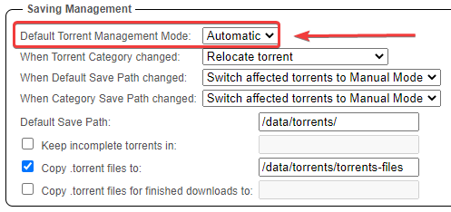

# qBittorrent - How to add categories

This basic example is based on the use of docker images

!!! tip ""

    Keep in mind the path are set up so it works with hardlinks and instant moves.

    More info [HERE](/File-and-Folder-Structure/Hardlinks-and-Instant-Moves/){:target="_blank" rel="noopener noreferrer"}

!!! info

    Pick one path layout and use it for all of them.

    It doesn't matter if you prefer to use `/data`, `/shared`, `/storage` or whatever.

    The screenshots in the examples use the following root path `/data`

---

1. Click on the left under categories with your left mouse button.
1. Click on `Add category`

1. Enter your category.
1. Enter your save path subfolder (keep it simple and recognizable)

You don't need to add the full path under `Save Path`, it will use the root download path that you've set up in `Options` => `Saving Management` => `Default Save Path:`.

---

## Paths and Categories Breakdown

## Downloads do not go into the category folder

!!! warning "Downloads do not go into the category folder"

    When your downloads end up in `/data/torrents/` and not in `/data/torrents/{tv|movies|music}` then you probably forgot to change `Default Torrent Management Mode:` to `Automatic`

    

--8<-- "includes/support.md"
