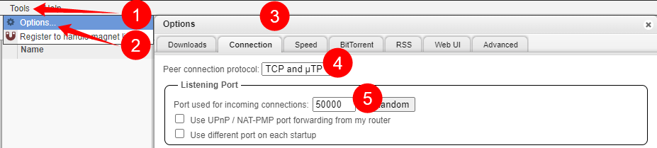

# qBittorrent - Port forwarding

--8<-- "includes/downloaders/port-forwarding.md"

---

## Client settings

`Tools` => `Options` => `Connection` is where you will find the settings to which port the download should use.

1. Tools or cogwheel.
1. Options (skip if you choose the cogwheel).
1. Select the `Connection` Tab.
1. Change `TCP and uTP` to `TCP`, if you get speed issues try one of the others.
1. Add here the port you've forwarded.
