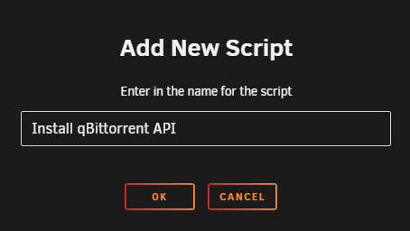
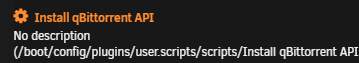
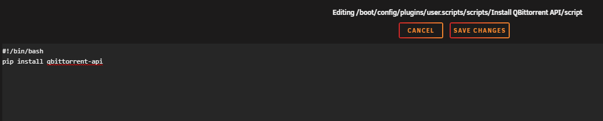
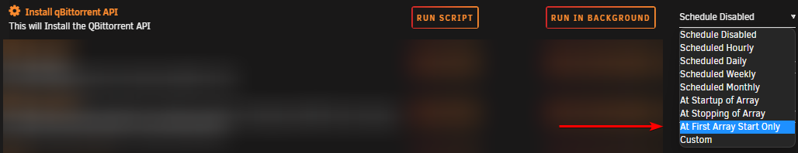
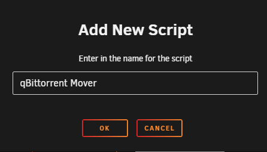
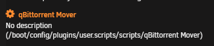
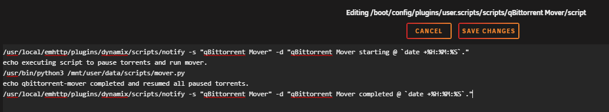
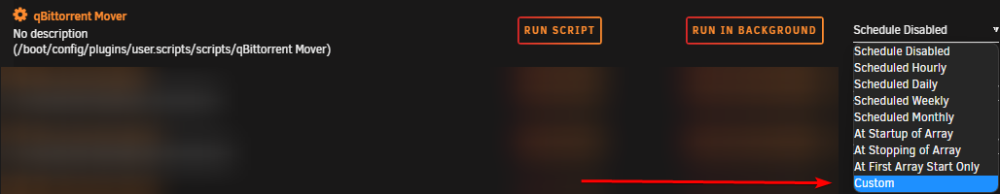

# unRAID Mover and qBittorrent

When you make use of the unRAID cache drive for your `/data/torrents` share, and the torrents in qBittorrent are still seeding, the mover can't move files since they are still in use.

Using the following instructions will allow you to move the files using the qBittorrent API.

!!! abstract "Workflow Rules"

    1. Pause torrents in a specified age range that reside on your cache drive.
    1. Run the unRAID mover.
    1. Resume the torrents after the mover has completed.

!!! warning

    The screenshots below are only **EXAMPLES** to show you how it should look and where you need to place the data that you need to add. They are **NOT** always a 100% reflection of the actual data, and not always the actual values you need to add.

    - Always follow the recommendations described in the guide.
    - If you have any questions, or aren't sure, just click the chat badge to join the Discord Channel where you can ask your questions directly.

## Needed

### qBit-Mover script

Download the following standalone Python script.

- [Script (mover.py)](https://raw.githubusercontent.com/StuffAnThings/qbit_manage/master/scripts/mover.py){:target="\_blank" rel="noopener noreferrer"}

Big Thnx to [bobokun](https://github.com/bobokun){:target="\_blank" rel="noopener noreferrer"} Developer of [qBit Manage](https://github.com/StuffAnThings/qbit_manage){:target="\_blank" rel="noopener noreferrer"}

### Plugins

Install the following plugins:

- User Scripts
- You will need to manually install the following packages for the correct Slackware version from [https://packages.slackware.com/](https://packages.slackware.com/){:target="\_blank" rel="noopener noreferrer"}
    - python3
    - python-setuptools
    - python-pip

--8<-- "includes/downloaders/nerdtools-replacement-package-slackware.md"

---

## Setup

After you install the needed `Plugins` - it's time to configure everything.

### `qbittorrent-api` module

The script needs the qbittorrent-api module to work, so we need to make sure it's installed when your unRAID server starts, or when the Array is started the first time.

You can choose one of the following 3 options (select a tab) to install `qbittorrent-api`.

=== "User scripts"

    With this option, we're going to install the `qbittorrent-api` module when the Array is started the first time.

    In your unRAID Dashboard, go to your `Settings` tab and select `User Scripts` in the `User Utilities` section at the bottom.

    

    At the bottom of the `User Scripts` page select the `ADD NEW SCRIPT` button.

    

    A popup will appear asking you to name the script. For this example, we're going to use `Install qBittorent-API` and then click on `OK`.

    

    Click on the cogwheel of the new script in the list, and select `Edit Script`.

    

    Copy/Paste the following in the new window that opens, then click `SAVE CHANGES`.

    ```bash
    #!/bin/bash
    pip3 install qbittorrent-api
    ```

    

    Select in the schedule list when the script should run, and choose `At First Array Start Only`.

    

    Click on `Apply`.

    Finally, you will need to choose `RUN IN BACKGROUND` or restart your unRAID server to install the `qbittorrent-api` module.

    

=== "Python venv"

    With this option, we're going to create a [Python virtual environment](https://docs.python.org/3/library/venv.html) on our disk. We will use this to run and store dependencies (`qbittorrent-api`) for this specific environment.

    By doing this, we will **only need to configure this once** and it will be persistent after reboots *(this differs from the previous steps)*.

    First, you need to choose a location to start a new Python environment.

    !!! info

        In the next steps, you will be asked to choose a [location to store the script](#copy-the-script-to-your-preferred-location); please try to be consistent.

    Suggestions:

    - `/mnt/user/appdata/qbittorrent/scripts/.venv`
    - `/mnt/user/data/scripts/.venv`

    Run the following command in unRAID's terminal in the directory you chose:

    ```bash
    python3 -m venv --clear /mnt/user/data/scripts/.venv
    ```

    We now need to enter this new environment and install our dependency (`qbittorrent-api`) in it, run:

    ```bash
    source /mnt/user/data/scripts/.venv/bin/activate
    pip3 install qbittorrent-api
    deactivate # to leave the environment
    ```

    !!! info

        Replace `/mnt/user/data/scripts/.venv` with the path you have chosen.

=== "Go File"

    With this option, we're going to install the `qbittorrent` module when the unRAID server is started.

    On your USB stick/key go to `/boot/config` and open the `go` file with your text editor ([VSCode](https://code.visualstudio.com/){:target="_blank" rel="noopener noreferrer"}/[Notepad++](https://notepad-plus-plus.org/downloads/){:target="_blank" rel="noopener noreferrer"}).

    Copy/paste the following command

    ```bash
    pip3 install qbittorrent-api
    ```

    Restart your unRAID Server or run the above command from the terminal.

---

### Script

#### Copy the script to your preferred location

Place the qBit-Mover script somewhere easy to access/remember.

Suggestions:

- `/mnt/user/appdata/qbittorrent/scripts/mover.py`
- `/mnt/user/data/scripts/mover.py`

#### Final steps

Set up the scheduler for when the mover should run.

In your unRAID Dashboard, go to your `Settings` tab and select `User Scripts` in the `User Utilities` section at the bottom.


At the bottom of the `User Scripts` page select the `ADD NEW SCRIPT` button.


A popup will appear asking you to name the script. For this example, we're going to use `qBittorrent Mover` and then click on `OK`.



Click on the cogwheel of the new script in the list.



Choose your method (select a tab) and copy/paste the script in the new window that opens, then click `SAVE CHANGES`.

!!! info "replace `ip` with your unraid server ip, replace `port` with your qBittorrent WebGUI port you use to access the qBittorrent WebGUI"

=== "Python (Native)"

    ``` bash
        #!/bin/bash
        /usr/local/emhttp/plugins/dynamix/scripts/notify -s "qBittorrent Mover" -d "qBittorrent Mover starting @ `date +%H:%M:%S`."
        echo "executing script to pause torrents and run mover."
        python3 /mnt/user/data/scripts/mover.py --host "ip:port" --user "your_user" --password "your_password" --cache-mount "/mnt/cache" --days_from 0 --days_to 2
        echo "qbittorrent-mover completed and resumed all paused torrents."
        /usr/local/emhttp/plugins/dynamix/scripts/notify -s "qBittorrent Mover" -d "qBittorrent Mover completed @ `date +%H:%M:%S`."
    ```

=== "Python (venv)"

    ``` bash
        #!/bin/bash

        /usr/local/emhttp/plugins/dynamix/scripts/notify -s "qBittorrent Mover" -d "qBittorrent Mover starting @ `date +%H:%M:%S`."
        echo "executing script to pause torrents and run mover."
        /mnt/user/data/scripts/.venv/bin/python3 /mnt/user/data/scripts/mover.py --host "ip:port" --user "your_user" --password "your_password" --cache-mount "/mnt/cache" --days_from 0 --days_to 2
        echo "qbittorrent-mover completed and resumed all paused torrents."
        /usr/local/emhttp/plugins/dynamix/scripts/notify -s "qBittorrent Mover" -d "qBittorrent Mover completed @ `date +%H:%M:%S`."
    ```

!!! info "Replace `/mnt/user/data/scripts/` in the script with the path you have chosen for the Python script (qBit-Mover script)."

- `--days_from` => Set Number of Days to stop torrents **from** for the move.
- `--days_to` => Set Number of Days to stop torrents **to** for the move.
- `--host` => Replace ip with your unraid server ip, and replace `port` with your qBittorrent WebGUI port you use to access the qBittorrent WebGUI.
- `--user` => Your used qBittorrent `User Name` if you have authentication enabled.
- `--password` => Your used qBittorrent `Password` if you have authentication enabled.
- `--cache-mount` => Cache mount point in Unraid. This is used to additionally filter for only torrents that exist on the cache mount. Use this option ONLY if you follow the TRaSH Guides folder structure. (For default cache drive set this to `/mnt/cache`)

<!--- -->

Click the schedule dropdown to choose when the script should run. We want to select `Custom`.



After changing to `Custom` you will get an extra text field on the right where you can set your schedule (cron).

For this example, we're going to tell the script to run every day at 4 AM.

`0 4 * * *`

You can generate your scheduling [HERE](https://crontab.guru/)


{! include-markdown "../../../../includes/support.md" !}
