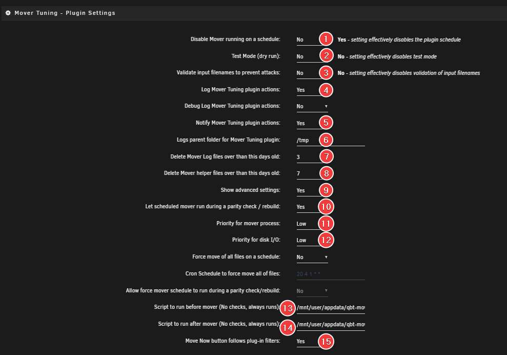

# unRAID Mover and qBittorrent

When you use the unRAID cache drive for your `/data/torrents` share while torrents are actively seeding in qBittorrent, the unRAID mover cannot move files. This happens because the files are still in use, which would break the hard links.

Using the instructions below, you can move files using the qBittorrent API with the qBit-Mover script.

---

## How the qBit-Mover Script Works

!!! info "The qBit-Mover script doesn't move files itself. It only pauses and resumes torrents, and it can trigger the unRAID mover or Mover Tuning."

This guide explains two ways to use the mover script:

- **Option 1:** Combined with the Mover Tuning Plugin (Recommended)
- **Option 2:** Using User Scripts

### Option 1

This option uses the Mover Tuning plugin to:

1. Pause torrents within a specific age range that are on your cache drive
1. Resume the torrents after the unRAID mover finishes

It also offers these features:

- Automatically install and update the qbittorrent-api module (**REQUIRED**)
- Automatically download the qBit-Mover script (**REQUIRED**)
- qBit-Manage integration (*OPTIONAL*)
    - Stop qBit-Manage before qBit-Mover runs
    - Start qBit-Manage after qBit-Mover completes or after fclones finishes

        !!! warning "If qBit-Manage runs while files are moving from cache to your array, it may incorrectly mark your files as NoHL. We strongly recommend enabling this option to prevent this issue."

- Automatically download fclones (*OPTIONAL*)
    - Run fclones (Replace copies with hardlinks)
- Automatically set the correct unRAID User/Group and permissions

### Option 2

This option runs the script from User Scripts to:

1. Pause torrents within a specific age range that are on your cache drive
1. Run/trigger the unRAID mover
1. Resume the torrents after the unRAID mover finishes

---

## Requirements

!!! danger "Important: Disable Pre-allocation in qBittorrent"
    Go to qBittorrent → Options → Downloads and **disable** this option:

    `Pre-allocate disk space for all files`

    When this option is enabled, it keeps the reserved space locked (in use) until you quit qBittorrent.

### Tips & Info

!!! tip
    - Don't disable the mover from **Settings** → **Scheduler** → **Mover Settings**. Instead, you could set the mover to run once a month, one minute after you run the qBit Mover script. The mover shouldn't run because it's already running.
    - If you're also using Mover Tuning, don't disable the mover from running on a schedule—this could completely disable it.
    - We recommend using Mover Tuning. If you do, make sure **Move files that are greater than this many days old** matches the number of days you set in the qBit-Mover script or config.

!!! info
    The screenshots below are **EXAMPLES** to show you how things should look and where to add data. They are **NOT** always 100% accurate reflections of the actual data or the exact values you need.

    - Always follow the recommendations in this guide.
    - If you have questions or aren't sure about something, click the chat badge to join the Discord Channel where you can ask questions directly.

---

## Option 1: Mover Tuning

!!! danger "This option expects that you follow the guide's suggested paths as described in this section."

Install the following plugins:

- Python 3 for unRAID (unRAID Plugin)
- Mover Tuning (unRAID Plugin)

Install the following container (Optional but suggested):

- qBit-Manage

---

For this option, you only need to download three files and place them in `/mnt/user/appdata/qbt-mover/`:

- **[mover-tuning-start.sh](https://raw.githubusercontent.com/TRaSH-Guides/Guides/refs/heads/master/includes/downloaders/mover-tuning-start.sh)** - The script that runs before the mover starts.

    ??? example "mover-tuning-start.sh - [Click to show/hide]"
        ```bash
        --8<-- "includes/downloaders/mover-tuning-start.sh"
        ```

- **[mover-tuning-end.sh](https://raw.githubusercontent.com/TRaSH-Guides/Guides/refs/heads/master/includes/downloaders/mover-tuning-end.sh)** - The script that runs after the mover finishes.

    ??? example "mover-tuning-end.sh - [Click to show/hide]"
        ```bash
        --8<-- "includes/downloaders/mover-tuning-end.sh"
        ```

- **[mover-tuning.cfg](https://raw.githubusercontent.com/TRaSH-Guides/Guides/refs/heads/master/includes/downloaders/mover-tuning.cfg)** - This config file holds all the user variables used by the other scripts.

    !!! info "Read and edit the instructions inside the script."

    ??? example "mover-tuning.cfg - [Click to show/hide]"
        ```bash
        --8<-- "includes/downloaders/mover-tuning.cfg"
        ```

### Permissions

Once you've downloaded all the scripts, make sure the permissions are correct and that the scripts are executable. You can do this from a terminal with the following command:

```bash
chown -R nobody:users /mnt/user/appdata/qbt-mover/
chmod -R a=,a+rX,u+w,g+w /mnt/user/appdata/qbt-mover/
chmod +x /mnt/user/appdata/qbt-mover/mover-tuning-start.sh
chmod +x /mnt/user/appdata/qbt-mover/mover-tuning-end.sh
```

#### Fixing Run Errors

After editing the scripts, make sure they use LF line endings (Unix format). If you edited the files on Windows, they may have CRLF line endings, which can cause errors.

Run the following command to convert all `.sh` files to the correct format:

```bash
for file in *.sh; do [ -f "$file" ] && sed -i 's/\r$//' "$file" && echo "Converted $file"; done
```

**How to use this command:**

1. Open the unRAID terminal
2. Navigate to the directory containing your mover-tuning scripts:

    ```bash
    cd /mnt/user/appdata/qbt-mover/
    ```

3. Paste the command above
4. Press ++enter++

This converts all `.sh` files from CRLF (Windows line endings) to LF (Unix line endings) in the current directory.

---

### Mover Tuning Settings

We'll only cover the Mover Tuning settings that are important for qBit-Mover, not every single setting.

In your unRAID Dashboard, go to the **Settings** tab and select **Scheduler** in the **User Preferences** section.

#### Mover Settings

In the Scheduler under Mover Settings, first set when the mover should run:


1. Choose how often you want the mover to run
1. Choose when you want the mover to run
1. Enable mover logging if you want to see what's being moved in the log files
1. Click **APPLY** to save the settings

#### Mover Tuning - Plugin Settings



1. This prevents the mover from running at the schedule set in Mover Settings. Setting this to "Yes" effectively disables the plugin schedule.
1. Test Mode (dry run). Enable this the first few times to see what will happen without actually moving files.
1. We've had reports that enabling this option prevents the mover from moving certain files, so we recommend keeping it disabled.

    !!! success ""
        **Suggested:** `Disabled`

1. Enable Mover Tuning logging.
1. Enable or disable notifications for this plugin. Notifications appear in the Unraid GUI.
1. Default save path for Mover Tuning log files. You can choose a different location if you prefer.
1. Select how many days old log files (`*.log`) and text files (`*.txt`) should be before Mover Tuning deletes them.
1. Select how many days old list files (`*.list`) should be before Mover Tuning deletes them.
1. Show advanced settings options. Make sure this is enabled.

    !!! success ""
        **Suggested:** `Enabled`

1. If enabled, the mover will run during a parity check or rebuild.
1. Set the priority for the mover process. Adjusting these options may help if other applications pause or buffer when the mover runs.
1. Set the priority for the mover process. Adjusting these options may help if other applications pause or buffer when the mover runs.
1. Path to a script that runs before the mover starts. (**This is where we add the path to the `mover-tuning-start.sh` script.**)

    !!! success ""
        **Suggested:** `/mnt/user/appdata/qbt-mover/mover-tuning-start.sh`

1. Path to a script that runs after the mover finishes. (**This is where we add the path to the `mover-tuning-end.sh` script.**)

    !!! success ""
        **Suggested:** `/mnt/user/appdata/qbt-mover/mover-tuning-end.sh`

1. Select "Yes" to follow plugin filters, or "No" to run the original mover (ignores plugin filters) from the button.

#### Mover Tuning - Filters


1. When this percentage threshold is reached, the mover starts moving data off the cache pool.

    !!! success ""
        If your cache drive is large enough, you could set this to 75%, for example. This lets you seed longer from your cache drive and have all upgrades happen there before moving to your array.

1. Set the percentage of disk space used on the cache drive after the mover completes. Setting this to 0% means the mover continues until all data is moved off the cache pool.

    !!! success ""
        Setting this to 50%, for example, frees up space to 50% of your cache capacity and lets you seed longer from your cache drive.

1. Select whether you want to move files off the Primary (cache) based on their age in days.

    !!! success ""
        **Suggested:** `Yes`

1. Select how many days old a file must be to move (up to 1 year). "Auto" moves from oldest to newest until the threshold is met.

    !!! success ""
        **Suggested:** `Auto`

1. Show advanced filter options.

    !!! success ""
        **Suggested:** `Yes`

1. Use CTIME (creation time) instead of MTIME (modification time) in the find command.

    !!! success ""
        **Suggested:** `No`

1. Use ATIME (access time) instead of MTIME (modification time) in the find command.

    !!! success ""
        **Suggested:** `No`

1. Select "Yes" if you want to move files based on their size in MB.

    !!! success ""
        **Suggested:** `No`

1. Ignore all hidden files and directories.

    !!! success ""
        **Suggested:** `No`

1. Set to "Yes" if you want to move all files from your cache to the array when the percentage below is exceeded.
1. Set the percentage of disk space used on the Primary pool that triggers a move of all files from your cache to your array.

#### Mover Tuning - Options


1. Forces unRAID to switch to turbo write mode (reconstruct write) when the mover runs.

    !!! success ""
        **Suggested:** `Personal Preference`

1. Choose the tool for moving files with plugin filters. You can select between Rsync or Move (Unraid's built-in file-moving utility).
    - **Move** - Use Unraid's built-in tool for moving, but continue using Rsync for syncing files.
    - **Rsync** - Use Rsync for both moving and syncing files.

    !!! success ""
        **Suggested:** `Personal Preference and what works best for you. Some people report that Move didn't work but Rsync did.`

1. This removes the parent folder only of moved files. "Top Folder" removes the top-level folder of moved files on a share, including all subfolders if they're empty.

    !!! success ""
        **Suggested:** `Top Folder`

1. Show advanced options.

    !!! success ""
        **Suggested:** `Yes`

1. Moves files from shares to their Primary and/or Secondary storage if they're spread across Unattended Storage (disks/pools not assigned as a share's Primary or Secondary). May move older files from Primary→Secondary or Secondary→Primary if allowed.

    !!! success ""
        **Suggested:** `No`

1. Click **APPLY** to save the settings

---

## Option 2: User Scripts

Install the following plugins:

- User Scripts
- Python 3 for unRAID (unRAID Plugin)

### qBit-Mover Script

Download the latest qBit-Mover script [HERE](https://raw.githubusercontent.com/StuffAnThings/qbit_manage/master/scripts/mover.py){:target="_blank" rel="noopener noreferrer"}.

Big thanks to [bobokun](https://github.com/bobokun){:target="_blank" rel="noopener noreferrer"}, the developer of [qBit Manage](https://github.com/StuffAnThings/qbit_manage){:target="_blank" rel="noopener noreferrer"}, for creating this script with all the requested changes.

#### Save the Script to Your Preferred Location

Place the qBit-Mover script somewhere easy to access and remember.

**Suggested locations:**

- `/mnt/user/appdata/qbt-mover/mover.py`
- `/mnt/user/appdata/scripts/mover.py`

### Install the `qbittorrent-api` Module

The script needs the `qbittorrent-api` module to work, so you need to install it when your unRAID server starts or when the Array starts for the first time.

Choose one of the following three methods (select a tab) to install `qbittorrent-api`.

=== "Python venv (Recommended)"

    This method creates a [Python virtual environment](https://docs.python.org/3/library/venv.html) on your disk. You'll use this to run and store dependencies (`qbittorrent-api`) for this specific environment.

    With this method, you **only need to set this up once** and it will remain after reboots (unlike the other methods).

    First, choose a location for your new Python environment.

    !!! info
        In the next steps, you'll choose a [location to store the script](#save-the-script-to-your-preferred-location). Try to keep things organized.

    **Suggested locations:**

    - `/mnt/user/appdata/qbt-mover/.venv`
    - `/mnt/user/appdata/scripts/.venv`

    Run the following command in unRAID's terminal using the directory you chose:

    ```bash
    python3 -m venv --clear /mnt/user/appdata/scripts/.venv
    ```

    Now enter this new environment and install the dependency (`qbittorrent-api`):

    ```bash
    source /mnt/user/appdata/scripts/.venv/bin/activate
    pip3 install qbittorrent-api
    deactivate # to exit the environment
    ```

    !!! info
        Replace `/mnt/user/appdata/scripts/.venv` with the path you chose.

=== "User Scripts"

    This method installs the `qbittorrent-api` module when the Array starts for the first time.

    In your unRAID Dashboard, go to the **Settings** tab and select **User Scripts** in the **User Utilities** section at the bottom.

    

    At the bottom of the **User Scripts** page, click the **ADD NEW SCRIPT** button.

    

    A popup will ask you to name the script. For this example, use `Install qBittorrent-API` and click **OK**.

    

    Click the cogwheel next to the new script in the list and select **Edit Script**.

    

    Copy and paste the following into the new window that opens, then click **SAVE CHANGES**.

    ```bash
    #!/bin/bash
    pip3 install qbittorrent-api
    ```

    

    In the schedule list, select when the script should run and choose `At First Array Start Only`.

    

    Click **Apply**.

    Finally, click **RUN IN BACKGROUND** or restart your unRAID server to install the `qbittorrent-api` module.

    

=== "Go File"

    This method installs the `qbittorrent-api` module when the unRAID server starts.

    On your USB stick/key, go to `/boot/config` and open the `go` file with your text editor ([VSCode](https://code.visualstudio.com/){:target="_blank" rel="noopener noreferrer"} or [Notepad++](https://notepad-plus-plus.org/downloads/){:target="_blank" rel="noopener noreferrer"}).

    Copy and paste the following command:

    ```bash
    pip3 install qbittorrent-api
    ```

    Restart your unRAID server or run the command above from the terminal.

### Set Up the Scheduler

Set up the scheduler for when the mover should run.

In your unRAID Dashboard, go to the **Settings** tab and select **User Scripts** in the **User Utilities** section at the bottom.


At the bottom of the **User Scripts** page, click the **ADD NEW SCRIPT** button.


A popup will ask you to name the script. For this example, use `qBittorrent Mover` and click **OK**.


Click the cogwheel next to the new script in the list.


Choose your method (select a tab) and copy/paste the script into the new window that opens, then click **SAVE CHANGES**.

!!! info "Important: Replace placeholders"
    Replace `ip` with your unRAID server IP and `port` with your qBittorrent WebGUI port.

=== "Python (Native)"

    ```bash
    #!/bin/bash
    /usr/local/emhttp/plugins/dynamix/scripts/notify -s "qBittorrent Mover" -d "qBittorrent Mover starting @ `date +%H:%M:%S`."
    echo "executing script to pause torrents and run mover."
    python3 /mnt/user/appdata/scripts/mover.py --host "ip:port" --user "your_user" --password "your_password" --cache-mount "/mnt/cache" --days_from 0 --days_to 2
    echo "qbittorrent-mover completed and resumed all paused torrents."
    /usr/local/emhttp/plugins/dynamix/scripts/notify -s "qBittorrent Mover" -d "qBittorrent Mover completed @ `date +%H:%M:%S`."
    ```

=== "Python (venv)"

    ```bash
    #!/bin/bash

    /usr/local/emhttp/plugins/dynamix/scripts/notify -s "qBittorrent Mover" -d "qBittorrent Mover starting @ `date +%H:%M:%S`."
    echo "executing script to pause torrents and run mover."
    /mnt/user/appdata/scripts/.venv/bin/python3 /mnt/user/appdata/scripts/mover.py --host "ip:port" --user "your_user" --password "your_password" --cache-mount "/mnt/cache" --days_from 0 --days_to 2
    echo "qbittorrent-mover completed and resumed all paused torrents."
    /usr/local/emhttp/plugins/dynamix/scripts/notify -s "qBittorrent Mover" -d "qBittorrent Mover completed @ `date +%H:%M:%S`."
    ```

!!! info "Update the script path"
    Replace `/mnt/user/appdata/scripts/` in the script with the path you chose for the Python script (qBit-Mover script).

### Script Parameters Explained

| Parameter       | Description                                                                                                                                                                                                              |
| --------------- | ------------------------------------------------------------------------------------------------------------------------------------------------------------------------------------------------------------------------ |
| `--days_from`   | Set the number of days to stop torrents **from** for the move                                                                                                                                                            |
| `--days_to`     | Set the number of days to stop torrents **to** for the move                                                                                                                                                              |
| `--host`        | Replace `ip` with your unRAID server IP and `port` with your qBittorrent WebGUI port                                                                                                                                     |
| `--user`        | Your qBittorrent username (if you have authentication enabled)                                                                                                                                                           |
| `--password`    | Your qBittorrent password (if you have authentication enabled)                                                                                                                                                           |
| `--cache-mount` | Cache mount point in Unraid. This filters for only torrents that exist on the cache mount. Use this option ONLY if you follow the TRaSH Guides folder structure. (For the default cache drive, set this to `/mnt/cache`) |

### Set the Schedule

Click the schedule dropdown to choose when the script should run. Select `Custom`.


After changing to `Custom`, you'll see an extra text field on the right where you can set your schedule using cron syntax.

For this example, we'll run the script every day at 4 AM:

```bash
0 4 * * *
```

You can create your schedule using [crontab guru](https://crontab.guru/).


---

{! include-markdown "../../../../includes/support.md" !}
