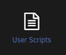

# How to run the unRaid mover for qBittorent seeding torrents

{! include-markdown "../../../../includes/downloaders/basic-setup.md" !}
<!-- --8<-- "includes/downloaders/basic-setup.md" -->

When you make use of the unRaid cache drive for your `/data/torrents` share and the torrents in qBittorent are still seeding then the mover can't move files, because they are still in use.

Using the following instructions you will be able to move the files with the use of the qBittorrent API.

!!! summary "Workflow Rules - [CLICK TO EXPAND]"

    1. Pause torrents older than last x days.
    1. Run the mover.
    1. Resume the torrents once the mover is completed.

## Warning

!!! Danger "If you make use of the Seed Time/Ratio settings in your Indexers settings in the Starr apps[^1].<br> Make sure you're using `Post-Import Category` in your Starr apps Download clients settings.<br>Else it could happen when the torrents get paused that they get removed by the Starr apps before the seeding goal is reached."

## Needed

### The Script

Download the following standalone script.

- [Script](https://raw.githubusercontent.com/StuffAnThings/qbit_manage/master/scripts/mover.py){:target="_blank" rel="noopener noreferrer"}

Big Thnx to [bobokun](https://github.com/bobokun){:target="_blank" rel="noopener noreferrer"} Developer of [qBit Manage](https://github.com/StuffAnThings/qbit_manage){:target="_blank" rel="noopener noreferrer"}

### Plugins

Install the following Plugins.

- User Scripts
- Nerd Tools
      - python3 [^2]
      - python-setuptools [^2]

------

## Setup

After you installed the needed Plugins it's time to configure everything.

### qBit API

The script needs the qBit API to work, so we need to make sure it's installed when your unRaid server is booted or when the Array is started the first time.

You can choose from the following 2 options how you want to install it, depending what you preferce.

- [User scripts](#user-scripts)
- [Go File](#go-file)

#### User scripts

With this option we're going to install the qBit API when the Array is started the first time.

Go to your unRaid Dashboard to your settings tab and select in the `User Utilities` at the bottom the new plugin you installed `User Scripts`.



Select at the bottom `ADD NEW SCRIPT`.


A popup will appear where you can give it a name, for this example we're going to use `Install qBittorrent API` and then click on `OK`.


Click in the list on the cogwheel of the new user scrip you made.


Copy/Paste in the new windows that opens the following bash command followed by `SAVE CHANGES`.

```bash
#!/bin/bash
pip3 install qbittorrent-api
```


Select in the schedule list when the script should run, and choose `At First Array Start Only`.


Click on `RUN IN BACKGROUND` or restart your unRaid server so the qBit API is installed.


------

#### Go File

With this option we're going to install the qBit API when the unRaid server is started.

On your USB stick/key go to `/boot/config` and open the `go` file with your favorite editor ([VSCode](https://code.visualstudio.com/){:target="_blank" rel="noopener noreferrer"}/[Notepad++](https://notepad-plus-plus.org/downloads/){:target="_blank" rel="noopener noreferrer"}) and copy/paste the following command.

```bash
pip3 install qbittorrent-api
```

Restart your unRaid Server, or run the above command from the terminal.

------

### Script

Edit the script with your favorite editor ([VSCode](https://code.visualstudio.com/){:target="_blank" rel="noopener noreferrer"}/[Notepad++](https://notepad-plus-plus.org/downloads/){:target="_blank" rel="noopener noreferrer"}) you downloaded at the beginning of the guide [HERE](#the-script).

You only need to edit a few options in the script

```python
# --DEFINE VARIABLES--#
# Set Number of Days to stop torrents for the move
days = 2
qbt_host = '192.168.2.200:8080'
qbt_user = 'admin'
qbt_pass = 'adminadmin'
# --DEFINE VARIABLES--#
```

- `days` => Set Number of Days to stop torrents for the move.
- `qbt_host` => The URL you use to access qBittorrent locally. (*the* `'` *should remain*)
- `qbt_user` => Your used qBittorrent `User Name` if you have authentication enabled.
- `qbt_pass` => Your used qBittorrent `Password` if you have authentication enabled.

!!! attention ""
    If you don't use the unRaid `Mover Tuning` app, You might need to change **line 54** from `os.system('/usr/local/sbin/mover.old start')` to `os.system('/usr/local/sbin/mover start')`

#### Copy script to your preferred location

Now it's time to place the script you just edited somewhere easy to access/remember.

Suggestions:

- `/mnt/user/appdata/qbittorrent/scripts` (yes you need to create this folder your self)
- `/mnt/user/data/scripts` (yes you need to create this folder your self)

#### Final steps

Now it's time to setup the scheduler when the mover should run.

Go to your unRaid Dashboard to your settings tab and select in the `User Utilities` at the bottom the new plugin you installed `User Scripts`.


Select at the bottom `ADD NEW SCRIPT`.


A popup will appear where you can give it a name, for this example we're going to use `qBittorrent Mover` and then click on `OK`.


Click in the list on the cogwheel of the new user scrip you made.


Copy/Paste in the new windows that opens the following bash command followed by `SAVE CHANGES`.

```bash
#!/bin/bash
/usr/local/emhttp/plugins/dynamix/scripts/notify -s "qBittorrent Mover" -d "qBittorrent Mover starting @ `date +%H:%M:%S`."
echo executing script to pause torrents and run mover.
/usr/bin/python3 /mnt/user/data/scripts/mover.py
echo qbittorrent-mover completed and resumed all paused torrents.
/usr/local/emhttp/plugins/dynamix/scripts/notify -s "qBittorrent Mover" -d "qBittorrent Mover completed @ `date +%H:%M:%S`."
```

!!! info
    Replace the `/mnt/user/data/scripts/mover.py` path to the path where you placed your python script.


Select in the schedule list when the script should run, and choose `Custom`


After changing to `Custom` you get on the right a extra option where you can setup your cron schedule when it should be run.

For this example we're going to let the script run a 4am at night. `0 4 * * *`

Setup your own schedule [HERE](https://crontab.guru/)


--8<-- "includes/support.md"

[^1]:
    Starr apps = Sonarr/Radarr etc. Doesn't Starr apps sound better then `The arr(s)` ?

[^2]:
    These needs to be installed from the Nerd Tools.
