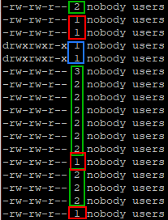
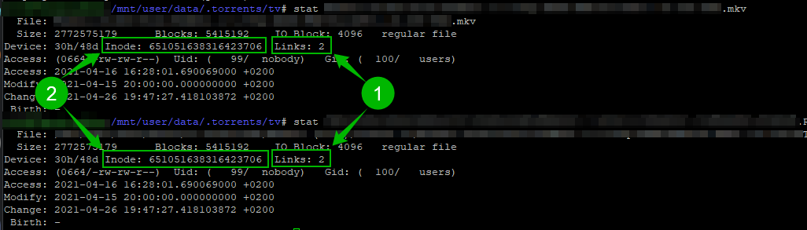
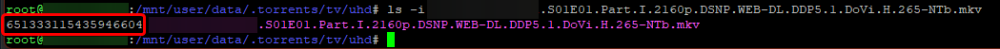
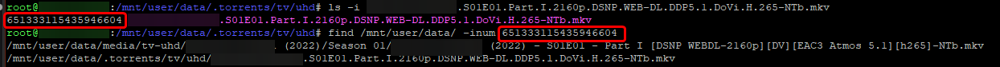

# How to check if hardlinks are working

You've followed the guide step by step but still want to check if hardlinks are working, or someone on the Sonarr/Radarr support team asked you to check if your files are hardlinked.

You can use 3 options to check if you got working hardlinks.

_All methods require logging in to your terminal with PuTTY or similar software._

!!! warning

    - You **CAN'T** create hardlinks for directories :bangbang:
    - You **CAN'T** hardlink across separate file systems, partitions, or mounts :bangbang:
    - Some file systems, such as exFAT, are known not to support hardlinks and should be avoided (double-check if you are unsure!)

---

## Usenet

!!! info "If you use Usenet, these examples won't work because you use instant/atomic moves and not hardlinks.  Still want to test if it works?  Test an import of a 4k Remux or any other big file, and you should notice it's almost instant and not a slower and more I/O intensive copy + delete."

## Mac or Linux Method 1: Using ls

This is the easiest to check, in our opinion.

In your terminal, `cd` to your download location and run `ls -al` or type `ls -al /path/to/your/download/location/`

You will get a listing of all your files and on the left side you will see a couple of numbers, every file with a number above 1 is hardlinked.

- Red rectangle - Not Hardlinked
- Green rectangle - Hardlinks
- Blue rectangle - Folders/Directories you will need to go into them to check if the files are hardlinked.

---

## Mac or Linux Method 2: Using stat

This way requires a bit more work.

- In the terminal, type: `stat /path/to/your/download/location/file.mkv`
- In the terminal, type: `stat /path/to/your/media/location/file.mkv`

You will get 2 results you can use to compare several things.

1. Links: Everything above 1 means it's hardlinked
1. Inode: if the numbers match, you know the files are hardlinked

---

## Mac or Linux Method 3: Using Inode copies

- In your terminal, `cd` to your download location and run `ls -i file.mkv` or type `ls -i /path/to/your/download/location/file.mkv`

This will reveal the inode of your file on the left side of the file.

- In your terminal type: `find /mnt/user/data/ -inum ###` or `find . -inum ###` if you're in your root folder.

!!! note ""

    `###` = Your inode number on the left of the file you found.

It will list all files linked with the same inode number.

## Windows Method 1: Using fsutil

- In the command line type: `fsutil hardlink list c:\path\to\your\download\location\file.mkv`

It will list all hardlinked files.

--8<-- "includes/support.md"
