# Examples

!!! info

    Pick one path layout and use it for all of them.

    It doesn't matter if you prefer to use `/data`, `/shared`, `/storage` or whatever.

    The screenshots in the examples use the following root path `/data`

## Sonarr

??? example "Sonarr Examples - [Click to show/hide]"

    `Settings` => `Media Management` => `Importing`

    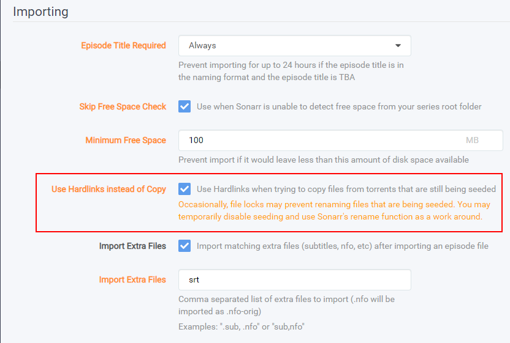

    `Settings` => `Media Management` => `Root Folders`

    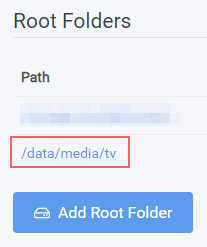

    `Series` => `Add New`

    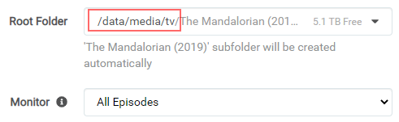

    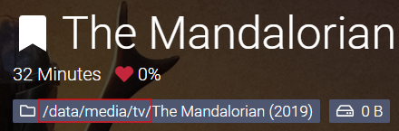

## Radarr

??? example "Radarr Examples - [Click to show/hide]"

    `Settings` => `Media Management` => `Importing`

    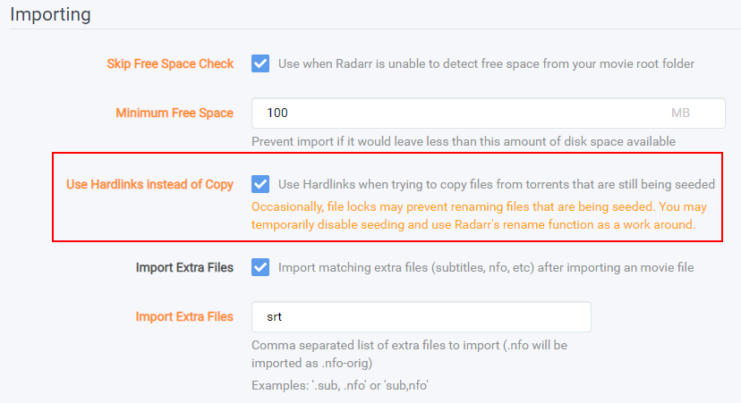

    `Settings` => `Media Management` => `Root Folders`

    

    `Movies` => `Add New`

    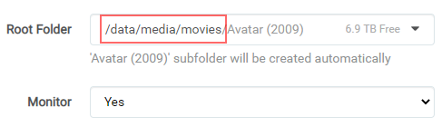

    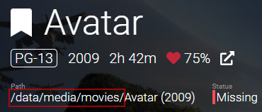

## SABnzbd

??? example "SABnzbd Examples - [Click to show/hide]"

    `SABnzbd config` => `Folders`

    

    `SABnzbd config` => `Categories`

    

    Don't forget to look at the full SABnzbd Guides

    - [SABnzbd - Basic Setup](/Downloaders/SABnzbd/Basic-Setup/)
    - [SABnzbd - Paths and Categories](/Downloaders/SABnzbd/Paths-and-Categories/)

## NZBGet

??? example "NZBGet Examples - [Click to show/hide]"

    !!! danger "NZBGet development has been officially abandoned by the developer :bangbang:"

    `Settings` => `PATHS`

    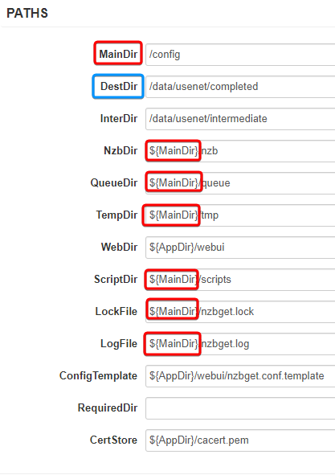

    `Settings` => `CATEGORIES`

    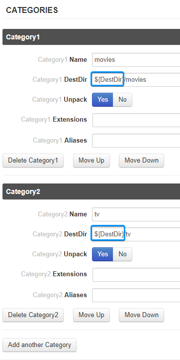

    Don't forget to look at the full NZBGet Guides

    - [NZBGet - Basic Setup](/Downloaders/NZBGet/Basic-Setup/)
    - [NZBGet - Paths and Categories](/Downloaders/NZBGet/Paths-and-Categories/)

## qBittorrent

??? example "qBittorrent Examples - [Click to show/hide]"

    `Options` => `Downloads`

    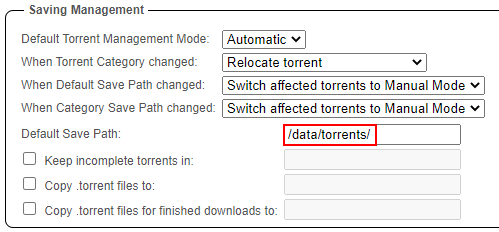

    Don't forget to look at the full qBittorrent Guides

    - [qBittorrent - Basic Setup](/Downloaders/qBittorrent/Basic-Setup/)
    - [qBittorrent - Paths](/Downloaders/qBittorrent/Paths/)
    - [qBittorrent - How to add categories](/Downloaders/qBittorrent/How-to-add-categories/)

## Deluge

??? example "Deluge Example - [Click to show/hide]"

    `Preferences` => `Downloads`

    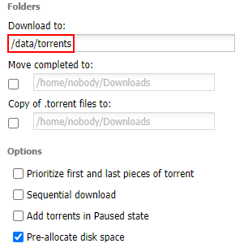

    Don't forget to look at the full Deluge Guides

    - [Deluge - Basic Setup](/Downloaders/Deluge/Basic-Setup/)
    - [Deluge - Using Labels](/Downloaders/Deluge/Using-Labels/)

## ruTorrent

??? example "ruTorrent Examples - [Click to show/hide]"

    `../config/rtorrent/config/rtorrent.rc` (path to your appdata)

    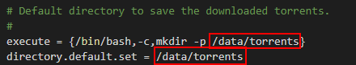

    `Settings` => `Downloads`

    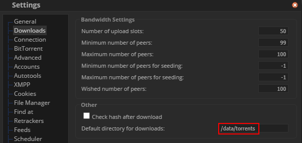

    `Settings` => `Autotools`

    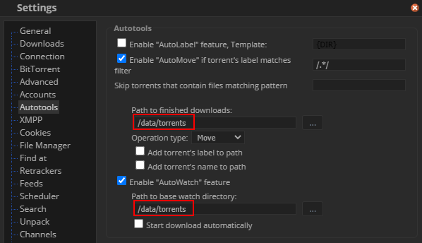

---

Big Thanks to [fryfrog](https://github.com/fryfrog){:target="\_blank" rel="noopener noreferrer"} for his [Docker Guide](https://wiki.servarr.com/docker-guide){:target="\_blank" rel="noopener noreferrer"} that we used as a basis for this guide.

--8<-- "includes/support.md"
