# Examples

::: info

Pick one path layout and use it for all of them.

It doesn't matter if you prefer to use `/data`, `/shared`, `/storage` or whatever.

The screenshots in the examples use the following root path `/data`

:::

## Sonarr

::: details Sonarr Examples - [Click to show/hide]

`Settings` => `Media Management` => `Importing`

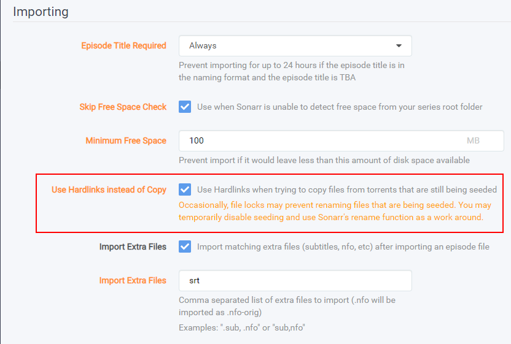

`Settings` => `Media Management` => `Root Folders`

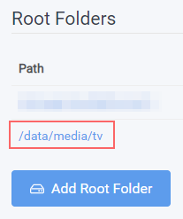

`Series` => `Add New`

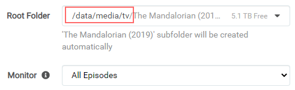

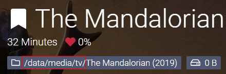

:::

## Radarr

::: details Radarr Examples - [Click to show/hide]

`Settings` => `Media Management` => `Importing`

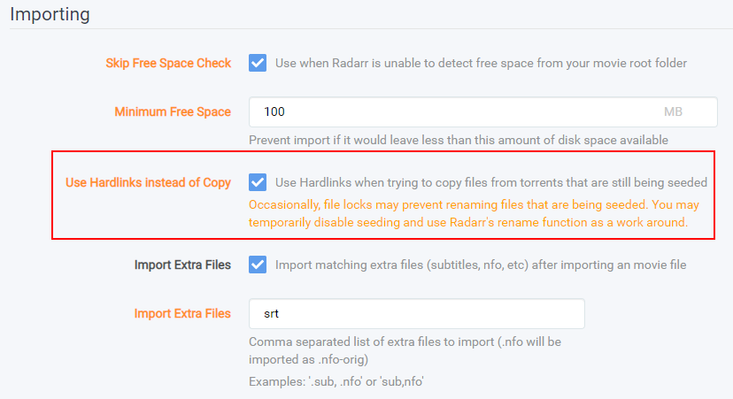

`Settings` => `Media Management` => `Root Folders`

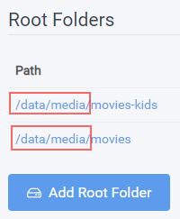

`Movies` => `Add New`

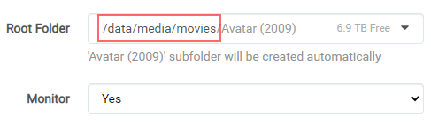

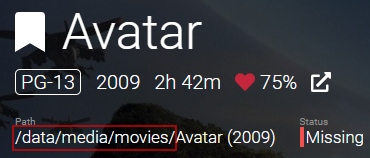

:::

## SABnzbd

::: details SABnzbd Examples - [Click to show/hide]

`SABnzbd config` => `Folders`

`SABnzbd config` => `Categories`

Don't forget to look at the full SABnzbd Guides

- [SABnzbd - Basic Setup](/Downloaders/SABnzbd/Basic-Setup/)
- [SABnzbd - Paths and Categories](/Downloaders/SABnzbd/Paths-and-Categories/)

:::

## NZBGet

::: details NZBGet Examples - [Click to show/hide]

`Settings` => `PATHS`

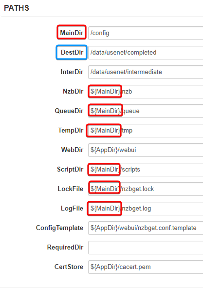

`Settings` => `CATEGORIES`

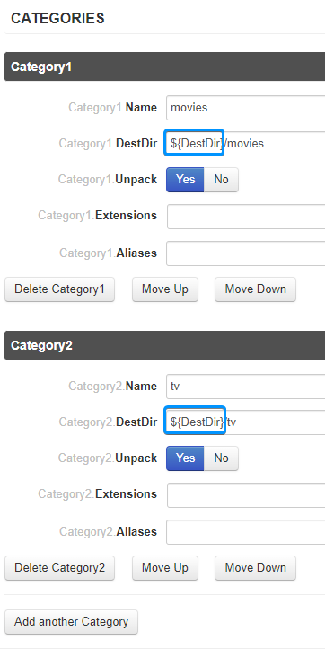

Don't forget to look at the full NZBGet Guides

- [NZBGet - Basic Setup](/Downloaders/NZBGet/Basic-Setup/)
- [NZBGet - Paths and Categories](/Downloaders/NZBGet/Paths-and-Categories/)

:::

## qBittorrent

::: details qBittorrent Examples - [Click to show/hide]

`Options` => `Downloads`

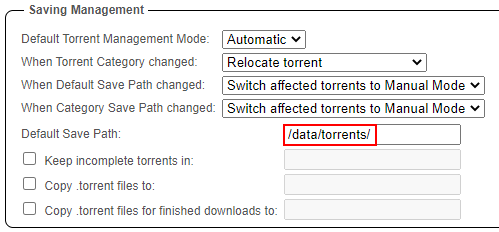

Don't forget to look at the full qBittorrent Guides

- [qBittorrent - Basic Setup](/Downloaders/qBittorrent/Basic-Setup/)
- [qBittorrent - Paths](/Downloaders/qBittorrent/Paths/)
- [qBittorrent - How to add categories](/Downloaders/qBittorrent/How-to-add-categories/)

:::

## Deluge

::: details Deluge Example - [Click to show/hide]

`Preferences` => `Downloads`

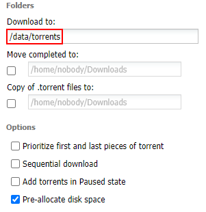

Don't forget to look at the full Deluge Guides

- [Deluge - Basic Setup](/Downloaders/Deluge/Basic-Setup/)
- [Deluge - Using Labels](/Downloaders/Deluge/Using-Labels/)

:::

## ruTorrent

::: details ruTorrent Examples - [Click to show/hide]

`../config/rtorrent/config/rtorrent.rc` (path to your appdata)

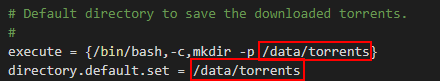

`Settings` => `Downloads`

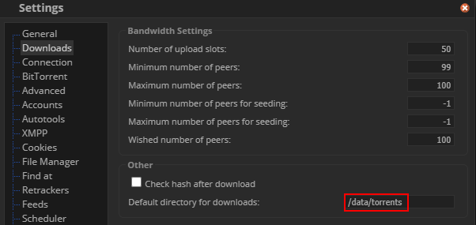

`Settings` => `Autotools`

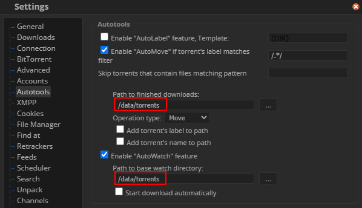

:::

---

Big Thanks to [fryfrog](https://github.com/fryfrog) for his [Docker Guide](https://wiki.servarr.com/docker-guide) that we used as a basis for this guide.

<!--@include: ../../includes/support.md-->
