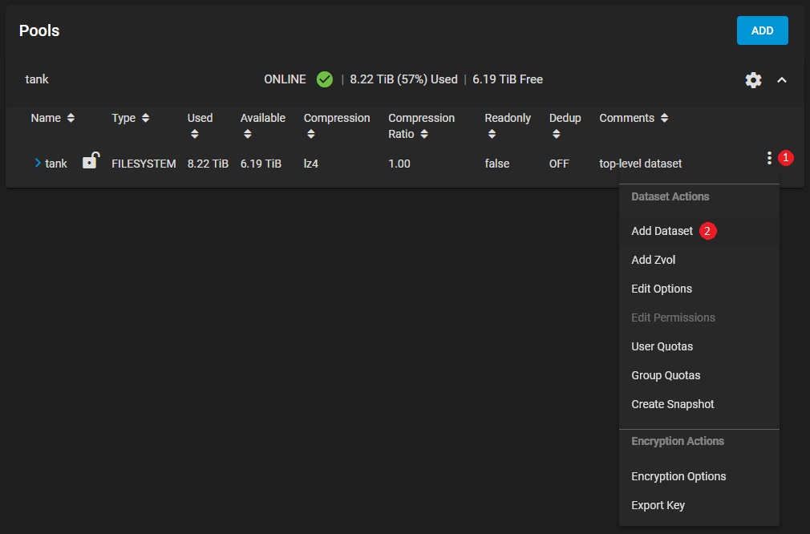
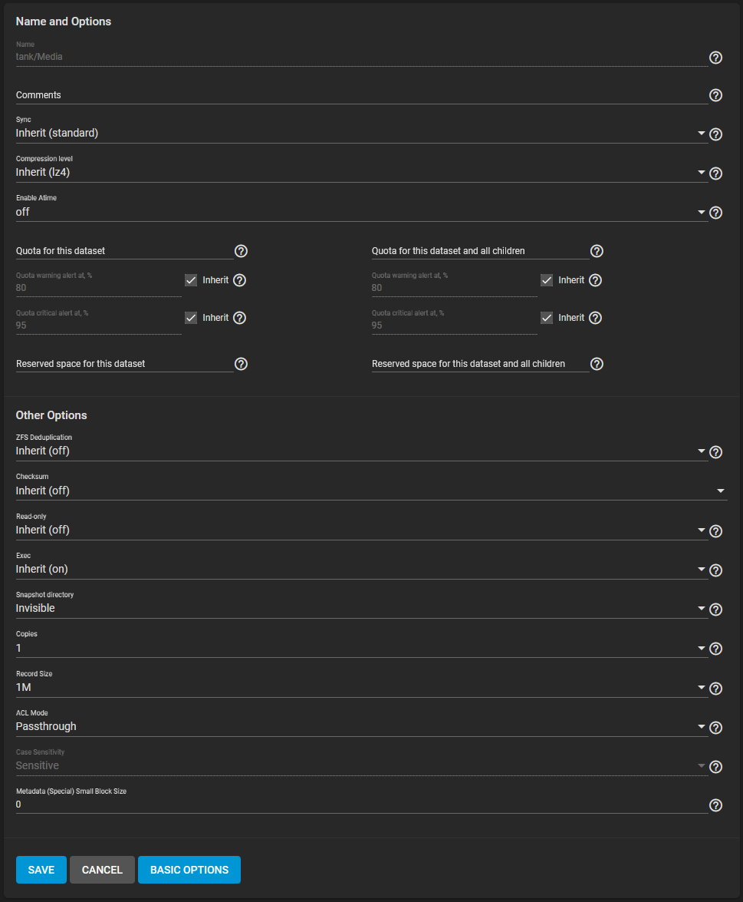
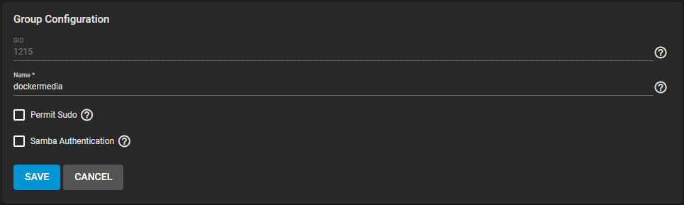
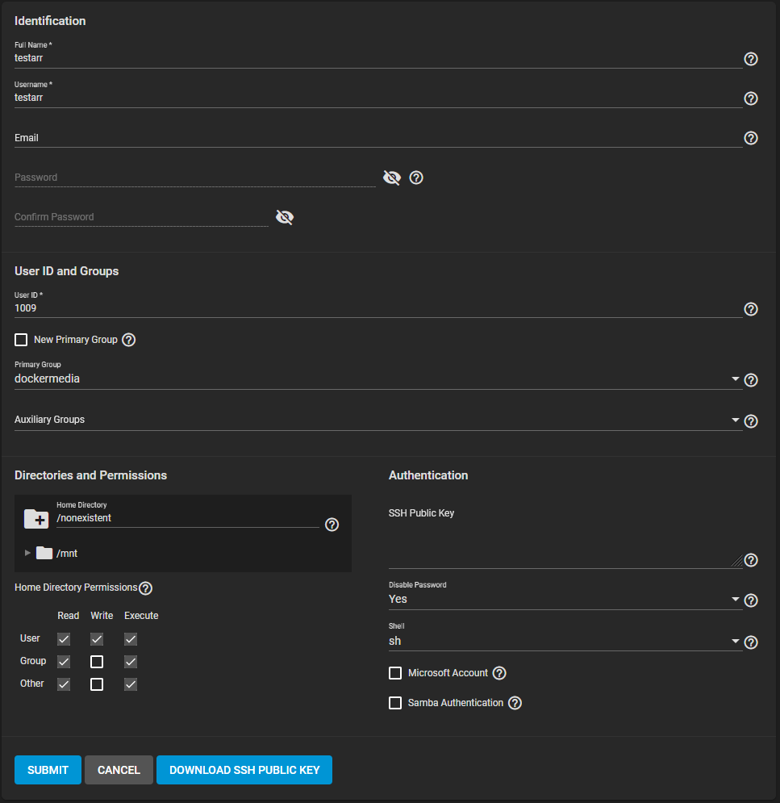
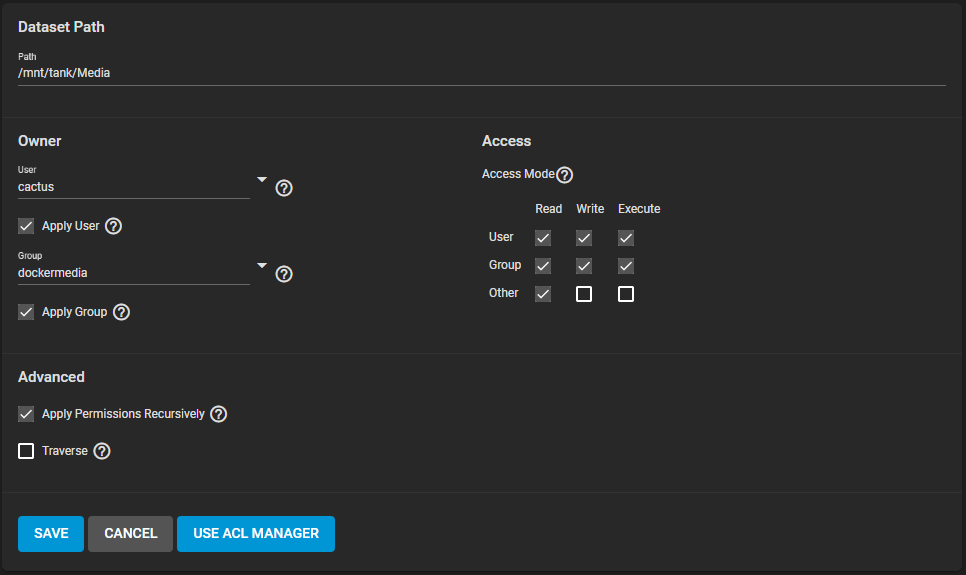
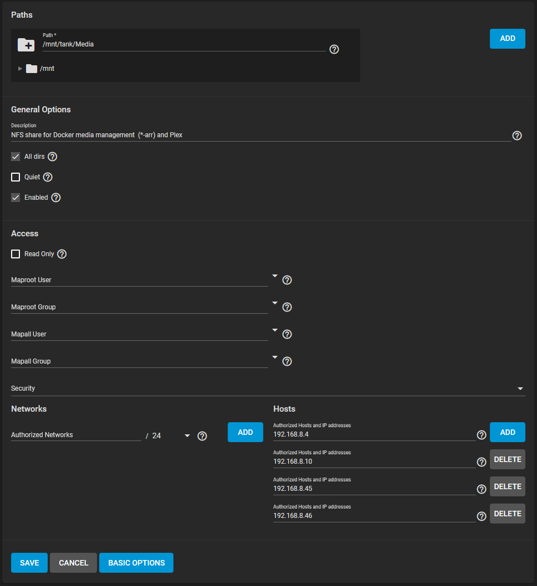
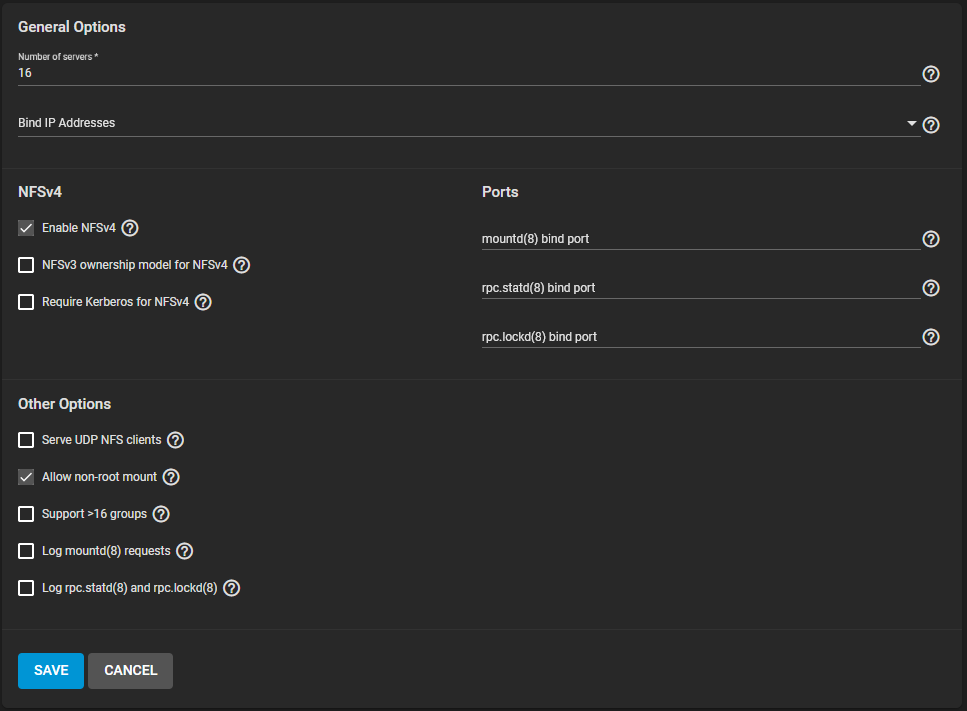

# TrueNAS Core

!!! note

    This guide is based on TrueNAS Core 13, a storage solution based on ZFS. While there are more similarities than differences between Core and Scale in terms of creating datasets, this guide explicitly covers dataset, share, and a basic permissions setup to provide a place for creating and accessing the recommended folder structure. This does not cover jails or other virtualization means on the TrueNAS Core platform.

    This guide assumes that you've already created a pool, which by default will contain a top-level dataset that was configured during the time of pool configuration. For the examples below, we'll be using a pool name of `tank`. Encryption is recommended on the pool (TrueNAS uses ZFS Encryption with AES-256-GCM in TrueNAS Core 13) but is not required. TrueNAS Core allows for granularity in encrypting individual datasets if you don't want to encrypt at the top-level dataset and have it be inherited down to the other datasets.

    TrueNAS Core defaults to `lz4` encryption as the compression level when creating a pool. This is fine for most workloads, and can be safely inherited down to other datasets under the top-level dataset. `ztsd` is currently the default in FreeBSD, however, TrueNAS Core still defaults to `lz4`. Given that media files are not very compressible by nature, the only benefit that compression provides, in this case, is to supplementary files such as `.srt`, `.nfo`, etc.

    Additionally, since SMB does not support hardlinks we will only be covering the creation and use of NFS shares.

---

## Create the main dataset

!!! warning

    To get hardlinks and atomic moves working with ZFS you will need to make use of <u>**ONE**</u> dataset with subfolders. Note that this does not mean multiple datasets under the example top-level dataset `tank` from this example.

For this example, I'm using the dataset from my existing setup, `Media`. The naming isn't important as host machine mappings can be manipulated as desired.

Go to Storage -> Pools and click the ⋮ on the right side of your root dataset, then select `Add Dataset`.

On the next screen, you'll fill out your basic dataset info, such as name and comments. We have a few things grayed out here as the dataset has already been configured, but in this example, you would use `Media` in the Name field and keep everything else at its default (`Inherit`) except for `Enable Atime` and `Record Size`. Set `Enable Atime` to `off` and `Record Size` to `1M`. This provides a performance increase on a dataset that will primarily be handling media files. Optionally, you can configure `Quota for this dataset` if you want to limit what the dataset displays and will accept in terms of capacity when it's mounted (i.e. setting this to `10 TiB` will show 10T as the capacity when mounted).

During share creation, there will be an option at the bottom for `Share Type`. `Generic` is the default, with `SMB` as a selectable option. Since we'll be using NFS, select `Generic`.

Click `Submit` (mine shows `Save` since this is an existing dataset) once complete.

---

## Create a shared group

We'll need to create a shared group so that we can ensure proper access when mounting, and to avoid ending up with `nobody` as the group name when mounting over NFS. This group should contain any of your user accounts that will be accessing the share (Starr apps, download clients, etc). It should also match the group and `GID` on the host you plan to mount the share as and run your apps from.

Navigate to Accounts -> Groups, and click `Add` at the top right.

You'll arrive at a simple configuration screen like the one shown below. Set your `GID` that you plan to use, and name the group. In this example, I'm using a `GID` of `1215` and a group name of `dockermedia`. Since this group won't be used for anything other than share permissions, leave `Permit Sudo` and `Samba Authentication` unchecked. Click `Submit` once complete.

---

## Create your user(s)

We'll need to create a user (or users - if you're using individual user accounts for each service) on TrueNAS that matches the user and UID of the user you'll be mounting your share with. It's important that these match since we're not using the `Mapall` function that exists under the NFS Share options.

Navigate to Accounts -> Users, and click `Add` at the top right.

You'll arrive at a configuration screen like the one shown below. Fill out `Full Name` and `Username` with the desired username, and set your `User ID` that you plan to use.

You'll need to uncheck `New Primary Group` so you can manually populate `Primary Group` with the shared group you created in the previous step. In this example, I'm using a GID of `1215` and a `Primary Group` name of `dockermedia`. Leave `Home Directory` as `/nonexistent`, and set `Disable Password` to `Yes`. Uncheck `Samba Authentication` and click `Submit` once complete. `Home Directory Permissions` aren't important as it's set to `/nonexistent`, and we won't ever be accessing it.

!!! note

    If you're using a single, shared user and group setup (1000:1000 is the common one) you can leave New Primary Group checked. Assuming there's not a group that already exists with GID 1000 it will create that group automatically with the same name as the user.

---

## Dataset permissions

Now that we have a user and a group, we can set the permissions on the dataset.

Navigate to Storage -> Pools, and click ⋮ on the right side of your target dataset (`Media` if you're following my example), then select `Edit Permissions`.

You'll arrive at a configuration screen like the one shown below. Under `Owner`, fill out your `User` and `Group` information with your desired user and the shared group you plan to use for your apps. `User` isn't super important here if you're using an NFS share and have `Group` configured properly, but it would matter if you're doing a single-user share (i.e. if you wanted a single person to have their own dataset -> share to map).

Check the boxes for `Apply User`, `Apply Group`, and `Apply Permissions Recursively` (check `Confirm` and click `Continue` if you get a popup). Check the `Access Mode` boxes as indicated in the image example and click `Save` once complete.

---

## Create your NFS share(s)

Navigate to Sharing -> Unix Shares (NFS), and click `Add` at the top right.

Under `Paths` you can either use the interactive browser by clicking `/mnt`, or just enter the correct `Path`. Following along with the previous examples, mine is `/mnt/tank/Media`.

Set a `Description` if desired (recommended for tracking), and check `All dirs` and `Enabled`.

Click `Advanced Options` to show the rest of the options we need.

Leave `Security` alone as the defaults are fine.

At the bottom, you have a couple of options. You can either specify `Authorized Networks` for more broad access or authorize specific hosts (my preferred method). Either way, make sure you use one of these options to ensure that whichever host is mounting the NFS share has access.

Click `Submit` once complete.

---

## Configure and enable NFS service

Navigate to Services and click the edit icon under `Actions` on the `NFS` row.

Enabling `NFSv4` is optional. If you wish to do so you will need to ensure that your NAS and host are on the same domain (verify with `hostname -d`), otherwise you'll run into permission issues (indicated by `nobody:4294967294` when checking files). Alternatively, enable `NFSv3 ownership model for NFSv4` to avoid the domain requirements. Make sure to check `Allow non-root mount` under `Other Options`.

One of the most important options here is the `Number of servers` setting. If you click on the help icon you'll see the help text for this setting, which indicates that you should keep this less than or equal to the number of CPUs reported by `sysctl -n kern.smp.cpus` to limit CPU context switching.

Any other options are mostly up to your environment and you should consult standard TrueNAS support paths for assistance.

Click `Save` once complete.

Make sure to check `Start Automatically` and click the slider under `Running` to make sure the service is running correctly and starts at boot.

---

## Mount your shares

Follow standard mounting procedures for your operating system/device. In Ubuntu mounting an NFS share is as simple as adding it to `/etc/fstab` with `<host>:/mnt/tank/Media /mnt/data nfs defaults,_netdev,rw 0 0`, and issuing `mount -a` (or rebooting).

Regardless of the method, make sure that the device ends up with a `data` mount point. The mount point is important since it will allow us to follow the usual guide for folder structure. If you've followed the guide, from a NFS share standpoint the owner and group of the `/mnt/data` directory will be the user and group that were previously configured in the Dataset Permissions section. If this is improperly configured you can end up with `nobody` as the owner or group, or have permission errors.

---

## Folder Structure

Now that you have a `data` folder, you can follow the normal folder structure recommendations, such as the one below.

{! include-markdown "../../../includes/file-and-folder-structure/docker-tree-full.md" !}

These subfolders you need to create yourself using your preferred method. Set your permissions accordingly as well. If you use ACLs on the datasets you can replicate the usual 775/664 (UMASK 002) or 755/644 (UMASK 022) recommendation, but this guide only covers the use of basic permissions for mounting and expects the end user to fine-tune permissions via chmod, chown, and uid/gid/umask settings on the applications that will be utilizing the share.

--8<-- "includes/support.md"
