# unRAID

!!! warning "**DO NOT** use the template paths from unRAID or the suggested paths from SpaceInvader One"

    SpaceInvader One YouTube guides are great for learning how to start with unRAID or how to set up certain applications - and yes I did and still do use them.<br><br>The main reason why he's probably using those paths is because they are predefined in the templates.

---

## Preparation

Make sure `Tunable (support Hard Links)` is enabled in your `Settings` => `Global Share Settings`.

=== "unRAID 6.12"
    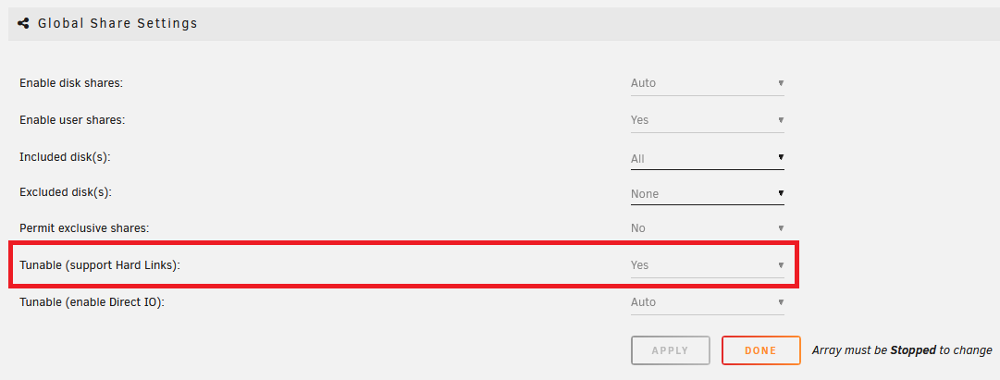

=== "unRAID 6.11"
    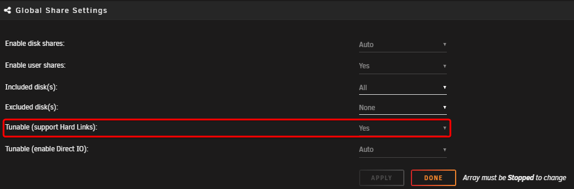

## Create the main share

!!! warning "To get Hardlinks and Atomic-Moves working with unRAID,<br>You will need to make use of <u>**ONE**</u> share with subfolders."

In this example, I'm using my setup and the preferred share `data`.

Go to your dashboard and select `Shares` on the navigation bar, then choose `Add Share`.

=== "unRAID 6.12 (No Cache)"
    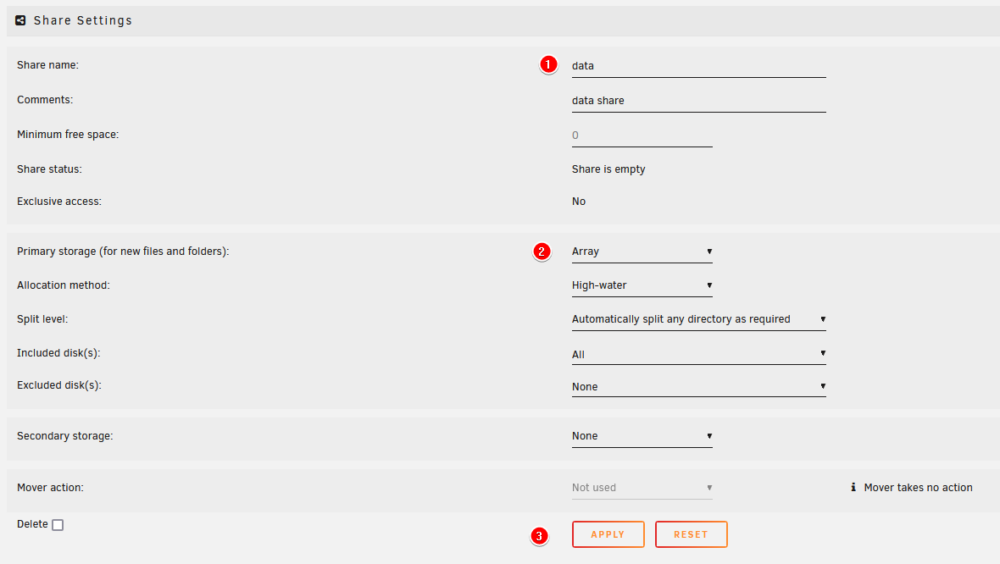

=== "unRAID 6.12 (Cache)"
    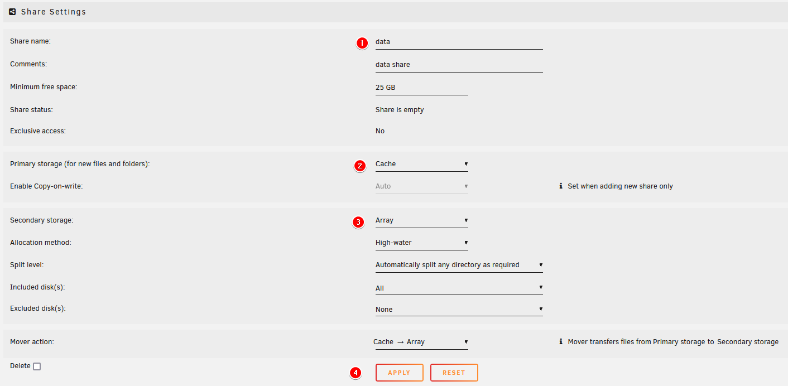

=== "unRAID 6.11"
    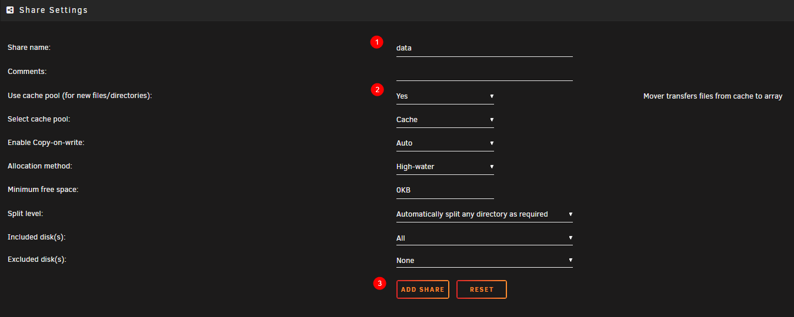

1. Use `data`
1. Set up your share with the applicable settings.

    === "unRAID 6.12 (No Cache)"
        Select the `Primary storage` as `Array` (shown in the `No Cache` tab above).

    === "unRAID 6.12 (Cache)"
        1. Select the `Primary storage` as `Cache` (shown in the `Cache` tab above).
        1. Select the `Secondary storage` as `Array`
        1. Make sure `Mover action` is set to `Cache -> Array`

    === "unRAID 6.11"
        Choose `Yes` on step (2) (unRAID 6.11 tab above). If not using a cache drive, keep this option disabled.

    !!! info "Hardlinks will stay intact if you're using a cache"

1. Click on `ADD SHARE`

!!! note

    Keep in mind, regarding the use of the cache drive, unRAID's integrated mover cannot move files that are in use, like seeding torrents. You will need to stop/pause the torrents so the mover can move the files from the cache to your array.

    !!! tip "If you use qBittorrent you can automate the process by following the following Guide [HERE](/Downloaders/qBittorrent/Tips/How-to-run-the-unRaid-mover-for-qBittorrent/){:target="_blank" rel="noopener noreferrer"}<br>If you use Deluge you can automate the process by following the following Guide [HERE](/Downloaders/Deluge/Tips/Unraid-Mover/){:target="_blank" rel="noopener noreferrer"}"

    With Usenet, you won't have any issues.

---

## Folder Structure

On the host (unRAID) you will need to add `/mnt/user` before it. **So `/mnt/user/data`**

{! include-markdown "../../../includes/file-and-folder-structure/docker-tree-full.md" !}

_I'm using lower-case on all folders on purpose, being Linux is case-sensitive._

The `data` folder has sub-folders for `torrents` and `usenet`, and each of these has sub-folders for `tv`, `movie`, and `music` downloads to keep things organized. The `media` folder has nicely named `TV`, `Movies`, and `Music` sub-folders, this is where your library resides, and what you’d pass to Plex, Emby, or JellyFin.

You will need to create these subfolders yourself. You can do this in any way you prefer, but the fastest way to create all the necessary subfolders would be to use the terminal (explained below). Alternatively, Krusader or WinSCP are popular choices if you are unsure.

### Fastest way to create the needed subfolders

The fastest way to create all the necessary subfolders would be to use the terminal, use a program like [PuTTy](https://www.putty.org/){:target="\_blank" rel="noopener noreferrer"} or use the terminal from the dashboard.
These options will automatically create the required subfolders for your media library as well as your preferred download client(s).
If you use both torrents and Usenet, use both commands.

#### If you use Usenet

```bash
mkdir -p /mnt/user/data/{usenet/{incomplete,complete}/{tv,movies,music},media/{tv,movies,music}}
```

#### If you use torrents

```bash
mkdir -p /mnt/user/data/{torrents/{tv,movies,music},media/{tv,movies,music}}
```

---

### Breakdown of the Folder Structure

{! include-markdown "../../../includes/file-and-folder-structure/bad-path-suggestion.md" !}

## Setting up the containers

!!! tip "Create a custom docker network"
    Why would you want a custom docker network?

    A major benefit of having your Docker containers on the same custom Docker network is that they will be able to communicate with other using their container names, rather than having to use IP addresses.

    Unraid doesn't create a custom docker network by default, you need to create one yourself.

    - Open a terminal window and type:

        ```none
        docker network create your_uber_cool_network_name
        ```

    - or watch the following video below on how to create a custom docker network

        <iframe width="560" height="315" src="https://www.youtube.com/embed/7fzBDCI8O2w?si=itGS624rC7jxD8ly" title="YouTube video player" frameborder="0" allow="accelerometer; autoplay; clipboard-write; encrypted-media; gyroscope; picture-in-picture" allowfullscreen></iframe>

---

After you've created all the necessary folders, it's time to set up the Docker container's paths.

Go to your dashboard and select the Docker container you want to edit, or, if you're starting fresh, add the container/App you want to use.

1. Make sure you enable the `Advanced View` at the top right corner.

    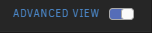

1. When adding/editing the paths make sure you click on the `EDIT` button to add/edit the paths correctly.

    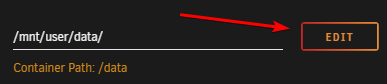

1. Don't forget to remove all individual location mounts, for example `/movies`, `/tv`, `/books`, or `/downloads`, so you can avoid making mistakes by using them. You only need the `/config` mount, and then whichever paths/mounts/volumes are described in this guide.

!!! info
    unRAID makes it pretty clear which is the Host Path and Container Path.

    `Container Path:` => The path that will be used from inside the container.

    `Host Path:` => The actual/absolute path used on your unRAID Server (The Host).

---

### Torrent clients

qBittorrent, Deluge, ruTorrent

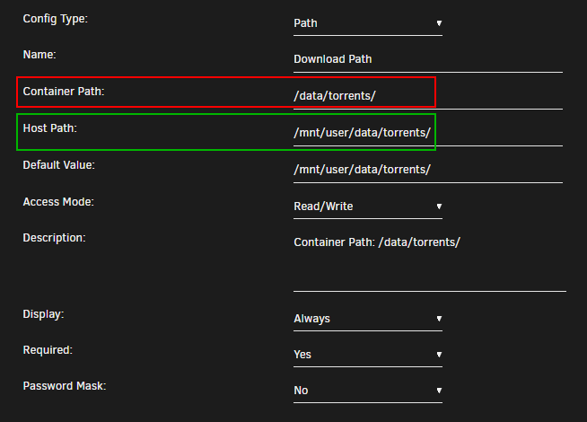

`Container Path:` => `/data/torrents/`

`Host Path:` => `/mnt/user/data/torrents/`

!!! info

    The reason why we use `/data/torrents/` for the torrent client is because it only needs access to the torrent data. In the torrent software settings, you’ll need to configure your categories/labels to utilize the right path for specific content. You can sort into sub-folders like `/data/torrents/{tv|movies|music}`.

{! include-markdown "../../../includes/file-and-folder-structure/docker-tree-torrents.md" !}

---

### Usenet clients

NZBGet or SABnzbd

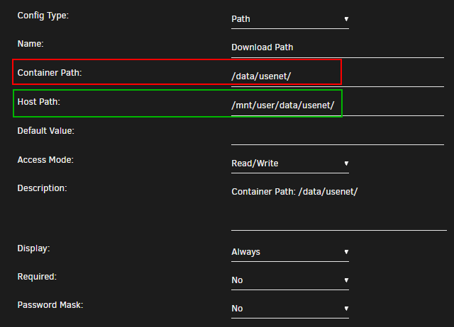

`Container Path:` => `/data/usenet/`

`Host Path:` => `/mnt/user/data/usenet/`

!!! info

    The reason why we use `/data/usenet/` for the Usenet client is that it only needs access to the Usenet data. In the Usenet software settings, you’ll need to configure your paths to sort content into sub-folders like `/data/usenet/{tv|movies|music}`.

{! include-markdown "../../../includes/file-and-folder-structure/docker-tree-usenet.md" !}

---

### The Starr Apps

Sonarr, Radarr and Lidarr

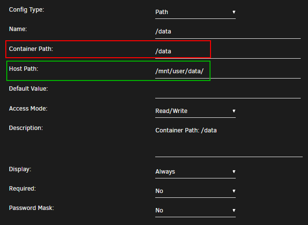

`Container Path:` => `/data`

`Host Path:` => `/mnt/user/data/`

!!! info

    Sonarr, Radarr, and Lidarr get access to everything because the download folder(s) and media folder will need to look like and be one mount, on the file system. hardlinks will work properly and any moves will be atomic, rather than copying and deleting.

{! include-markdown "../../../includes/file-and-folder-structure/docker-tree-full.md" !}

---

### Media Server

Plex, Emby, JellyFin and Bazarr

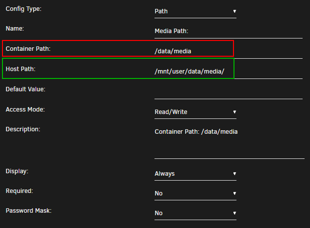

`Container Path:` => `/data/media`

`Host Path:` => `/mnt/user/data/media/`

!!! info

    Plex, Emby, JellyFin, and Bazarr only need access to your media library, which can have any number of sub-folders (Movies, Kids Movies, TV, Documentary TV, and/or Music).

{! include-markdown "../../../includes/file-and-folder-structure/docker-tree-media.md" !}

---

## Final Result

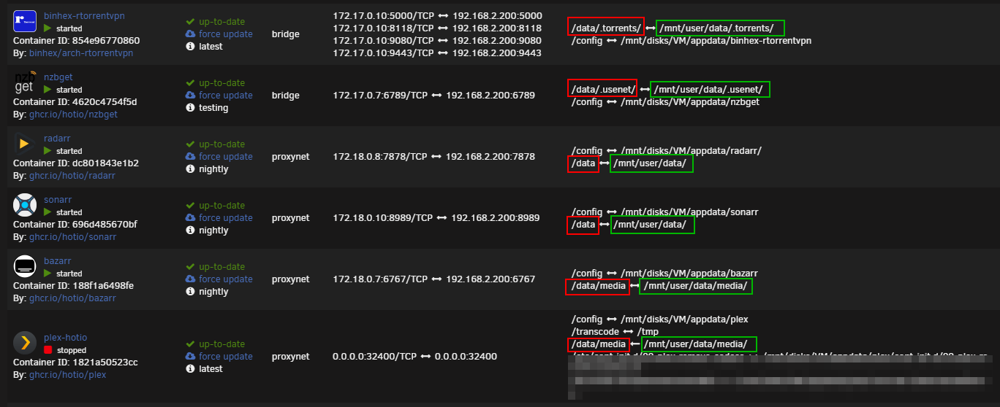

### Examples - How to set up your paths INSIDE your applications

**Don't forget to look at the [Examples](/File-and-Folder-Structure/Examples/) of how to set up your paths INSIDE your applications.**

## Video Tutorial

!!! tip ""

    !!! warning "Videos are generally outdated very fast, so make sure you always follow and double-check with the written guide."

    Big Thanks to IBRACORP for noticing this Guide and creating a Video covering this unRAID section.

    The reason why I have this video at the end is because I want the users to ACTUALLY LEARN and UNDERSTAND why it's recommended to use this folder structure before going straight to a YouTube video.

    <iframe width="560" height="315" src="https://www.youtube.com/embed/AMcHsQJ7My0" title="YouTube video player" frameborder="0" allow="accelerometer; autoplay; clipboard-write; encrypted-media; gyroscope; picture-in-picture" allowfullscreen></iframe>

    Check out other videos from IBRACORP [HERE](https://www.youtube.com/c/IBRACORP/videos){:target="_blank" rel="noopener noreferrer"}

--8<-- "includes/support.md"
