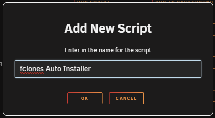
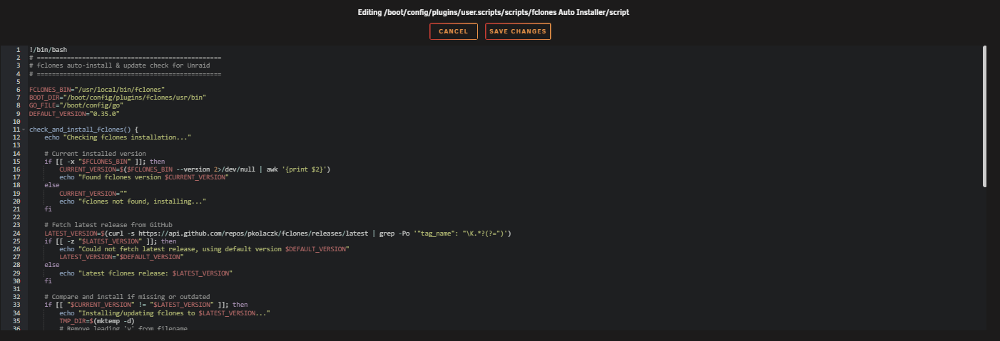
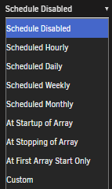

# Replace Copies with Hardlinks

Have you recently switched to a setup that supports hardlinks and Instant Moves (Atomic-Moves)? Would you like to replace duplicate files with hardlinks?

If your operating system supports it, you can use [jdupes](https://codeberg.org/jbruchon/jdupes/releases){:target="_blank" rel="noopener noreferrer"} or [fclones](https://github.com/pkolaczk/fclones){:target="_blank" rel="noopener noreferrer"}.

The latest binaries are available for Windows at the links above. For Mac or Linux, you can use a package manager like [homebrew](https://formulae.brew.sh/formula/jdupes){:target="_blank" rel="noopener noreferrer"}, `apt`, or `pacman` to install the latest version.

## Jdupes

!!! info ""
    We won't cover every command in this guide.

    If you want to learn what else [jdupes](https://codeberg.org/jbruchon/jdupes){:target="_blank" rel="noopener noreferrer"} can do, please [read the usage manual](https://codeberg.org/jbruchon/jdupes#usage){:target="_blank" rel="noopener noreferrer"}.

!!! tip "Performance Considerations"
    This process can place a heavy load on your system for an extended time, depending on your library size. As duplicates are found and hardlinks are created, the process becomes more efficient because linked files and different-sized files are not repeatedly checked. This means later runs will finish faster.

    You can speed this up significantly by using a hash database. This stores information about your files (including their signatures) across `jdupes` runs, which greatly increases the speed.

    Simply add the following option **before your directories** with a path that is always available and persistent:

    ```bash
    -y "/mnt/user/appdata/scripts/media_hash.db"
    ```

    **Note:** We don't recommend using `jdupes` on cloud-based setups.

### Basic Jdupes Usage

Here's the basic command structure:

```bash
jdupes [options] DIR1 DIR2
```

### Dry Run Example

The example below performs a dry run and shows a summary at the end.

!!! info "Adjust folder paths to match your directory structure."

=== "Without Hash Database"

    ```bash
    jdupes -rMX onlyext:mp4,mkv,avi "/mnt/user/data/torrents/movies/" "/mnt/user/data/media/movies"
    ```

=== "With Hash Database"

    ```bash
    jdupes -rMX onlyext:mp4,mkv,avi -y "/mnt/user/appdata/scripts/media_hash.db" "/mnt/user/data/torrents/movies/" "/mnt/user/data/media/movies"
    ```

### Hardlink All Duplicates

The example below will hardlink all duplicate files without prompting.

!!! info "Adjust folder paths to match your directory structure."

=== "Without Hash Database"

    ```bash
    jdupes -rLX onlyext:mp4,mkv,avi "/mnt/user/data/torrents/movies/" "/mnt/user/data/media/movies"
    ```

=== "With Hash Database"

    ```bash
    jdupes -rLX onlyext:mp4,mkv,avi -y "/mnt/user/appdata/scripts/media_hash.db" "/mnt/user/data/torrents/movies/" "/mnt/user/data/media/movies"
    ```

### Important Warnings

!!! bug "Windows Hardlink Limit"
    Windows only allows a maximum of 1,023 hardlinks per file.

!!! warning "Quick Mode Risk"
    The `-Q` or `--quick` option only reads each file once, hashes it, and performs comparisons based solely on the hashes. There is a small but real risk of a hash collision, which is why the standard byte-for-byte comparison exists as a safety check. This option bypasses that safety check.

    **Do not use this option on any data where data loss is unacceptable. You have been warned!**

## fclones

There are several ways to run fclones. We're only going to show the option we've tested and had the best experience with.

### Basic fclones Usage

Here's the basic command structure:

```bash
fclones [options] DIR1 DIR2
```

### Usage Example

```bash
fclones --one-fs --hidden --follow-links "/mnt/user/data/torrents/movies/" "/mnt/user/data/media/movies"
```

### fclones on unRAID

This is straightforward because two users on our Discord created a bash script to make this as simple as possible.

#### The All-in-One Script (Recommended)

Use option 1 in the following guide: [How to run the unRAID mover for qBittorrent with the Mover Tuning](/Downloaders/qBittorrent/Tips/How-to-run-the-unRaid-mover-for-qBittorrent/){:target="_blank" rel="noopener noreferrer"} that also will install fclones for you automatically.

#### How to Install the Standalone fclones on unRAID

We're going to install fclones with the help of a script that will place fclones in `/usr/local/bin/`.

1. In your unRAID Dashboard, go to the **Settings** tab and select **User Scripts** in the **User Utilities** section at the bottom.

    

2. At the bottom of the **User Scripts** page, click the **ADD NEW SCRIPT** button.

    

3. A popup will ask you to name the script. For this example, use `fclones Auto Installer` and click **OK**.

    

4. Click the cogwheel next to the new script in the list and select **Edit Script**.

    

5. Copy and paste the script below into the new window that opens, then click **SAVE CHANGES**.

    **[unRAID fclones installer](https://gist.github.com/johnwinger8/e668f05fa2be05cdd7348f5edc394fb8){:target="_blank" rel="noopener noreferrer"}** - This script will install fclones on unRAID or update the current version.

6. If you want to keep fclones up to date, you can choose when the script should run to stay current. If you only want to run it once or handle the updates manually, skip this step.

    

    Click **Apply**.

7. Click **RUN IN BACKGROUND** to manually trigger the installation of the `fclones Auto Installer`.

    

Big thanks to johnwinger for creating the unRAID fclones installer!

##### How to Run fclones

Use the following fclones bash script:

**[fclones.sh](https://gist.github.com/BaukeZwart/b570ce6b6165c4f0b64c5b98d9d3af1e){:target="_blank" rel="noopener noreferrer"}** - *Read the instructions inside the script*

Big thanks to BZ for creating the fclones.sh!

--8<-- "includes/support.md"
