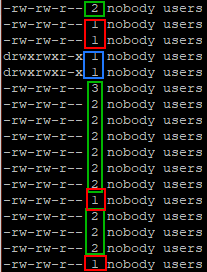
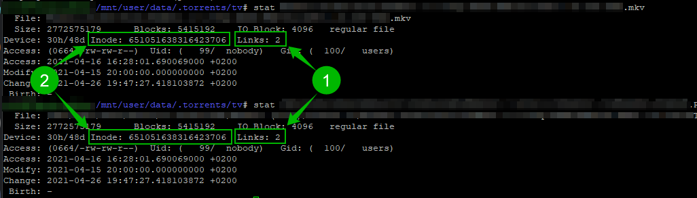

# How to check if hardlinks are working

You've followed the guide step by step but still want to check if hardlinks are working, or someone on the Sonarr/Radarr support team asked you to check if your files are hardlinked?

You can use 2 options to check if you got working hardlinks.

*Both ways requires you to login to your terminal with PuTTY or similar software.*

!!! attention
    You can't create hard links for directories :bangbang:

    You can't cross file systems :bangbang:

---

## Usenet

!!! note ""

    If you use usenet these examples won't work because you make use of instant moves/atomic moves and not hardlinks.

    Still want to test if it works ?

    Test a import of a 4k remux (or any other big file and you should notice it's almost instant) and not a slower and more I/O intensive copy + delete.

## Method 1: Using ls

This is the easiest to check in my opinion.

In your terminal `cd` to your download location and run `ls -al` or type `ls -al /path/to/your/download/location/`

You will get a listing of all your files and on the left side you will see a couple of numbers, every file with a number above 1 are hardlinks.

- Red rectangle - Not Hardlinked
- Green rectangle - Hardlinks
- Blue rectangle - Folders/Directories you will need to go in to them to check if the files are hardlinked.

---

## Method 2: Using stat

This way requires a bit more work.

- On the terminal type: `stat /path/to/your/download/location/file.mkv`

- On the terminal type: `stat /path/to/your/media/location/file.mkv`

You will get 2 results you can use to compare several things.

1. Links: Everything above 1 means it's a hardlink
1. Inode: if the numbers match you know the files are hardlinked
