# Examples

!!! info

    Pick one path layout and use it for all of them.

    It doesn't matter if you prefer to use `/data`, `/shared`, `/storage` or whatever.

    The screenshots in the examples are using the following root path `/data`

- [Sonarr](#sonarr)
- [Radarr](#radarr)
- [SABnzbd](#sabnzbd)
- [NZBGet](#nzbget)
- [qBittorrent](#qbittorent)
- [Deluge](#deluge)
- [ruTorrent](#rutorrent)

??? example "Sonarr Examples"

    ## Sonarr

    `Settings` => `Media Management` => `Importing`

    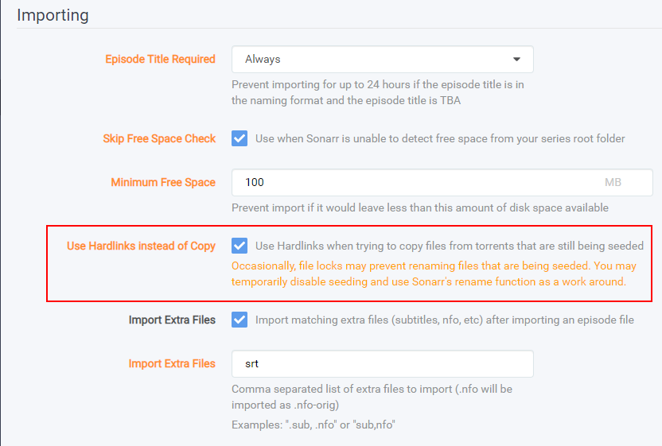

    `Settings` => `Media Management` => `Root Folders`

    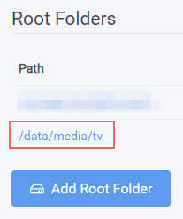

    `Series` => `Add New`

    

    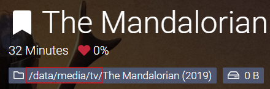

??? example "Radarr Examples"

    ## Radarr

    `Settings` => `Media Management` => `Importing`

    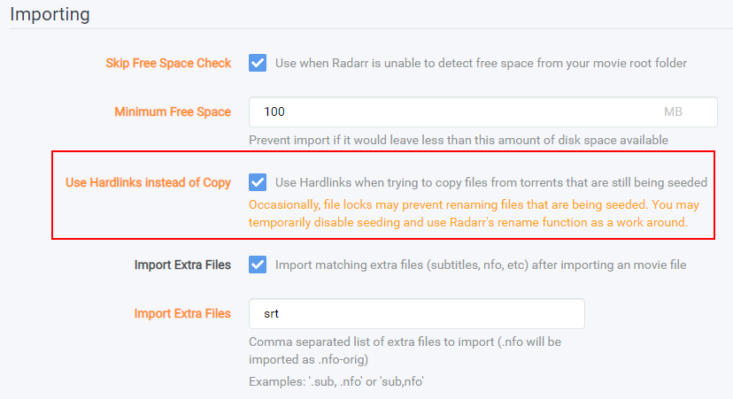

    `Settings` => `Media Management` => `Root Folders`

    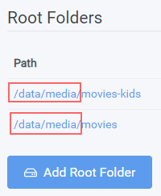

    `Movies` => `Add New`

    

    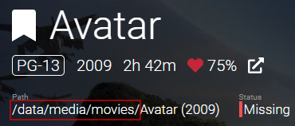

??? example "SABnzbd Examples"

    ## SABnzbd

    `SABnzbd config` => `Folders`

    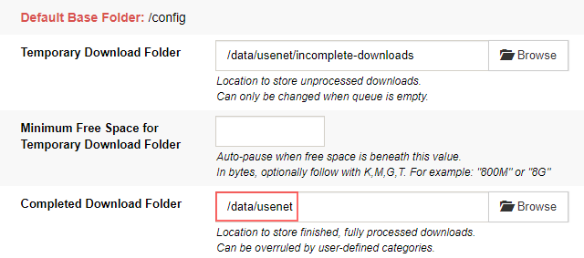

    `SABnzbd config` => `Categories`

    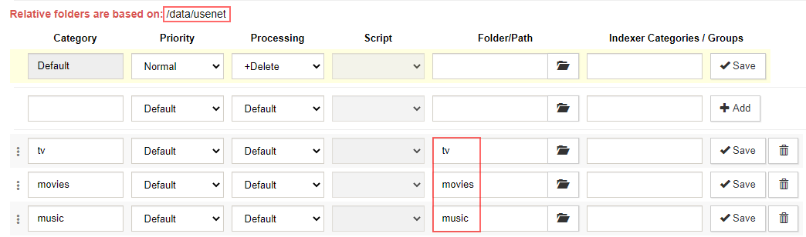

??? example "NZBGet Examples"

    ## NZBGet

    `Settings` => `PATHS`

    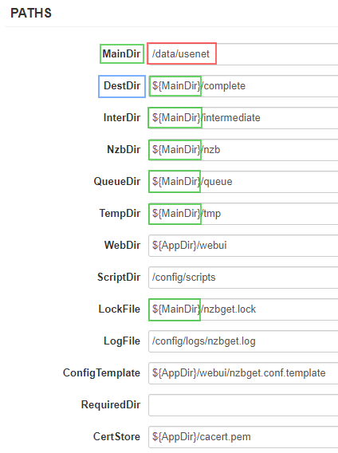

    `Settings` => `CATEGORIES`

    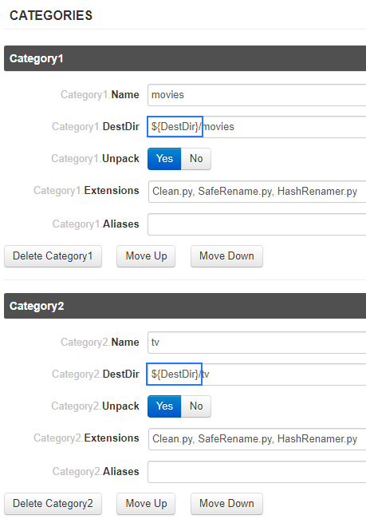

??? example "qBittorrent Examples"

    ## qBittorrent

    `Options` => `Downloads`

    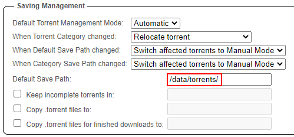

??? example "Deluge Example"

    ## Deluge

    `Preferences` => `Downloads`

    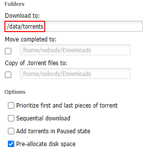

??? example "ruTorrent Examples"

    ## ruTorrent

    `../config/rtorrent/config/rtorrent.rc` (path to your appdata)

    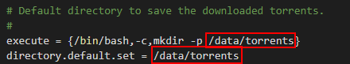

    `Settings` => `Downloads`

    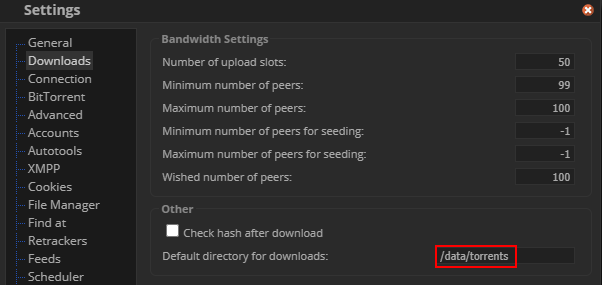

    `Settings` => `Autotools`

    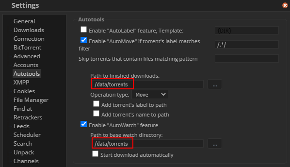

------

Big Thnx to [fryfrog](https://github.com/fryfrog){:target="_blank" rel="noopener noreferrer"} for his [Docker Guide](https://wiki.servarr.com/Docker_Guide){:target="_blank" rel="noopener noreferrer"} that I used as basis for this guide.
