# Dockstarter

!!! note

    I'm using the default paths in this example, and will keep the other paths unchanged so nothing will break if you make a mistake.

## Folder Structure

We're going to use a mounted drive that we're going to use as storage for downloads and your media.
In this example the mounted drive will be mounted to `/mnt/` with the following folder structure.

```none
storage
├── downloads
|  ├── torrents
│  |  ├── movies
│  |  ├── music
│  |  └── tv
|  └── usenet
│     ├── movies
│     ├── music
│     └── tv
└── medialibrary
    ├── movies
    ├── music
    └── tv
```

## Changes to the .env

To accomplish this we need to change first a few paths in your `.env` (Usually `~/.docker/compose/.env`)

``` yaml
# Global Settings
COMPOSE_HTTP_TIMEOUT=60
DOCKERCONFDIR=~/.config/appdata
DOCKERGID=999
DOCKERHOSTNAME=DockSTARTer
DOCKERLOGGING_MAXFILE=10
DOCKERLOGGING_MAXSIZE=200k
DOCKERSTORAGEDIR=/mnt/storage
PGID=1000
PUID=1000
TZ=America/Chicago

# DEPRECATED Settings (will be removed at the end of 2020)
DOCKERSHAREDDIR=~/shared
DOWNLOADSDIR=/mnt/downloads
MEDIADIR_AUDIOBOOKS=/mnt/medialibrary/audiobooks
MEDIADIR_BOOKS=/mnt/medialibrary/books
MEDIADIR_COMICS=/mnt/medialibrary/comics
MEDIADIR_MOVIES=/mnt/medialibrary/movies
MEDIADIR_MUSIC=/mnt/medialibrary/music
MEDIADIR_TV=/mnt/medialibrary/tv
```

### Changes to your paths

When that's all set then you will need to change the paths you're going to use in the containers from:

`/downloads` => `/storage/downloads`

`/audiobooks` => `/storage/medialibrary/audiobooks`

`/books` => `/storage/medialibrary/books`

`/comics`  => `/storage/medialibrary/comics`

`/movies` => `/storage/medialibrary/movies`

`/music` => `/storage/medialibrary/music`

`/tv` => `/storage/medialibrary/tv`

## DockSTARTer Examples

!!! info

    The screenshots in the examples are using the following root path `/storage`

- [Sonarr](#sonarr)
- [Radarr](#radarr)
- [SABnzbd](#sabnzbd)
- [NZBGet](#nzbget)
- [qBittorrent](#qbittorent)
- [Deluge](#deluge)
- [ruTorrent](#rutorrent)

??? example "Sonarr Examples - [CLICK TO EXPAND]"

    ##### Sonarr

    `Settings` => `Media Management` => `Importing`

    

    `Settings` => `Media Management` => `Root Folders`

    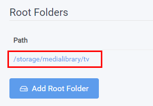

    `Series` => `Add New`

    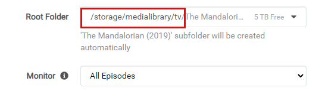

    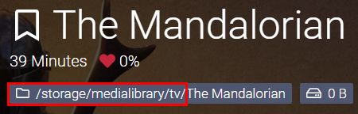

??? example "Radarr Examples - [CLICK TO EXPAND]"

    ##### Radarr

    `Settings` => `Media Management` => `Importing`

    

    `Settings` => `Media Management` => `Root Folders`

    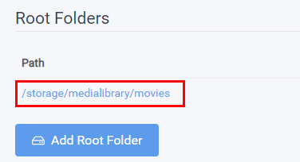

    `Movies` => `Add New`

    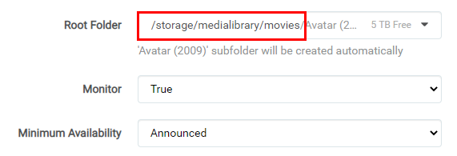

    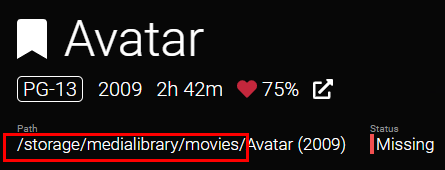

??? example "SABnzbd Examples - [CLICK TO EXPAND]"

    ##### SABnzbd

    `SABnzbd config` => `Folders`

    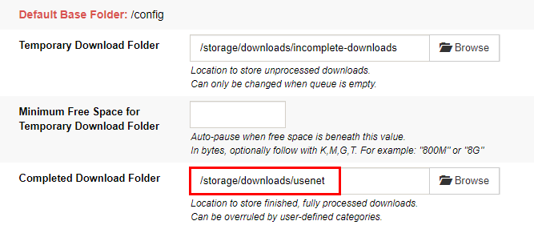

    `SABnzbd config` => `Categories`

    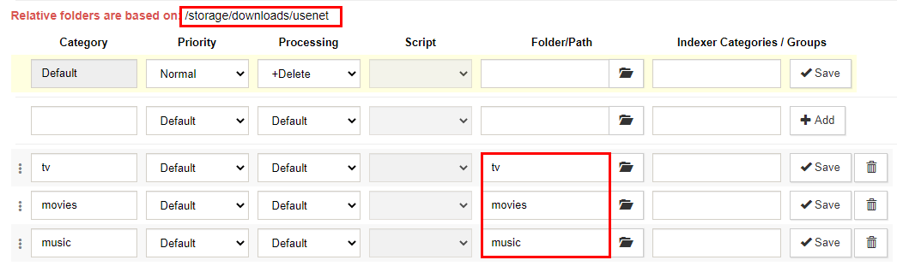

??? example "NZBGet Examples - [CLICK TO EXPAND]"

    ##### NZBGet

    `Settings` => `PATHS`

    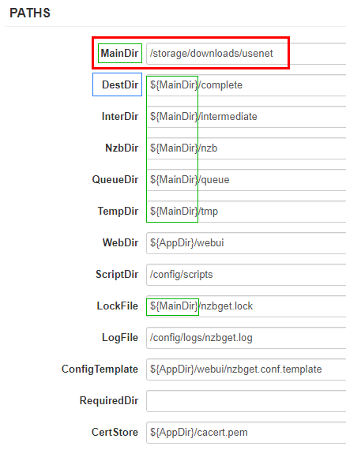

    `Settings` => `CATEGORIES`

    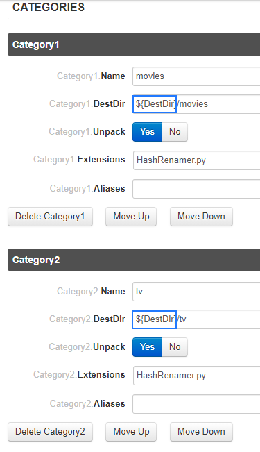

??? example "qBittorrent Examples - [CLICK TO EXPAND]"

    ##### qBittorrent

    `Options` => `Downloads`

    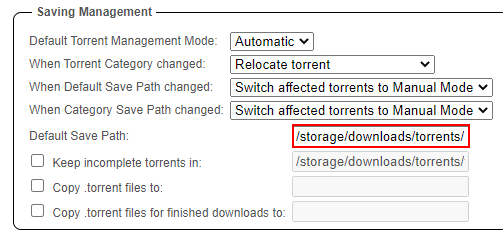

??? example "Deluge Example - [CLICK TO EXPAND]"

    ##### Deluge

    `Preferences` => `Downloads`

    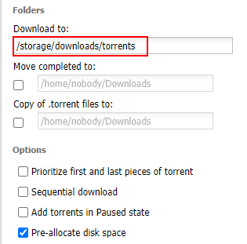

??? example "ruTorrent Examples - [CLICK TO EXPAND]"

    ##### ruTorrent

    `../config/rtorrent/config/rtorrent.rc` (path to your appdata)

    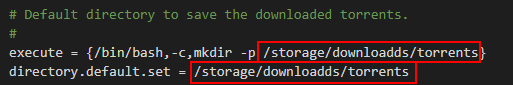

    `Settings` => `Downloads`

    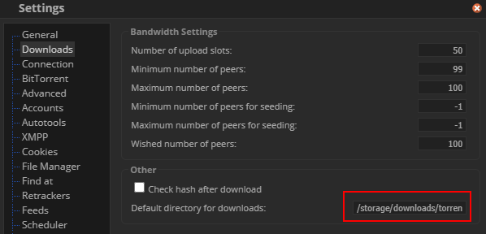

    `Settings` => `Autotools`

    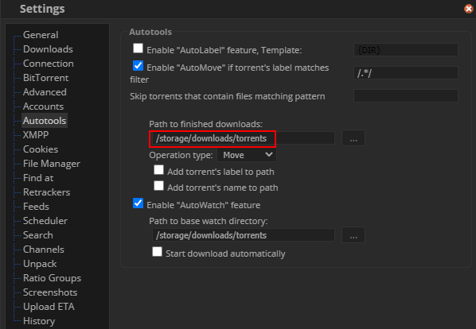

--8<-- "includes/support.md"
