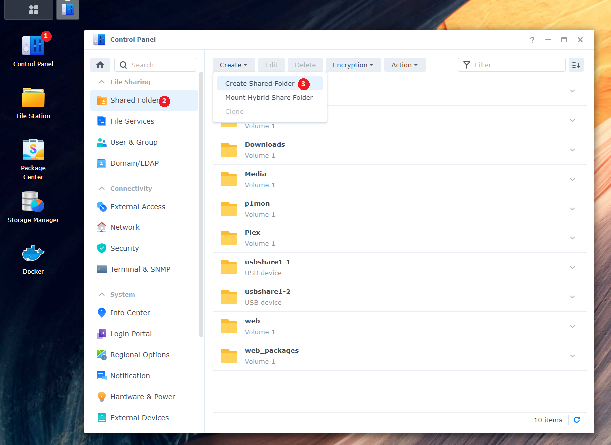
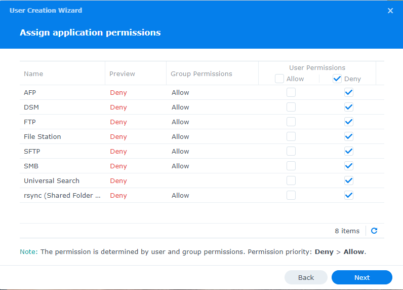
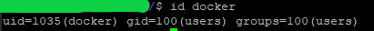

# Synology

!!! note

    Being I don't have a Synology myself and I kind of hate the Synology GUI for the dockers, I'm doing this with the use of docker-compose through a terminal.

    This is faster then the GUI and after installing, it shows up in the Docker GUI.

    Thanks to faxity for the initial compose that I used to create the Synology Guide.

    And a very big thanks to [Bokkoman](https://www.buymeacoffee.com/bokkoman){:target="_blank" rel="noopener noreferrer"} and [BZwart](https://github.com/BaukeZwart){:target="_blank" rel="noopener noreferrer"} that updated this Guide for DSM 7 and also offered their help on discord as Synology Support Team.

## Install Docker

You need to install Docker from the `Package Center`. This should also create a share named `docker`, check File Station if it is present.

## Create the main share

!!! attention

    To get Hardlinks and Atomic-Moves working with your Synology you will need to make use of **ONE** share with subfolders.

We will use a new share named `data` (lowercase) for all your library media.

Later in this guide, we will fill this share with subfolders.

To create a new share:

`Control Panel` > `Shared Folder` > click `Create` > choose `Create Shared Folder`



Name this shared folder `data`. You can disable the trash can. Click next until you are done.

## Create a user

For this, we are going to create a new user that only has access to the share(s) that we use for this guide.

Go to `Control Panel` > `User & Group`

In the `User` section, create a new user. Name it whatever you like, but for this guide we will use `docker`.


Fill out the rest of the information, generate a password or type your own.

Click next, you will now be able to select which group this user will belong to, it should only be `users`. Click `Next`.

### Assign shared folder permissions

In this screen you will be able to select which Shares this user will have access to, click `No Access` on the top, this will deny all access.

Now only select `Read/Write` on the shares `docker` and `data`.


Click `Next` until you reach `Assign application permissions`

### Assign application permissions

In this screen you will be able to select which application this user will have access to, Check `Deny` for all applications.



Continue to click `Next` until you are finished.

## SSH

You are mostly going to use the terminal. Some parts will need the Synology web GUI.
To enable terminal, you need to enable SSH in the Synology Settings.

`Control Panel` > `Terminal & SNMP` > `Enable SSH service`


Then use a program like [Putty](https://www.putty.org/){:target="_blank" rel="noopener noreferrer"} and you can SSH into your Synology.

If you get a popup asking if you want to trust the key,
Just press `OK` or `ACCEPT`

Enter the login information of your main Synology user account.

### PUID and PGID

In order for the Docker container to access the shares on the Synology, we need to know the user ID (PUID) and group ID (PGID) from the `docker` user we just created.

Go into your terminal app, login to your synology ssh.

Once logged in type `id $user`. Change $user to the newly created username `docker`.



This will show you the UID (aka PUID).
Which in this screenshot is `1035` for the docker user
and the GID (aka PGID) which is `100` for the users group.
Remember these values for later use.

!!! attention

    It is not recommended to use (anymore) your admin/main user account. That is why we just created a new user.

------

## Folder Structure

For this example we're going to make use of the share called `data`.

On the host (Synology) terminal you will need to add `/volume1/` before it. So `/volume1/data`

The `data` folder has sub-folders for `torrents` and `usenet` and each of these have sub-folders for `tv`, `movie` and `music` downloads to keep things neat. The `library` folder has nicely named `tv`, `movies` and `music` sub-folders, this is your library and what you’d pass to Plex, Emby or JellyFin.

These subfolders you need to create your self.

*I'm using lower case on all folder on  purpose, being Linux is case sensitive.*

```none
data
├── torrents
│  ├── movies
│  ├── music
│  └── tv
├── usenet
│  ├── movies
│  ├── music
│  └── tv
└── media
   ├── movies
   ├── music
   └── tv
```

--8<-- "includes/hardlinks/breakdown-folder-structure.md"

------

### Create the needed subfolder

Here we will create the needed subfolders for your media library and also for your preferred download client.
If you use both then run both commands

#### If you use usenet

```bash
sudo mkdir -p /volume1/data/{usenet/{tv,movies,music},media/{tv,movies,music}}
```

#### If you use torrents

```bash
sudo mkdir -p /volume1/data/{torrents/{tv,movies,music},media/{tv,movies,music}}
```

------

### Appdata

Your appdata will be stored in `/volume1/docker/appdata/{appname}`
These `{appname}` sub folders you need to create your self. (*This is a limitation of the Synology*)
We're going to do this in Putty or a similar program.

```bash
sudo mkdir -p /volume1/docker/appdata/{radarr,sonarr,bazarr,plex,pullio}
```

You can add your own sub folders for your download client(s) using the command above.

So your appdata folder will look like this.

```bash
ls -al /volume1/docker/appdata
```

```none
docker
└── appdata
    ├── radarr
    ├── sonarr
    ├── bazarr
    ├── plex
    ├── pullio
    └── (your download client, i.e. nzbget; sabnzbd; qbittorrent)
```

------

## Needed files

Now we are ready to move to the installation of containers.

For this, we need two files:

1. `docker-compose.yml`
1. `.env`

We will start with downloading the `docker-compose.yml` file

Download this [docker-compose.yml](https://github.com/TRaSH-/Guides-Synology-Templates/blob/main/docker-compose/docker-compose.yml){:target="_blank" rel="noopener noreferrer"} to your `/volume1/docker/appdata` location so you got your important stuff together.

```bash
sudo wget https://raw.githubusercontent.com/TRaSH-/Guides-Synology-Templates/main/docker-compose/docker-compose.yml -P /volume1/docker/appdata/
```

??? question "What's included and What's not included - [CLICK TO EXPAND]"

    This docker-compose file will have the following docker containers included.

    - Radarr
    - Sonarr
    - Bazarr (Subtitle searcher and downloaded)
    - Plex

    What's not included.

    I didn't add a download client to it, because it depends on what you prefer (usenet/torrent) and which client you prefer, so I created a new [Repository](https://github.com/TRaSH-/Guides-Synology-Templates/tree/main/templates){:target="_blank" rel="noopener noreferrer"} on Github where I provide and maintain some templates that are ready to use with the main `docker-compose.yml`.

    The only thing you need to do is copy/paste what's inside the `.yml` file in to the main `docker-compose.yml`, the template also has the command what you need to use to create the [appdata](#appdata) folder that we explained earlier.

Second we will download the `.env` file

Download this [.env](https://github.com/TRaSH-/Guides-Synology-Templates/blob/main/docker-compose/.env){:target="_blank" rel="noopener noreferrer"} to your `/volume1/docker/appdata` location so you got your important stuff together.

```bash
sudo wget https://raw.githubusercontent.com/TRaSH-/Guides-Synology-Templates/main/docker-compose/.env -P /volume1/docker/appdata/
```

!!! attention
    :bangbang: MAKE SURE THE FILE KEEPS THE ORIGINAL NAME `.env` WITH THE DOT BEFORE IT  :bangbang:

------

### Changes and preparations

!!! tip
    If you need to edit docker-compose.yml ot he .env file we advise to use [Notepad++](https://notepad-plus-plus.org/){:target="_blank" rel="noopener noreferrer"} or [Visual Studio Code](https://code.visualstudio.com/){:target="_blank" rel="noopener noreferrer"}

The `.env` file we downloaded holds the variables/information you need to change in order for everything to work. I added explanations in the `.env` file.

1. DOCKERCONFDIR (only change this if you know what you're doing and decide to use another path than this guide used)
1. DOCKERDATADIR (only change this if you know what you're doing and decide to use another path than this guide used)
1. PUID/PGID (this info you got earlier from [HERE](#puid-and-pgid)
1. TZ (Change to your timezone, can be found [HERE](https://en.wikipedia.org/wiki/List_of_tz_database_time_zones){:target="_blank" rel="noopener noreferrer"}
1. Install and Create a task scheduler for Pullio, so your containers stay up to date.

!!! info ""
    The `.env` holds more variables/information for other containers you don't need to remove those variables and will be only used when you install the other containers.

------

#### Pullio - Auto update docker-compose the correct way

Pullio allows you to automatically update your containers. And send you a notification through various means. In my setup, I use a Discord Webhook.

First you need to download Pullio

```bash
   sudo curl -fsSL "https://raw.githubusercontent.com/hotio/pullio/master/pullio.sh" -o /usr/local/bin/pullio
   sudo chmod +x /usr/local/bin/pullio
```

For Pullio to work, you will need to create in your Task Scheduler a "Scheduled Task" that runs for example at 4am at night with root privileges.

`Control Panel` > `Task Scheduler` > click `Create` > choose `Scheduled task - user defined script`

Give the task a name so you know what it does. Choose user `root`.

In the `Schedule` tab choose whenever you want it to check for updates.

At `Task Settings` tab, add the following line in the Run Command section:

```bash
   /usr/local/bin/pullio > /volume1/docker/appdata/pullio/pullio.log 2>&1
```

It can be frustrating to test the script if no docker image updates are available, for that you can run command `sudo pullio --debug` and the script will behave as if an update is available. If you have set to receive notifications, you should receive them.

More info about Pullio [HERE](https://hotio.dev/pullio/){:target="_blank" rel="noopener noreferrer"}

------

### Permissions

Now we need to make sure that the newly created files and folders have the correct permissions.

!!! note
    If you're using another user than `docker`, then you need to change it in the commands below !!!

```bash
sudo chown -R docker:users /volume1/data /volume1/docker
sudo chmod -R a=,a+rX,u+w,g+w /volume1/data /volume1/docker
```

!!! note
    If you copy files from a different library into the newly created library, you need to rerun these commands. !!!

------

## Run the Docker Compose

!!! important
    make sure you delete/remove all your existing dockers from the Docker GUI and also remove your native installs (in Package Center) of these applications !!!
    If you had previous installed apps, make a backup of their config folders.

When you did all the above steps you only need to type the following in your `/volume1/docker/appdata`

```bash
cd /volume1/docker/appdata
sudo docker-compose up -d
```

You will notice that all the images will be downloaded, after that the containers will be started. If you get a error then look at the error what it says and try to fix it. If you still got issues then put your used docker-compose.yml on [0bin](https://0bin.net/){:target="_blank" rel="noopener noreferrer"} and join the guides-discord [here](https://trash-guides.info/discord){:target="_blank" rel="noopener noreferrer"} and provide the pastebin link with the error, have patience because of timezone differences.

------

**Don't forget to look at the [Examples](/Hardlinks/Examples/) how to setup the paths inside your applications.**

!!! attention

    If you need to do any changes, only edit the `docker-compose.yml` file. To activate the changes, run the command `sudo docker-compose -f /volume1/docker/appdata/docker-compose.yml up -d` again.

    Any changes you do/did in the GUI will be reverted when you run the docker-compose command.

    Just don't use the GUI, only for information purposes !!!

--8<-- "includes/hardlinks/docker-compose-commands.md"
