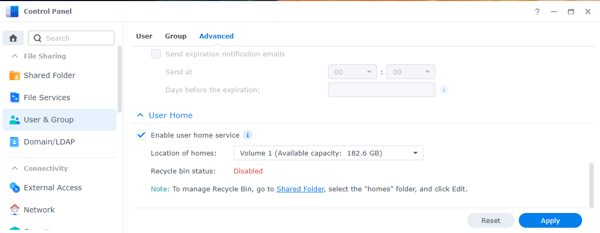

# Synology

!!! note

    As I don't have a Synology myself (and I kind of hate the Synology GUI for Docker containers), I'm doing this with the use of docker-compose through a terminal.

    This is faster than the GUI and, after installing, it shows up in the Docker GUI.

    *Thanks to faxity for the initial compose that I used to create the Synology Guide.*

    *And a very big thanks to [Bokkoman](https://www.buymeacoffee.com/bokkoman){:target="_blank" rel="noopener noreferrer"} and [BZwart](https://github.com/BaukeZwart){:target="_blank" rel="noopener noreferrer"} that updated this Guide for DSM 7 and also offered their help on Discord as Synology Support Team.*

## Introduction

Follow the guidance below to install several Docker images to your Synology system. We highly recommend you read the *full* guide so you have a better understanding of what you do (in case you later decide to make changes).

### Automated Script

??? example "Automated Script (**:bangbang:Use at your own risk:bangbang:**) - [CLICK TO EXPAND]"

    !!! Warning
        This is intended as a quick way to do everything that is written on this page within one script *and is only for initial setup*. After that, you must manage it yourself. *Rerunning the script will reset all personal changes made in the compose/env*.

        The script is only tested on Synology *DSM7 and higher*.

        **:bangbang: We are not held reliable if anything breaks on your system. Use this at your own risk. :bangbang:**

    First, enable terminal access (SSH) and home folders.

    Backup your Docker settings and then delete any current running Docker containers *related to this guide* (ie. *arr apps, download clients).

    (Click [HERE](#ssh){:target="_blank" rel="noopener noreferrer"} for information on enabling SSH on your Synology installation).

    To enable Home folders, go to `Control Panel` > `User & Group` > `Advanced` > `Enable user home service` at the bottom.

    

    Once you've enabled SSH and Home folders, run the following commands in your favorite terminal app and follow the onscreen questions.

    ```bash
    curl -sL git.io/syno-script > ~/syno-script
    ```

    ```bash
    sudo bash ~/syno-script
    ```

## Install Docker

Install Docker from the `Package Center`. **Note:** This should also create a share named `docker`; check File Station to see if it is present.

## Create the Main Share

!!! warning

    To get Hardlinks and Atomic-Moves working with your Synology, you will need to make use of **ONE** share with subfolders.

We will use a new share named `data` (lowercase) for all your library media.

Later in this guide, we will fill this share with subfolders.

To create a new share:

Navigate to `Control Panel` > `Shared Folder` > click `Create` > choose `Create Shared Folder`


Name this shared folder `data`. You can disable the trash can. Click `next` until you are done.

## Create a User

For this, we are going to create a new user that only has access to the share(s) that we use for this guide.

Go to `Control Panel` > `User & Group`

In the `User` section, create a new user. Name it whatever you like, but for this guide we will use `docker`.


Fill out the rest of the information, generate a password or type your own.

Click next. Ensure this user belongs only to the `users` group. Click `Next`.

### Assign Shared Folder Permissions

Next, you can select which Shares this user will have access to. Click `No Access` on the top to deny all access.

Now select *only* `Read/Write` on the shares `docker` and `data`.


Click `Next` until you reach `Assign application permissions`.

### Assign Application Permissions

At this stage, you can select which application this user will have access to. Check `Deny` for all applications.


Continue to click `Next` until you are finished.

## SSH

You are mostly going to use the terminal. Some parts will need the Synology web GUI.
To enable terminal, you need to enable SSH in the Synology Settings.

`Control Panel` > `Terminal & SNMP` > `Enable SSH service`


Then use a program like [Putty](https://www.putty.org/){:target="_blank" rel="noopener noreferrer"} or Powershell/Terminal to SSH into your Synology.

Enter the login information of a Synology user account that has admin priveliges (only members of the 'administrators' user group are able to use SSH).

**Note:** If you get a popup asking if you want to trust the key, press `OK` or `ACCEPT`.

### PUID and PGID

In order for the Docker container to access the shares on the Synology, we need to know the user ID (PUID) and group ID (PGID) from the `docker` user we just created.

Go into your terminal app and login to your Synology SSH.

Once logged in, type `id docker`. **Note:** If you created a different username, use that instead of `docker`.


This will show you the UID (aka PUID) which, in this screenshot, is `1035` for the docker user and the GID (aka PGID) which is `100` for the users group.
Remember these values for later use.

!!! warning

    It is not recommended to use your admin or main user account. That is why we just created a new user.

------

## Folder Structure

For this example, we're going to make use of the share called `data`.

On the host (Synology) terminal you will need to add `/volume1/` before it. So `/volume1/data`

The `data` folder has subfolders for `torrents` and `usenet` and each of these have subfolders for `tv`, `movie` and `music` downloads to keep things neat. The `library` folder has nicely named `tv`, `movies` and `music` subfolders. This is your library and what you’d pass to Plex, Emby, or JellyFin.

You must create these subfolders yourself.

*I'm purposefully using lowercase on all folders, because Linux is case-sensitive.*

{! include-markdown "../../../includes/hardlinks/docker-tree-full.md" !}

{! include-markdown "../../../includes/hardlinks/bad-path-suggestion.md" !}
<!-- --8<-- "includes/hardlinks/bad-path-suggestion.md" -->

{! include-markdown "../../../includes/hardlinks/breakdown-folder-structure-synology.md" !}
<!-- --8<-- "includes/hardlinks/breakdown-folder-structure.md" -->

------

### Create the Needed Subfolder

Here, we will create the needed subfolders for your media library and also for your preferred download client.
If you use both, run both commands.

#### If You Use Usenet

```bash
mkdir -p /volume1/data/{usenet/complete/{tv,movies,music},media/{tv,movies,music}}
```

#### If You USe Torrents

```bash
mkdir -p /volume1/data/{torrents/{tv,movies,music},media/{tv,movies,music}}
```

------

### Appdata

Your appdata will be stored in `/volume1/docker/appdata/{appname}`
You must create these `{appname}` subfolders yourself. (*This is a limitation of Synology*.)
We're going to do this in Putty or a similar program.

```bash
mkdir -p /volume1/docker/appdata/{radarr,sonarr,bazarr,plex,pullio}
```

You can add your own subfolders for your download client(s) using the command above by adding the name in the curly braces (**{}**) to the command.

Using this command:

```bash
ls -al /volume1/docker/appdata
```

Your appdata folder should look like this:

```none
docker
└── appdata
    ├── radarr
    ├── sonarr
    ├── bazarr
    ├── plex
    ├── pullio
    └── (your download client, i.e. nzbget; sabnzbd; qbittorrent)
```

------

## Needed Files

Now we are ready to move to the installation of containers.

For this, we need two files:

1. `docker-compose.yml`
1. `.env`

We will start with downloading the `docker-compose.yml` file

Download this [docker-compose.yml](https://raw.githubusercontent.com/TRaSH-/Guides-Synology-Templates/main/docker-compose/docker-compose.yml){:target="_blank" rel="noopener noreferrer"} to your `/volume1/docker/appdata` location so you got your important stuff together. Or use the command below:

```bash
wget https://raw.githubusercontent.com/TRaSH-/Guides-Synology-Templates/main/docker-compose/docker-compose.yml -P /volume1/docker/appdata/
```

### What's Included (and What's Not Included)

??? question "What's included and what's not included? - [CLICK TO EXPAND]"

    This docker-compose file will have the following docker containers included:

    - Radarr
    - Sonarr
    - Bazarr (Subtitle searcher and downloader)
    - Plex

    What's not included (and where are the download clients?).

    I didn't add a download client to it, because it depends on what you prefer (usenet/torrent) and which client you prefer, so I created a new [Repository](https://github.com/TRaSH-/Guides-Synology-Templates/tree/main/templates){:target="_blank" rel="noopener noreferrer"} on Github where I provide and maintain some templates that are ready to use with the main `docker-compose.yml`.

    The only thing you need to do is copy/paste what's inside the `.yml` file in to the main `docker-compose.yml`, the template also has the command you must use to create the [appdata](#appdata) folder that we explained earlier.

Next, we will download the `.env` file

Download this [.env](https://raw.githubusercontent.com/TRaSH-/Guides-Synology-Templates/main/docker-compose/.env){:target="_blank" rel="noopener noreferrer"} to your `/volume1/docker/appdata` location so you got your important stuff together. Or use this command:

```bash
wget https://raw.githubusercontent.com/TRaSH-/Guides-Synology-Templates/main/docker-compose/.env -P /volume1/docker/appdata/
```

!!! warning
    :bangbang: MAKE SURE THE FILE KEEPS THE ORIGINAL NAME (`.env`) WITH THE DOT BEFORE IT  :bangbang:

------

### Changes and Preparations

!!! tip
    If you need to edit the docker-compose.yml or the .env file, we advise using [Notepad++](https://notepad-plus-plus.org/){:target="_blank" rel="noopener noreferrer"} or [Visual Studio Code](https://code.visualstudio.com/){:target="_blank" rel="noopener noreferrer"}

The `.env` file we downloaded holds the variables/information you need to change in order for everything to work. I added explanations in the `.env` file.

1. DOCKERCONFDIR (Only change this if you know what you're doing and decide to use another path than this guide used.)
1. DOCKERDATADIR (Only change this if you know what you're doing and decide to use another path than this guide used.)
1. PUID/PGID (This info you got earlier from [HERE](#puid-and-pgid).)
1. TZ (Change to your timezone, can be found [HERE](https://en.wikipedia.org/wiki/List_of_tz_database_time_zones){:target="_blank" rel="noopener noreferrer"}.)
1. Install and create a task scheduler for Pullio, so your containers stay up to date.

!!! info ""
    The `.env` holds more variables/information for other containers. You don't need to remove those variables, because they will only be used if you install the other containers.

------

#### Pullio - Auto Update docker-compose the Correct Way

Pullio allows you to automatically update your containers, and sends you a notification through various means. In my setup, I use a Discord Webhook.

First, download Pullio.

```bash
   sudo curl -fsSL "https://raw.githubusercontent.com/hotio/pullio/master/pullio.sh" -o /usr/local/bin/pullio
```

```bash
   sudo chmod +x /usr/local/bin/pullio
```

For Pullio to work, you need to create in your Task Scheduler a "Scheduled Task" that runs, for example, at 4am at night with root privileges.

`Control Panel` > `Task Scheduler` > click `Create` > choose `Scheduled task - user defined script`

Give the task a name so you know what it does. Choose user `root`.

In the `Schedule` tab, choose whenever you want it to check for updates.

In the `Task Settings` tab, add the following line in the Run Command section:

```bash
/usr/local/bin/pullio > /volume1/docker/appdata/pullio/pullio.log 2>&1
```

It can be frustrating to test the script if no docker image updates are available. In that case, you can run command `sudo pullio --debug` and the script will behave as if an update is available. If you have something set to receive notifications, you should receive them.

More info about Pullio [HERE](https://hotio.dev/pullio/){:target="_blank" rel="noopener noreferrer"}

------

### Permissions

Now we need to make sure that the newly created files and folders have the correct permissions.

!!! note
    If you're using a different user than `docker` (the user generated in the beginning), then you need to change the `docker:users` part in the commands below!!!

```bash
sudo chown -R docker:users /volume1/data /volume1/docker
```

```bash
sudo chmod -R a=,a+rX,u+w,g+w /volume1/data /volume1/docker
```

!!! note
    If you copy files from a different library into the newly created library, you need to rerun these commands. !!!

------

## Run the Docker Compose

!!! tip
    Make sure you delete/remove all your existing Docker containers from the Docker GUI and also remove your native installs (in Package Center) of these applications !!!
    If you had previous installed apps, make a backup of their config folders.

When you've done all the above steps, run the following commands:

```bash
cd /volume1/docker/appdata
```

```bash
sudo docker-compose up -d
```

All the images will be downloaded and the containers will be started. If you get an error, review the error and try to fix it. If you still have issues, put your used docker-compose.yml on [0bin](https://0bin.net/){:target="_blank" rel="noopener noreferrer"}, join the TRaSH-Guides Discord [here](https://trash-guides.info/discord){:target="_blank" rel="noopener noreferrer"}, and provide the pastebin link with the error. Please have patience for a response (because of timezone differences).

------

**Don't forget to look at the [Examples](/Hardlinks/Examples/) for more information on how to setup the paths inside your applications.**

!!! warning

    If you need to make any changes, only edit the `docker-compose.yml` file. To activate the changes, run the command `sudo docker-compose up -d` again, from within the `/volume1/docker/appdata` folder.

    Any changes you do/did in the GUI will be reverted when you run the docker-compose command.

    Don't use the GUI unless for information purposes !!!

{! include-markdown "../../../includes/hardlinks/docker-compose-commands.md" !}
<!-- --8<-- "includes/hardlinks/docker-compose-commands.md" -->

{! include-markdown "../../../includes/support.md" !}
<!-- --8<-- "includes/support.md" -->
