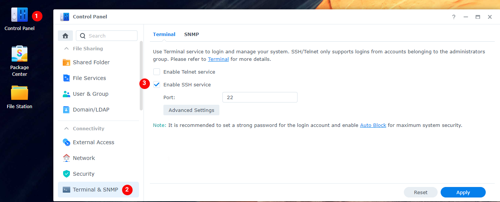

# Synology

!!! note

    Being I don't have a Synology myself and I kind of hate the Synology GUI for the dockers, I'm doing this with the use of docker-compose.

    This works like 10x faster then the GUI and after adding it shows up in the GUI.

    Thnx to faxity for the initial compose that I used to create the Synology Guide.

We need to get some information that we need later to setup the docker-compose file.

## PUID and PGID

In order for the Docker container to access the shares on the Synology,
we need to give it the same permissions as your main user who has access to those shares.
For this we need to figure out the PUID and the PGID of the user having access to your shares.

You will need to SSH into your Synology.
If you didn't already enable it you need to do that first



Then use a program like Putty and SSH to your Synology.

Login if you get a popup asking if you want to trust the key,
Just press `OK` or `ACCEPT`

Enter the login information of your main Synology user account.


Once logged in type `id`.
This will show your UID (aka PUID).
Which in this screenshot is `1026` for the administrator
and the GID (aka PGID) which is `100` for the users group.
Remember these values for later use.

!!! note

    Yes we know it's not recommended to use the admin account but if you already know this then you wouldn't need to read this ;)

------

## Folder Structure

!!! attention

    To get Hardlinks and Atomic-Moves working with your Synology you will need to make use of **ONE** share with subfolders.

For this example we're going to make use of a share called `data`.

On the host (Synology) you will need to add `/volume1/` before it. So `/volume1/data`

The `data` folder has sub-folders for `torrents` and `usenet` and each of these have sub-folders for `tv`, `movie` and `music` downloads to keep things neat. The `media` folder has nicely named `TV`, `Movies` and `Music` sub-folders, this is your library and what you’d pass to Plex, Emby or JellyFin.

These subfolders you need to create your self.

*I'm using lower case on all folder on  purpose, being Linux is case sensitive.*

```none
data
├── torrents
│  ├── movies
│  ├── music
│  └── tv
├── usenet
│  ├── movies
│  ├── music
│  └── tv
└── media
    ├── movies
    ├── music
    └── tv
```

## Breakdown of the Folder Structure

### Torrent clients

qBittorrent, Deluge, ruTorrent

The reason why we use `/data/torrents` for the torrent client is because it only needs access to the torrent files. In the torrent software settings, you’ll need to reconfigure paths and you can sort into sub-folders like `/data/torrents/{tv|movies|music}`.

```none
data
└── torrents
    ├── movies
    ├── music
    └── tv
```

### Usenet clients

NZBGet or SABnzbd

The reason why we use `/data/usenet` for the usenet client is because it only needs access to the usenet files. In the usenet software settings, you’ll need to reconfigure paths and you can sort into sub-folders like `/data/usenet/{tv|movies|music}`.

```none
data
└── usenet
    ├── movies
    ├── music
    └── tv
```

### The arr(s)

Sonarr, Radarr and Lidarr

Sonarr, Radarr and Lidarr gets access to everything because the download folder(s) and media folder will look like and be one file system. Hard links will work and moves will be atomic, instead of copy + delete.

```none
data
├── torrents
│  ├── movies
│  ├── music
│  └── tv
├── usenet
│  ├── movies
│  ├── music
│  └── tv
└── media
    ├── movies
    ├── music
    └── tv
```

### Media Server

Plex, Emby, JellyFin and Bazarr

Plex, Emby, JellyFin and Bazarr only needs access to your media library, which can have any number of sub folders like Movies, Kids Movies, TV, Documentary TV and/or Music as sub folders.

```none
data
└── media
    ├── movies
    ├── music
    └── tv
```

------

## Appdata

Your appdata will be stored in `/volume1/docker/appdata/{appname}`
These `{appname}` sub folders you need to create your self. (*This is a limitation of the Synology*)
We're going to do this in Putty or a similar program.

```bash
sudo mkdir /volume1/docker/appdata
cd /volume1/docker/appdata
sudo mkdir radarr sonarr bazarr plex tautulli
```

So your appdata folder will look like this.

```bash
ls -al /volume1/docker/appdata
```

```none
docker
└── appdata
    ├── radarr
    ├── sonarr
    ├── bazarr
    ├── plex
    └── tautulli
```

------

## Needed files

First we will download the `docker-compose.yml` file

Download this [docker-compose.yml](https://github.com/TRaSH-/Guides-Synology-Templates/blob/main/docker-compose/docker-compose.yml){:target="_blank" rel="noopener noreferrer"} to your `/volume1/docker/appdata` location so you got your important stuff together.

```bash
sudo wget https://raw.githubusercontent.com/TRaSH-/Guides-Synology-Templates/main/docker-compose/docker-compose.yml
```

??? question "What's included and What's not included"

    This docker-compose file will have the following docker containers included.

    - Radarr
    - Sonarr
    - Bazarr (Subtitle searcher and downloaded)
    - Plex
    - Tautulli
    - Watchtower (automatic docker container updater at 4am)

    What's not included.

    I didn't add a downloader to it because it depends on what you prefer usenet/torrents and which client you prefer, so i created a new [Repository](https://github.com/TRaSH-/Guides-Synology-Templates){:target="_blank" rel="noopener noreferrer"} on Github where I provide and maintain some templates that you can find in the `template` folder ready to use with the main `docker-compose.yml`.

    The only thing you need to do is copy/paste what's inside the `.yml` file in to the main `docker-compose.yml`, the template also has the command what you need to use to create the [appdata](#appdata) folder that we explained earlier.

Second we will download the `.env` file

Download this [.env](https://github.com/TRaSH-/Guides-Synology-Templates/blob/main/docker-compose/.env){:target="_blank" rel="noopener noreferrer"} to your `/volume1/docker/appdata` location so you got your important stuff together.

```bash
sudo wget https://raw.githubusercontent.com/TRaSH-/Guides-Synology-Templates/main/docker-compose/.env
```

------

### Changes you need to do

The `.env` we downloaded holds the variables/information you need to change so everything works (I added also a description in the `.env` file)

1. DOCKERCONFDIR (only change this if you know what you're doing and decide to use another path then in this guide used)
1. DOCKERDATADIR (only change this if you know what you're doing and decide to use another path then in this guide used)
1. PUID/PGID (this info you got earlier from [HERE](#puid-and-pgid))
1. TZ (Change to your timezone)

It holds more variables/information for other containers but they are described in the `.env`

------

### Permissions

Now we need to make sure that the newly created files and folders have the correct permissions.

!!! note
    If you're using another user then `admin` then you need to change it in the commands below !!!

```bash
sudo chown -R admin:users /volume1/data /volume1/docker
sudo chmod -R a=,a+rX,u+w,g+w /volume1/data /volume1/docker
```

------

### Run the Docker Compose

!!! important
    make sure you deleted/removed all your existing dockers from the GUI and also remove your native installs of these applications !!!

When you did all the above steps you only need to type the following in your `/volume1/docker/appdata`

```bash
cd /volume1/docker/appdata
sudo docker-compose up -d
```

You will notice that all the images will be downloaded, and after that the containers will be started. If you get a error then look at the error what it says and try to fix it. If you still got issues then put your used docker-compose.yml on pastebin and join the guides-discord [here](https://trash-guides.info/discord){:target="_blank" rel="noopener noreferrer"} and provide the pastebin link with the error, have patience because of timezone differences.

------

**Don't forget to look at the [Examples](/Hardlinks/Examples/) how to setup the paths inside your applications.**

!!! attention

    If you need to do any changes only edit the `docker-compose.yml` file and activate the changes when you type `sudo docker-compose up -d` again.

    Any changes you do/did in the GUI will be reverted when you run the docker-compose.

    Just don't use the GUI !!!

??? hint "docker-compose commands"

    - `sudo docker-compose up -d` (This Docker-compose command helps builds the image, then creates and starts Docker containers. The containers are from the services specified in the compose file. If the containers are already running and you run docker-compose up, it recreates the container.)
    - `sudo docker-compose pull` (Pulls an image associated with a service defined in a docker-compose.yml)
    - `sudo docker-compose down` (The Docker-compose down command also stops Docker containers like the stop command does. But it goes the extra mile. Docker-compose down, doesn’t just stop the containers, it also removes them.)
    - `sudo docker system prune -a --volumes --force` (Remove all unused containers, networks, images (both dangling and unreferenced), and optionally, volumes.)
