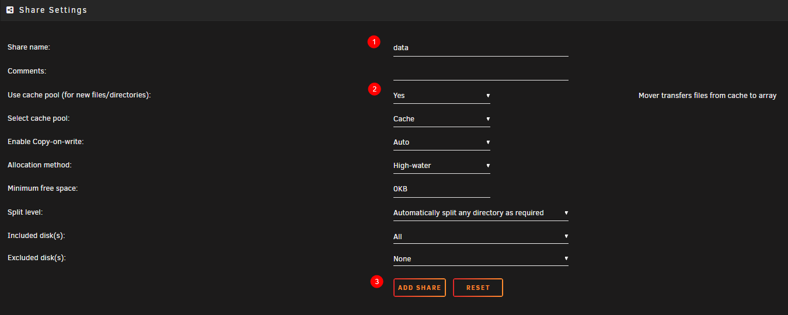
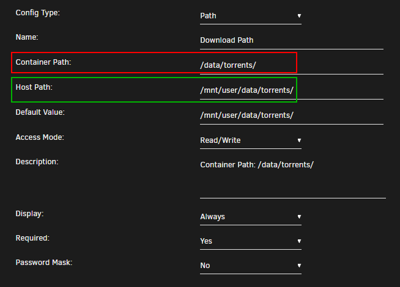
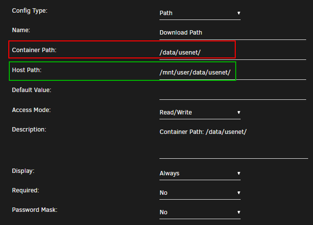
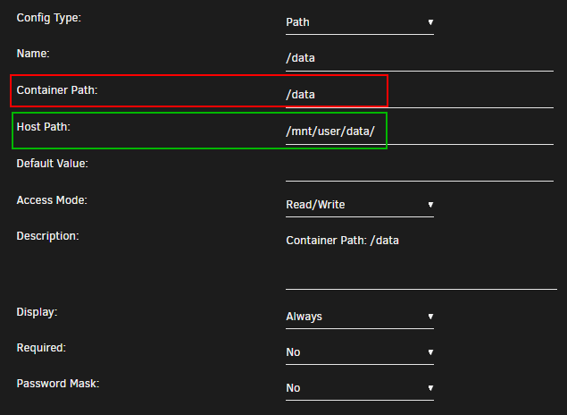
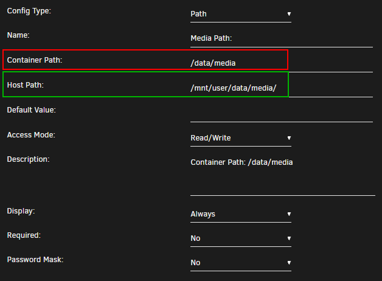
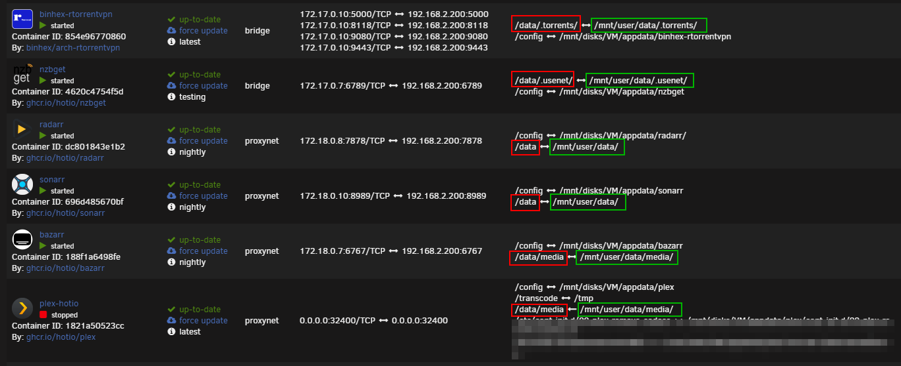

# Unraid

!!! note

    The first thing you need to do is forget the suggested paths from the Spaceinvader One YouTube Tutorials,

    and don't use the predefined paths from the unraid templates.

    (Spaceinvader One YouTube guides are great to learn how to start with unraid or how to setup certain applications, and yes I did and still do use them. Probably the main reason why he's using those path is because they are predefined in the template)

------

## Create the main share

!!! attention

    To get Hardlinks and Atomic-Moves working with Unraid you will need to make use of <u>**ONE**</u> share with subfolders.

For this example I'm using my own setup and preferred share `data`.

Go to your dashboard and on the top select `shares` select `add share` .



1. use `data`
1. if you got a cache drive and want to make use of it put it on `Yes` or keep it disabled (Hardlinks will stay in tact if you're using the cache)
1. click on `ADD SHARE`

!!! note

    Keep in mind regarding the use of the Cache drive, The mover can't move files that are in use, like  when seeding with torrents. You will need to shutdown your client or stop/pause the torrents so the mover can move them to your Array.

    With Usenet  you won't have any issues.

------

## Folder Structure

On the host (Unraid) you will need to add `/mnt/user` before it. **So `/mnt/user/data`**

The `data` folder has sub-folders for `torrents` and `usenet` and each of these have sub-folders for `tv`, `movie` and `music` downloads to keep things neat. The `media` folder has nicely named `TV`, `Movies` and `Music` sub-folders, this is your library and what you’d pass to Plex, Emby or JellyFin.

These subfolders you need to create your self, you can use krusader or winscp to create them or any other way you prefer.

```none
data
├── torrents
│  ├── movies
│  ├── music
│  └── tv
├── usenet
│  ├── movies
│  ├── music
│  └── tv
└── media
    ├── movies
    ├── music
    └── tv
```

*I'm using lower case on all folder on  purpose, being Linux is case sensitive.*

------

### Breakdown of the Folder Structure

!!! info

    The paths you use on the inside matter. Because of how Docker’s volumes work, passing in two or three volumes such as the commonly suggested `/tv`, `/movies` and `/downloads` makes them look like two or three file systems, even if they aren’t. This means hard links won’t work and instead of an instant move, a slower and more I/O intensive copy + delete is used.

## Setting up the containers

After you created all the needed folders it's time to setup the paths in the docker containers.

Go to your dashboard and select your docker container you want to edit or if you're starting fresh add the docker containers you want to use or prefer.

Unraid makes it actually  pretty clear what's the Host Path and what's the Container Path.

`Container Path:` => The path that will be used inside the container.

`Host Path:` => The path on your Unraid Server (The Host).

------

### Torrent clients

qBittorrent, Deluge, ruTorrent



`Container Path:` => `/data/torrents/`

`Host Path:` => `/mnt/user/data/torrents/`

!!! info

    The reason why we use `/data/torrents/` for the torrent client is because it only needs access to the torrent files. In the torrent software settings, you’ll need to reconfigure paths and you can sort into sub-folders like `/data/torrents/{tv|movies|music}`.

```none
data
└── torrents
    ├── movies
    ├── music
    └── tv
```

------

### Usenet clients

NZBGet or SABnzbd



`Container Path:` => `/data/usenet/`

`Host Path:` => `/mnt/user/data/usenet/`

!!! info

    The reason why we use `/data/usenet/` for the usenet client is because it only needs access to the usenet files. In the usenet software settings, you’ll need to reconfigure paths and you can sort into sub-folders like `/data/usenet/{tv|movies|music}`.

```none
data
└── usenet
    ├── movies
    ├── music
    └── tv
```

------

### The arr(s)

Sonarr, Radarr and Lidarr



`Container Path:` => `/data`

`Host Path:` => `/mnt/user/data/`

!!! info

    Sonarr, Radarr and Lidarr gets access to everything because the download folder(s) and media folder will look like and be one file system. Hard links will work and moves will be atomic, instead of copy + delete.

```none
data
├── torrents
│  ├── movies
│  ├── music
│  └── tv
├── usenet
│  ├── movies
│  ├── music
│  └── tv
└── media
    ├── movies
    ├── music
    └── tv
```

------

### Media Server

Plex, Emby, JellyFin and Bazarr



`Container Path:` => `/data/media`

`Host Path:` => `/mnt/user/data/media/`

!!! info

    Plex, Emby, JellyFin and Bazarr only needs access to your media library, which can have any number of sub folders like Movies, Kids Movies, TV, Documentary TV and/or Music as sub folders.

```none
data
└── media
    ├── movies
    ├── music
    └── tv
```

------

## Final Result



**Don't forget to look at the [Examples](/Hardlinks/Examples/) how to setup the paths inside your applications.**

### Video Tutorial

!!! tip ""

    Big Thnx to IBRACORP for noticing this Guide and creating a Video covering this unraid section.

    The reason why I added the video to the end is because I want the user to actually learn and understand why it's recommended to use this folder structure, before going straight to the YouTube video.

    <iframe width="560" height="315" src="https://www.youtube.com/embed/AMcHsQJ7My0" title="YouTube video player" frameborder="0" allow="accelerometer; autoplay; clipboard-write; encrypted-media; gyroscope; picture-in-picture" allowfullscreen></iframe>

    Please don't forget to check out his other Unraid Video's [HERE](https://www.youtube.com/c/IBRACORP/videos){:target="_blank" rel="noopener noreferrer"}
