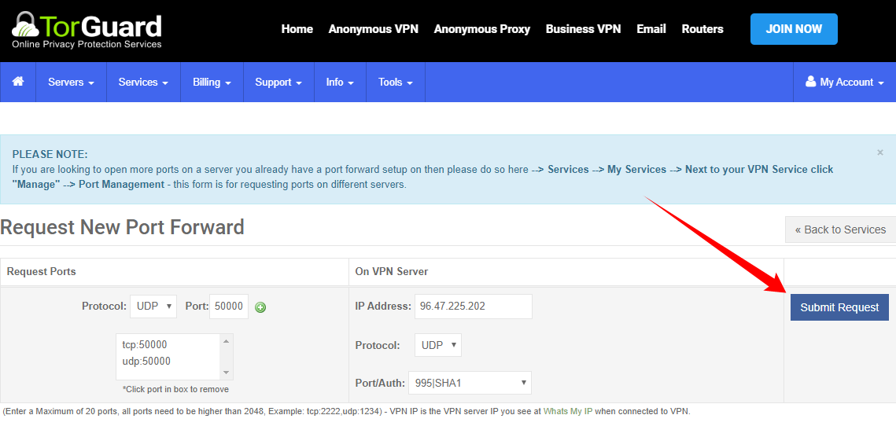

# How to setup TorGuard for port forwarding

!!! note
    These settings are a recommendation if you want to choose other settings be my guest.

    If you want to support me, please use the following [referral link](https://torguard.net/aff.php?aff=5575){:target="_blank"} and use one of the following codes:

    * `TGLIFE`: Get 50% Off for Life for Anonymous Proxy, Anonymous VPN, Anonymous Webmail.
    * `TGLIFE-STREAMING`: Get 50% Off for Life Anonymous Proxy, Anonymous VPN, Streaming Bundle.
    * `TGLIFE-PRO`: Get 50% Off for Life for Anonymous VPN, Streaming Bundle, Anonymous VPN Pro.

    {:target="_blank"}
------

## Create a user account

Go to [My Account > Services > My Service Credentials](https://torguard.net/clientarea.php?action=changepw){:target="_blank"}.
First we're going to create a user account for your VPN so we won't need to use your main account that you use to login to your account on the Torguard site.
This account will be used for authentication with your VPN Torrent client.

Create a new username and choose a secure password or create a random username and password.

## How to get the IP of your VPN server

Go to [My Account > Server > Global VPN Network](https://torguard.net/network/){:target="_blank"}

Then we're going to select which server we're going to use,

For the best speed it's recommended to choose the one nearest to your location.
Lets use for this example: `USA Miami` and copy/paste the Hostname `us-fl.secureconnect.me`.

then open a cmd window or something equal and type: `ping us-fl.secureconnect.me`

You will then get the IP of the server.
Remember that for later use.

## How to set Port forwarding

Go to [My Account > Services > My Services](https://torguard.net/clientarea.php?action=products){:target="_blank"}.

Then click on `Manage` and select `Request Port Forward`.

1. That's the `IP` we found earlier.
2. Select `UDP`.
3. Select a `Port/Auth` I personally use `995|SHA1`.
4. Select the `Protocol` `TCP`.
5. I suggest to use a high `Port` number 10.000+ or a game port you don't use, don't use the default torrent ports 6881- 6889
    (This is also the port you will use in your torrent client).
6. Click on the `+` sign and do the same with the `UDP` `Protocol`.
7. Then click on `Submit Request`.

And you will see something like this.

You will also receive a e-mail with the ports you forwarded.

## How to create the .ovpn file

Go to [My Account > Tools > OpenVPN Config Generator](https://torguard.net/tgconf.php?action=vpn-openvpnconfig){:target="_blank"}.

1. Choose the OS you want to use the .ovpn for.
2. Choose `Custom`.
3. Put in the `IP` we got earlier and used for the port forwarding.
4. Choose `UDP`.
5. Choose `995|SHA1` or what you selected during the port forwarding.
6. Choose `AES-128-GCM`.
7. Choose `2.4 and above`.
8. Check `Require TLS 1.2`
9. Click on `Generate Config`

Now you will download a .ovpn file with a random number.
This .ovpn file you place in the openvpn folder of your VPN torrent client.

------
