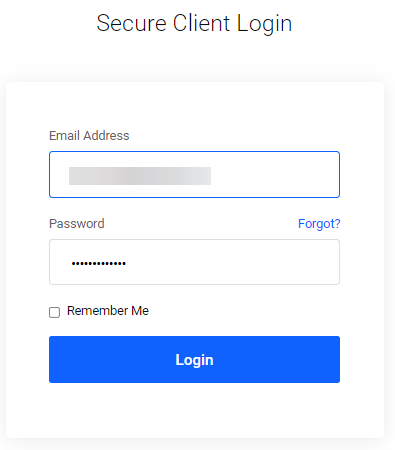
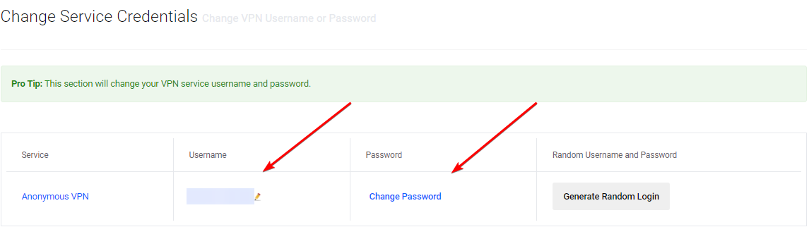
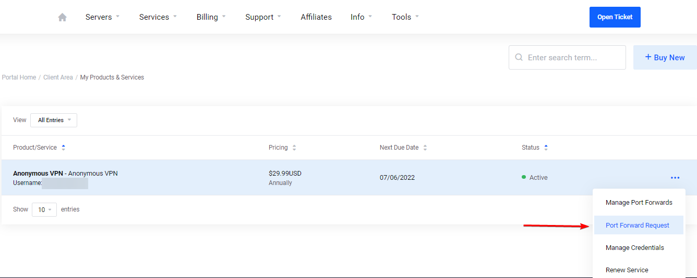
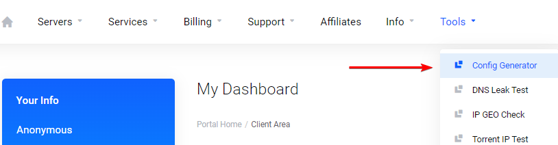

# Setup TorGuard for port forwarding

These settings are a recommendation if you want to choose other settings be my guest.

If you want to support me, please use this [referral link](https://torguard.net/aff.php?aff=5575){:target="_blank" rel="noopener noreferrer"} and enter the following discount code:

Get 50% Off ALL Plans (Anonymous VPN, Anonymous VPN Pro, Anonymous VPN Premium)

```none
TRaSH-Guides-2024
```

[](https://torguard.net/aff.php?aff=5575){:target="_blank" rel="noopener noreferrer"}

!!! bug "As of 13 March Torguard Settles Piracy Lawsuit and has agreed to use commercially reasonable efforts to block BitTorrent traffic on its servers in the US using firewall technology. :bangbang:<br><br>I Talked to several people and they are still able to use Torguard for Torrents, Perhaps because the connection is encrypted. And others just selected a server in another country.<br>- [Source Torguard](https://torguard.net/blog/why-torguard-is-blocking-bittorrent-on-us-servers/){:target="_blank" rel="noopener noreferrer"}.<br>- [Source Torrentfreak](https://torrentfreak.com/torguard-settles-piracy-lawsuit-and-agrees-to-block-torrent-traffic-on-u-s-servers-220314/){:target="_blank" rel="noopener noreferrer"}."

!!! warning "If the US server doesn't work for you use another country"

---

## Login to your Client area

Login to your [Client Area](https://torguard.net/clientarea.php){:target="\_blank" rel="noopener noreferrer"}.

??? success "Example - [Click to show/hide]"

    

### Create a user account

First we're going to create a [User Account](https://torguard.net/clientarea.php?action=changepw){:target="\_blank" rel="noopener noreferrer"} for your VPN so we won't need to use your main account that you use to login to your account on the Torguard site.
This account will be used for authentication with your VPN Torrent client.

`Services` > `My Services` > `Manage` > `Manage Credentials`

??? success "Example - [Click to show/hide]"

    

    

Create a new username and choose a secure password or create a random username and password.

??? success "Example - [Click to show/hide]"

    

---

## How to get the IP of your VPN server

Now it's time to get the IP of your VPN server you're going to use from the [Global VPN Network](https://torguard.net/network/){:target="\_blank" rel="noopener noreferrer"}, From your Client Area.

`Servers` > `Global VPN Network`

??? success "Example - [Click to show/hide]"

    

### Global VPN Network

Then we're going to select which server we're going to use,

For the best speed it's recommended to choose the one nearest to your location.

!!! tip "Sometimes you get better speeds if you use one of your neighboring countries."

!!! warning "If the US server doesn't work for you use another country"

Let's use for this example: `Netherlands Amsterdam` and copy/paste the Hostname `nl.torguard.org`.


!!! tip "Also check if your chosen server supports Wireguard"

### Get your VPN IP

Open a cmd window or something equal and type:

```bash
    ping nl.torguard.org
```

You will then get the IP of the server.
Remember that for later use.


---

## How to setup Port forwarding

### Port Forward Request

From your Client Area go to your [My Services](https://torguard.net/clientarea.php?action=products){:target="\_blank" rel="noopener noreferrer"}.

Then click on `Manage` and select `Port Forward Request`.

`Services` > `My Services` > `Manage` > `Port Forward Request`

??? success "Example - [Click to show/hide]"

    

#### WireGuard Request Port Forward


1. That's the `IP` we found earlier.
1. Select `UDP`. (:bangbang: **KEEP THIS ON UDP FOR WireGuard** :bangbang:)
1. Select a `Port/Auth` and select `WireGuard`.
1. Select the `Protocol` `TCP`.
1. I suggest to use a high `Port` number 10.000+ or a game port you don't use, don't use the default torrent ports 6881- 6889
    (This is also the port you will use in your torrent client).
1. Click on the `+` sign and do the same with the `UDP` `Protocol`.
1. Then click on `Submit Request`.

!!! warning ":bangbang: DON'T CHANGE OPTION 2 `UDP` to `TCP` :bangbang:"

If everything went according to plan you will see something like this.


<sub><sup>*The screenshot above is only an example to show you how it could look. It's not always a 100% reflection of the actual data.*</sup></sub>

You will also receive a e-mail with the ports you forwarded.

!!! Note "Normally it doesn't take more then a few seconds/minutes to get the ports approved if it takes longer or you get `PENDING` I suggest to ping the server again (or choose another sever) and you often get a new IP and retry it again with the new IP."

---

## How to create the config file

From your Client Area go to your [Config Generator](https://torguard.net/tgconf.php?action=vpn-openvpnconfig){:target="\_blank" rel="noopener noreferrer"}.

`Tools` > `Config Generator`

??? success "Example Select Tools > Config Generator - [Click to show/hide]"

    

### Config Generator

#### WireGuard Config Generator

 

 1. Choose `WireGuard`.
 1. Choose from the dropdown box the `IP` we got earlier and used for the port forwarding.
 1. Add your `VPN Username`.
 1. Only Change this if you know what you're doing :bangbang:
 1. [Optional] Choose you preferred DNS Server
 1. Only Change this if you know what you're doing :bangbang:
 1. Click on `Generate Config`

 Now you will download a `.conf` file with a random number.

 Rename the file from `*.conf` to `wg0.conf` and copy it to your wireguard folder of your VPN torrent client.

---

Thanks:

A big Thanks to [mrhotio](https://github.com/mrhotio) for his excellent instructions on how to setup WireGuard for TorGuard.

--8<-- "includes/support.md"
