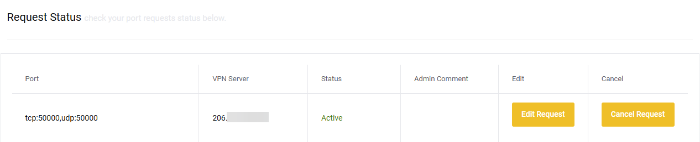

# Setup TorGuard for port forwarding

!!! note
    These settings are a recommendation if you want to choose other settings be my guest.

    If you want to support me, please use the following [referral link](https://torguard.net/aff.php?aff=5575){:target="_blank" rel="noopener noreferrer"} and use one of the following codes:

    * `TGLIFE`: Get 50% Off for Life for Anonymous Proxy, Anonymous VPN, Anonymous Webmail.
    * `TGLIFE-STREAMING`: Get 50% Off for Life Anonymous Proxy, Anonymous VPN, Streaming Bundle.
    * `TGLIFE-PRO`: Get 50% Off for Life for Anonymous VPN, Streaming Bundle, Anonymous VPN Pro.

    [](https://torguard.net/aff.php?aff=5575){:target="_blank" rel="noopener noreferrer"}
------

## Login to your Client area

Login to your [Client Area](https://torguard.net/clientarea.php){:target="_blank" rel="noopener noreferrer"}.

??? check "Example - [CLICK TO EXPAND]"
    

### Create a user account

First we're going to create a [User Account](https://torguard.net/clientarea.php?action=changepw){:target="_blank" rel="noopener noreferrer"} for your VPN so we won't need to use your main account that you use to login to your account on the Torguard site.
This account will be used for authentication with your VPN Torrent client.

`Services` > `My Services` > `Manage` > `Manage Credentials`

??? Check "Example - [CLICK TO EXPAND]"
    

Create a new username and choose a secure password or create a random username and password.

??? Check "Example - [CLICK TO EXPAND]"
    

------

## How to get the IP of your VPN server

Now it's time to get the IP of your VPN server you're going to use from the [Global VPN Network](https://torguard.net/network/){:target="_blank" rel="noopener noreferrer"}, From your Client Area.

`Servers` > `Global VPN Network`

??? Check "Example - [CLICK TO EXPAND]"
    

### Global VPN Network

Then we're going to select which server we're going to use,

For the best speed it's recommended to choose the one nearest to your location.
Let's use for this example: `USA Miami` and copy/paste the Hostname `us-fl.secureconnect.me`.


!!! important
    Also check if your choosen server supports OpenVPN or Wireguard depending what you want to use.

### Get your VPN IP

Open a cmd window or something equal and type:

```bash
    ping us-fl.secureconnect.me
```

You will then get the IP of the server.
Remember that for later use.

??? Check "Example - [CLICK TO EXPAND]"
    

------

## How to setup Port forwarding

!!! note
    This section will consist of 2 parts depending if you want to use OVPN or WireGuard so make sure you choose your preferred VPN Tunnel type.

### Request Port Forward

From your Client Area go to your [My Services](https://torguard.net/clientarea.php?action=products){:target="_blank" rel="noopener noreferrer"}.

Then click on `Manage` and select `Request Port Forward`.

`Services` > `My Services` > `Manage` > `Request Port Forward`

??? Check "Example - [CLICK TO EXPAND]"
    

### VPN Tunnel Type

Choose your preferred VPN Tunnel type.

#### OVPN Request Port Forward

??? example "OVPN Request Port Forward"

    

    1. That's the `IP` we found earlier.
    1. Select `UDP`.
    1. Select a `Port/Auth` I personally use `995|SHA1`.
    1. Select the `Protocol` `TCP`.
    1. I suggest to use a high `Port` number 10.000+ or a game port you don't use, don't use the default torrent ports 6881- 6889
        (This is also the port you will use in your torrent client).
    1. Click on the `+` sign and do the same with the `UDP` `Protocol`.
    1. Then click on `Submit Request`.

    If everything went according to plan you will see something like this.

    

    You will also receive a e-mail with the ports you forwarded.

    !!! Note
        Normally it doesn't take more then a few seconds/minutes to get the ports approved if it takes longer or you get `PENDING` I suggest to ping the server again (or choose another sever) and you often get a new IP and retry it again with the new IP.

#### WireGuard Request Port Forward

??? example "WireGuard Request Port Forward - [CLICK TO EXPAND]"

    

    1. That's the `IP` we found earlier.
    1. Select `UDP`. (:bangbang: **KEEP THIS ON UDP FOR WireGuard** :bangbang:)
    1. Select a `Port/Auth` and select `WireGuard`.
    1. Select the `Protocol` `TCP`.
    1. I suggest to use a high `Port` number 10.000+ or a game port you don't use, don't use the default torrent ports 6881- 6889
        (This is also the port you will use in your torrent client).
    1. Click on the `+` sign and do the same with the `UDP` `Protocol`.
    1. Then click on `Submit Request`.

    !!! warning "WARNING"
        :bangbang: DON'T CHANGE OPTION 2 `UDP` to `TCP` :bangbang:

    If everything went according to plan you will see something like this.

    

    You will also receive a e-mail with the ports you forwarded.

    !!! Note
        Normally it doesn't take more then a few seconds/minutes to get the ports approved if it takes longer or you get `PENDING` I suggest to ping the server again (or choose another sever) and you often get a new IP and retry it again with the new IP.

------

## How to create the config file

!!! note
    This section will consist of 2 parts depending if you want to use OVPN or WireGuard so make sure you choose your preferred VPN Tunnel type.

From your Client Area go to your [Config Generator](https://torguard.net/tgconf.php?action=vpn-openvpnconfig){:target="_blank" rel="noopener noreferrer"}.

`Tools` > `Config Generator`

??? Check "Example Select Tools > Config Generator - [CLICK TO EXPAND]"
    

### Config Generator

Choose your preferred VPN Tunnel type.

#### OVPN Config Generator

??? example "OVPN Config Generator - [CLICK TO EXPAND]"

    

    1. Keep this on `Default`.
    1. Choose `OpenVPN`.
    1. Put in the `IP` we got earlier and used for the port forwarding.
    1. Choose `UDP`.
    1. Choose `995|SHA1` or what you selected during the port forwarding.
    1. Choose `AES-128-GCM`.
    1. Choose `2.4 and above`.
    1. Check `Require TLS 1.2`
    1. Click on `Generate Config`,

    Now you will download a `.conf` file with a random number.

    Rename the extension from `*.conf` to `*.ovpn` and copy it to your openvpn folder of your VPN torrent client.

#### WireGuard Config Generator

??? example "WireGuard Config Generator - [CLICK TO EXPAND]"

    

    1. Choose `WireGuard`.
    1. Put in the `IP` we got earlier and used for the port forwarding.
    1. Add your `VPN Username`.
    1. Add your `VPN Password.
    1. Click on `Generate Config`

    Now you will download a `.conf` file with a random number.

    Rename the file from `*.conf` to `wg0.conf` and copy it to your wireguard folder of your VPN torrent client.

------

THNX:

A big thnx to [mrhotio](https://github.com/mrhotio) for his excellent instructions on how to setup WireGuard for TorGuard.
