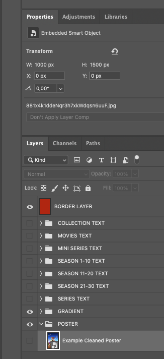

# How to create Posters for the Trash Guides community

So you want to create Posters for your media library in the one and only MusikMann2000 style. Not to be a bummer or cool down your enthusiasm but there are quite a few things to keep in mind and to make sure before you start creating your very first poster. This is something that everyone who creates posters adhere to and follow to the T so that everyone then can enjoy good quality Posters in their comfy sofa.

## Requirements

To be able to count yourself among the very stars who actually make Posters for this lovely community you need to follow these guidelines and rules so that we do not start introducing sub par quality posters into the repository which today contains over **50 000** posters.

1) First off, you need to make sure that you're actually using Trash-Guides recommended naming scheme before going any further. This is to make sure that all your posters have the correct file name. So first off, check out [Sonarr naming scheme](https://trash-guides.info/Sonarr/Sonarr-recommended-naming-scheme/) and [Radarr naming scheme](https://trash-guides.info/Radarr/Radarr-recommended-naming-scheme/) and make sure you use the one associated with **Plex** and **standard**.
2) Run userScripts Renameinatorr by installing [userScripts](https://github.com/Drazzilb08/userScripts/wiki#installation) and then running the the script on your **whole** library. This will make sure that your Radarr and Sonarr has the correct filenames which we will use when creating posters later. This may take a very long time depending on your naming scheme being done the right way or not. Whatever you do, do not create a poster before you're sure you have the correct filename or you'll have to redo it when noone can enjoy your hard work due to poster not matching their library.
3) Download the latest .
4) Install Photoshop as it's the best software for the job.

## Guidelines and Rules

- Do not change **ANY** settings or move **ANYTHING** around. Everything is positioned perfectly to keep a cohesive style everyone needs to adhere to. If you start changing the position or size please do **NOT** share these with anyone else as we only want MM2K Style posters. (Oh but I only moved that text 1 px that way? Well it hurts my eyes when I see that poster so PLEASE keep it to yourself)
- Do not move layers around (every layer is where it is supposed to be, if you think you've found a way to do something better please suggest a change to the `poster.psd` instead so that everyone can verify it before you actually use it)
- Remove **ALL** text from the poster you're using as a background before adding it to your `poster layer` inside `poster.psd`
- **ALWAYS** use ALL CAPS when adding text to the poster (unless you're 100% sure of what you're doing, cuz there are exceptions but we'd rather have ALL CAPS then a wrong use of non capitalized text)
- Posters must always be saved with the default White Border. If you want to use a different border, use [userScripts](https://github.com/Drazzilb08/userScripts/wiki#installation) border-replacerr
- Make sure the poster background you're using is positioned at X = 0 Y = 0 and that it is 1000 px wide and 1500 px in height 
??? Proper dimensions "Example - [Click to show/hide]"
    
- TV Shows should always have all season posters. However it is totally fine to use the same poster background for all seasons and only changing the relevant season number.
- Recommended to use AI Generative Fill features if you need to remove the text from a poster you find on the Internet.
- ALWAYS save final poster product as `.jpg` (that's `jpg` and NOT `JPG / JPEG`) with highest quality (7 on PS)

## Creating a Poster

1) Find the media you want to add a poster to in Radarr / Sonarr (if it's not a Collection) and copy the filename (found by navigation to the media and checking the `path` which looks something like this: `/data/media/movies/Accident Man (2018) {imdb-tt6237612})` and in this case the filename is `Accident Man (2018)`
2) Go find the background media to base your Poster on. For example [The Movie DB](https://www.themoviedb.org/) where you would then search for: `Accident Man` and find **Media** -> **Posters** and download the one you want to use.
3) Open the newly downloaded background/poster media and remove ALL text using Photoshops AI tool by using the rectangular select tool and placing it above what you want removed and then pressing generate. Generate until you're satisfied with the result. Sometimes you need to reposition the image due to it not matching up. For example you have a lot going on at the bottom to mid level then I'd suggest you take out the crop tool, select ratio 2:3 and moev the image up so that the actual content is better aligned and then press generate to once again let the AI generate a fill for the empty area at the bottom.
4) Once you're happy with your background for the Poster you open up `poster.psd` and select the layer which says poster. Then you drag your newly created background onto Photoshop and it should now be added as a layer under posters.
5) Time to fill out the necessary text. Use the correct layer group based on the content you're creating. Then **ALWAYS** use the MAIN one and try to add the content as nicely as possible to fit around the main one.
6) After you're done with this you want to export this poster to your Google Drive folder where you stash all your posters, but before you do PLEASE read through the next part to get the naming right.

## Naming your Poster

Finally! You've done all that hard work, followed all the rules and guidelines, and you're now ready to create your very first poster. Which leads to how do you name that beautiful piece of art? Well it depends, like so many things in life ;)

| Category | Scheme | Example |
-------------------------------
| Collection | The exact same name of the collection + `Collection` if not already present | `101 Dalmatians (Animated) Collection.jpg` |
| Movie | Radarr's filename **minus** IMDB id | `101 Dalmatians (1996).jpg` |
| TV Show | Sonarr's filename **minus** IMDB id | `The Adventures of Puss in Boots (2015).jpg` |
| TV Show Season | Sonarr's filename **minus** IMDB id **PLUS** `- Season X` | `The Adventures of Puss in Boots (2015) - Season 1.jpg` |