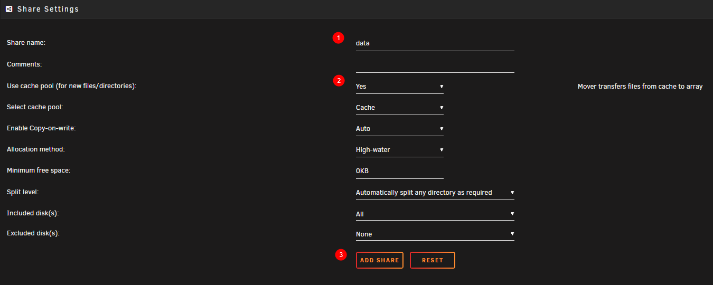
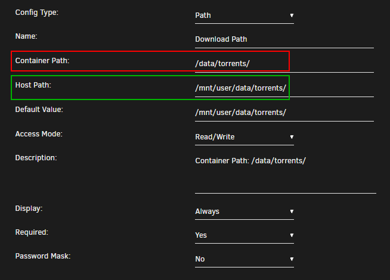
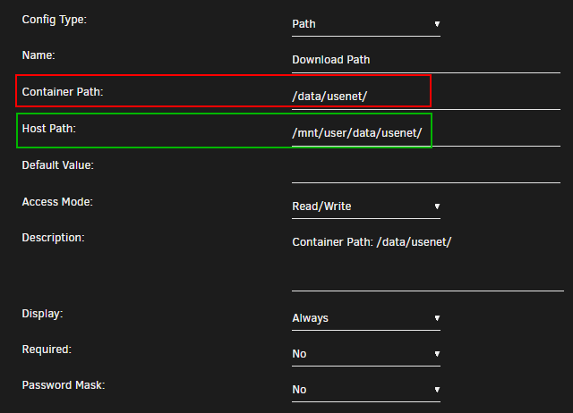
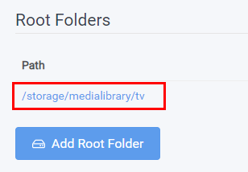
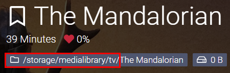
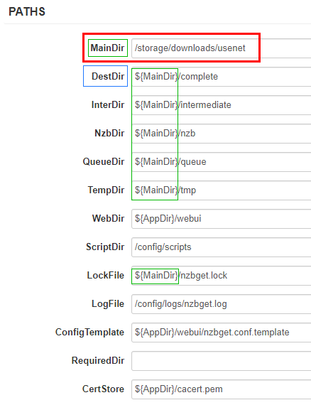
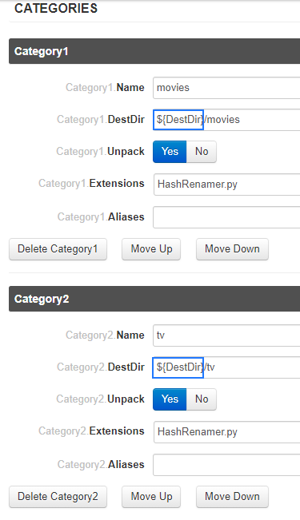
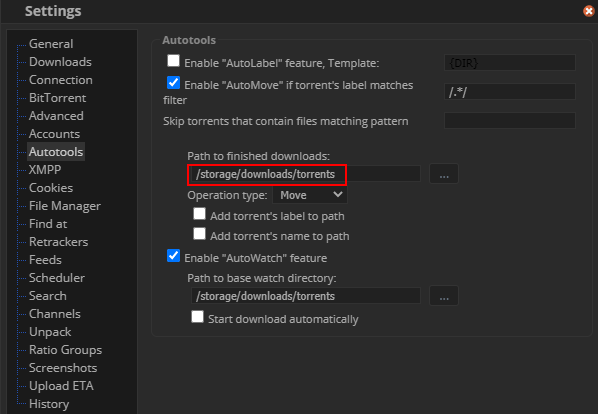

# How To Set Up Hardlinks and Atomic-Moves

## Description

!!! info

    If you’re wondering why hard links aren’t working or why a simple move is taking far longer than it should.

    Here we will try to explains it.

    The paths you use on the inside matter. Because of how Docker’s volumes work, passing in two or three volumes such as the commonly suggested `/tv`, `/movies` and `/downloads` makes them look like two or three file systems, even if they aren’t. This means hard links won’t work and instead of an instant move, a slower and more I/O intensive copy + delete is used.

So you want one of the following ?

- Instant moves (Atomic-Moves) during import of the *arr (useful when using Usenet)?
- You don't want to use twice the storage when using torrents. (hardlinks)?
- You want to perma seed?

Then keep reading.

### FAQ

??? faq "FAQ"

    1. Q: **What are the `*arr`?**

        - Sonarr, Radarr, Lidarr, etc.

    1. Q: **What are hardlinks?**

        - Short answer is "having a file in multiple folders" without using up your storage, [Long Answer](https://medium.com/@krisbredemeier/the-difference-between-hard-links-and-soft-or-symbolic-links-780149244f7d){:target="_blank"}.

    1. Q: **What's Atomic Moves?**

        - A real move and not a copy file from download folder to media folder and then delete file from download folder.

------

### How to Setup for

- [DockSTARTer](#dockstarter)
- [UnRaid](#unraid)

#### DockSTARTer

??? summary "DockSTARTer"

    !!! note

        I'm using the default paths in this example, and will keep the other paths unchanged so nothing will break if you make a mistake.

    We're going to use a mounted drive that we're going to use as storage for downloads and your media.
    In this example the mounted drive will be mounted to `/mnt/` with the following folder structure.

    ```
    storage
    ├── downloads
    |  ├── torrents
    │  |  ├── movies
    │  |  ├── music
    │  |  └── tv
    |  └── usenet
    │     ├── movies
    │     ├── music
    │     └── tv
    └── medialibrary
       ├── movies
       ├── music
       └── tv
    ```

    ##### Step 1
    To accomplisch this we need to change first a few paths in your `.env` (Usually `~/.docker/compose/.env`)

    ```yaml
    # Global Settings
    COMPOSE_HTTP_TIMEOUT=60
    DOCKERCONFDIR=~/.config/appdata
    DOCKERGID=999
    DOCKERHOSTNAME=DockSTARTer
    DOCKERLOGGING_MAXFILE=10
    DOCKERLOGGING_MAXSIZE=200k
    DOCKERSTORAGEDIR=/mnt/storage
    PGID=1000
    PUID=1000
    TZ=America/Chicago

    # DEPRECATED Settings (will be removed at the end of 2020)
    DOCKERSHAREDDIR=~/shared
    DOWNLOADSDIR=/mnt/downloads
    MEDIADIR_AUDIOBOOKS=/mnt/medialibrary/audiobooks
    MEDIADIR_BOOKS=/mnt/medialibrary/books
    MEDIADIR_COMICS=/mnt/medialibrary/comics
    MEDIADIR_MOVIES=/mnt/medialibrary/movies
    MEDIADIR_MUSIC=/mnt/medialibrary/music
    MEDIADIR_TV=/mnt/medialibrary/tv
    ```

    ##### Step 2

    When that's all set then you will need to change the paths you're going to use in the containers from:

    `/downloads` => `/storage/downloads`

    `/audiobooks` => `/storage/medialibrary/audiobooks`

    `/books` => `/storage/medialibrary/books`

    `/comics`  => `/storage/medialibrary/comics`

    `/movies` => `/storage/medialibrary/movies`

    `/music` => `/storage/medialibrary/music`

    `/tv` => `/storage/medialibrary/tv`

#### UnRaid

??? summary "UnRaid"

    !!! note

        The first thing you need to do is forget the suggested paths from the Spaceinvader One YouTube Tutorials,

        and don't use the predefined paths from the unraid templates.

        (Spaceinvader One YouTube guides are great to learn how to start with unraid or how to setup certain applications, and yes I did and still do use them. Probably the main reason why he's using those path is because they are predefined in the template)

    !!! attention

        To get Hardlinks and Atomic-Moves working with Unraid you will need to make use of **ONE** share with subfolders.

    ##### Create the main share

    For this example I'm using my own setup and preferred share `data`.

    Go to your dashboard and on the top select `shares` select `add share` .

    [](https://raw.githubusercontent.com/TRaSH-/Guides/master/docs/Misc/images/image-20201111225320772.png){:target="_blank"}

    1. use `data`
    1. if you got a cache drive and want to make use of it put it on `Yes` or keep it disabled (Hardlinks will stay in tact if you're using the cache)
    1. click on `ADD SHARE`

    !!! note

        Keep in mind regarding the use of the Cache drive, The mover can't move files that are in use, like  when `seeding` with torrents. You will need to shutdown your client or stop/pause the torrents so the mover can move them to your Array.

        With Usenet  you won't have any issues.

    ##### Folder Structure

    On the host (Unraid) you will need to add /mnt/user before it. **So /mnt/user/data**

    The `data` folder has sub-folders for `torrents` and `usenet` and each of these have sub-folders for `tv`, `movie` and `music` downloads to keep things neat. The `media` folder has nicely named `TV`, `Movies` and `Music` sub-folders, this is your library and what you’d pass to Plex, Emby or JellyFin.

    These subfolders you need to create your self, you can use krusader or winscp to create them or any other way you prefer.

    ```none
    data
    ├── torrents
    │  ├── movies
    │  ├── music
    │  └── tv
    ├── usenet
    │  ├── movies
    │  ├── music
    │  └── tv
    └── media
       ├── movies
       ├── music
       └── tv
    ```

    *I'm using lower case on all folder on  purpose, being Linux is case sensitive.*

    ##### Setting up the containers

    After you created all the needed folders it's time to setup the paths in the docker containers.

    Go to your dashboard and select your docker container you want to edit or if you're starting fresh add the docker containers you want to use or prefer.

    Unraid makes it actually  pretty clear what's the Host Path and what's the Container Path.

    `Container Path:` => The path that will be used inside the container.

    `Host Path:` => The path on your Unraid Server (The Host).

    ##### Torrent clients

    qBittorrent, Deluge, ruTorrent

    

    `Container Path:` => `/data/torrent`

    `Host Path`: => `/mnt/user/data/torrents`

    !!! info

        The reason why we use `/data/torrent` for the torrent client is because it only needs access to the torrent files. In the torrent software settings, you’ll need to reconfigure paths and you can sort into sub-folders like/data/torrents/{tv|movies|music}.

    ```none
    data
    └── torrents
       ├── movies
       ├── music
       └── tv
    ```

    ##### Usenet clients

    NZBGet or SABnzbd

    

    `Container Path:` => `/data/usenet`

    `Host Path:` => `/mnt/user/data/usenet`

    !!! info

        The reason why we use `/data/usenet` for the usenet client is because it only needs access to the usenet files. In the usenet software settings, you’ll need to reconfigure paths and you can sort into sub-folders like/data/usenet/{tv|movies|music}.

    ```none
    data
    └── usenet
       ├── movies
       ├── music
       └── tv
    ```

    ##### The arr(s)

    Sonarr, Radarr and Lidarr

    

    `Container Path:` => `/data`

    `Host Path:` => `/mnt/user/data/`

    !!! info

        Sonarr, Radarr and Lidarr get's access to everything because the download folder(s) and media folder will look like and be one file system. Hard links will work and moves will be atomic, instead of copy + delete.

    ```none
    data
    ├── torrents
    │  ├── movies
    │  ├── music
    │  └── tv
    ├── usenet
    │  ├── movies
    │  ├── music
    │  └── tv
    └── media
       ├── movies
       ├── music
       └── tv
    ```

    ##### Media Server

    Plex, Emby, JellyFin and Bazarr

    

    `Container Path:` => `/data/media`

    `Host Path:` => `/mnt/user/data/media/`

    !!! info

        Plex, Emby, JellyFin and Bazarr only needs access to your media library, which can have any number of sub folders like Movies, Kids Movies, TV, Documentary TV and/or Music as sub folders.

    ```none
    data
    └── media
       ├── movies
       ├── music
       └── tv
    ```

    ##### Final Result

    [](https://raw.githubusercontent.com/TRaSH-/Guides/master/docs/Misc/images/image-20201112210400294.png){:target="_blank"}

------

### Examples

!!! info

    Pick one path layout and use it for all of them.

    It doesn't matter if you prefer to use `/data`, `/shared`, `/storage` or whatever.

    The screenshots in the examples are using the following root path `/storage`

- [Sonarr](#sonarr)
- [Radarr](#radarr)
- [SABnzbd](#sabnzbd)
- [NZBGet](#nzbget)
- [qBittorrent](#qbittorent)
- [Deluge](#deluge)
- [ruTorrent](#rutorrent)

#### Sonarr

??? example "Sonarr Examples"

    `Settings` => `Media Managemen` => `Root Folders`

    

    `Series` => `Add New`

    

    

#### Radarr

??? example "Radarr Examples"

    `Settings` => `Media Managemen` => `Root Folders`

    

    `Movies` => `Add New`

    

    

#### SABnzbd config

??? example "SABnzbd Examples"

    `SABnzbd config` => `Folders`

    

    `SABnzbd config` => `Categories`

    

#### NZBGet

??? example "NZBGet Examples"

    `Settings` => `PATHS`

    

    `Settings` => `CATEGORIES`

    

#### qBittorrent

??? example "qBittorrent Examples"

    `Options` => `Downloads`

    

#### Deluge

??? example "Deluge Example"

    `Preferences` => `Downloads`

    

#### ruTorrent

??? example "ruTorrent Examples"

    `../config/rtorrent/config/rtorrent.rc` (path to your appdata)

    

    `Settings` => `Downloads`

    

    `Settings` => `Autotools`

    

------

Big Thnx to [fryfrog](https://github.com/fryfrog){:target="_blank"} for his [Docker Guide](https://wiki.servarr.com/Docker_Guide){:target="_blank"} that I used as basis for this guide.
