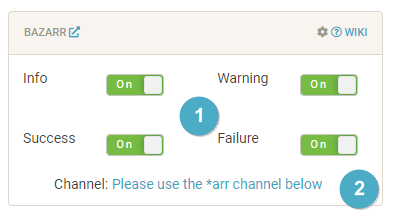
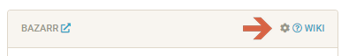
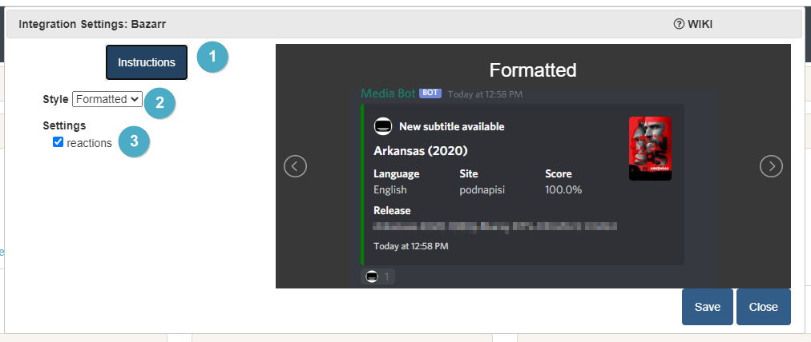
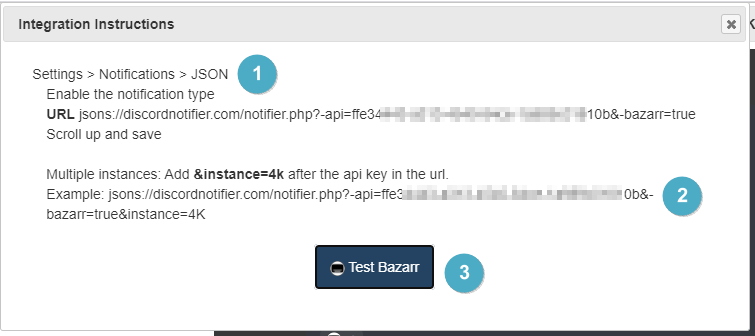

# Bazarr Integration

> This integration allows for notifications from Bazarr and will also add reactions to notifications if a subtitle was found for it and you are using reactions.

Reaction example:

---

## Trigger options

1. Triggers
    - `Info` - Currently all notifications use this type
    - `Warning` - To date, Bazarr doesn't use this type
    - `Success` - To date, Bazarr doesn't use this type
    - `Failure` - To date, Bazarr doesn't use this type
1. Channel
    - Bazarr shares the *arr channel unless Granular Setup is used, clicking the link on the site will move to the channel setup location.

---

## Configuration

Click the **cog icon** to open the configuration options for Bazarr.

1. Open integration specific instructions
1. Choose the notification format
1. Enable reactions for `*arr` notifications when a subtitle is found if the associated `*arr` notification can be found

### Instructions

1. How to enable notifications from within Bazarr
1. How to enable notifications of a 2nd instance from within Bazarr
1. Test the notification from Notifiarr to Discord
    - This will ensure your server, channel and permissions are set properly in Discord.
